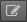
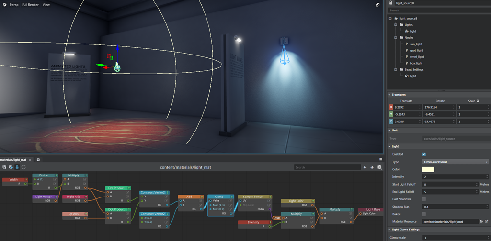

# Create a custom light material

By default, placeable light sources emit light with an even color and intensity. Everywhere the light reaches, its color and intensity is the same (except for attenuation over distance). If you want your light to shine with a particular pattern -- say a [gobo](https://en.wikipedia.org/wiki/Gobo_%28lighting%29), or a stained-glass effect -- you can create a custom material for your light.

1.	Create a new material. Navigate in the ~{ Asset Browser }~ to the folder where you want to save your new material. Right-click in the **Asset Browser** and choose **Create > Material (Empty)**. Enter a name for the new material, and click **OK**.

1.	Double-click the new material in the **Asset Browser** to open its shader graph in the ~{ Shader Graph Editor }~.

1.	Select and delete the **Standard Base** node that is in the graph by default. Replace it with an **Output > Light Base** node. To get started, click the  button next to the **Color** input of the **Light Base** node and set a color value. Save the material.

1.	Apply your material to a light in the scene so that you can see its effect as you work on the material's shader graph. With a light source selected, find the **Material Resource** setting and set it to your new material.

	You should see the light emitted by the selected source change to the output color you set for your material.

1.	Return to the **Shader Graph Editor** and set up your light material's shader graph the way you want it, so that it produces an output color for the light to emit.

	For example, the following graph makes a spotlight or omni-directional light emit a colored texture -- in this case, a brick pattern -- which is set up as a property for the material in the **Property Editor**.

---
Related topics:
-	~{ Create a parent material }~
-	~{ Shader Graph Editor }~
-	~{ Edit a child material }~

---
