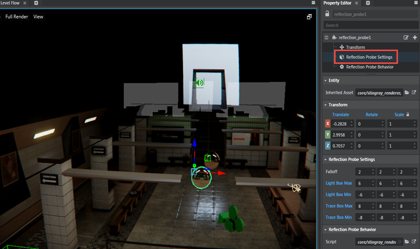
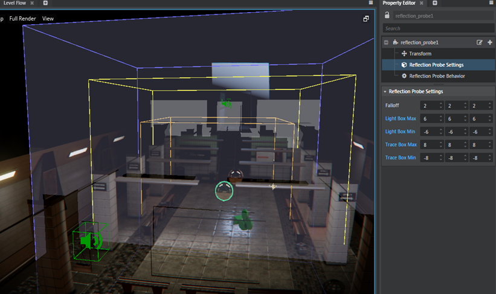
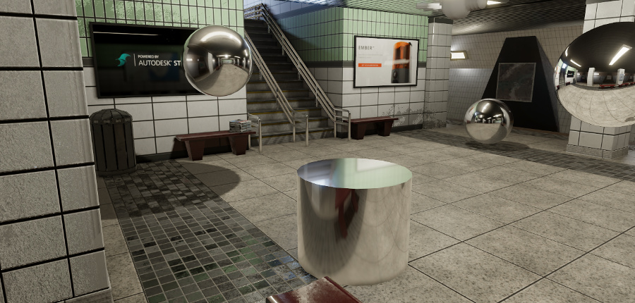
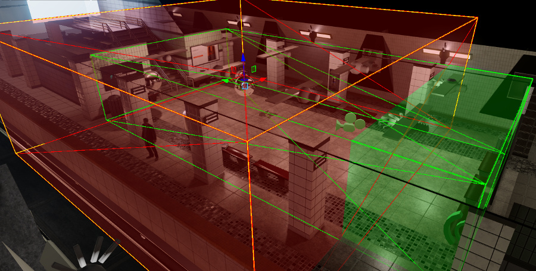

# Set up a baked reflection probe

This page describes how to set up and bake reflection probes to provide localized reflections for particular areas of your level.

1.	Enter the reflection probe placement mode by doing either of the following:

	-	Open the ~{ Create panel }~ to the **Helpers** tab. Under the **Rendering** group, select **Reflection probe**.

	-	From the main menu, select **Create > Reflection Probe Entity**.

1.	Click the viewport to place a new reflection probe into your level. Your probe is represented by a shiny sphere, giving you an idea of what objects it will pick up when you bake its reflections. Switch to the Move tool and adjust the probe's placement if needed.

1.	With the probe selected, set the **Reflection Probe Settings** properties in the ~{ Property Editor }~:

	-	The **Light Box Min** and **Light Box Max** settings control where in the level the reflections are shown during the game. Only surfaces inside this volume will be lit by the reflections baked for this probe.

	-	The **Falloff** controls how far from the outside of this volume the reflections start to fade out. Lower values cause the reflections to stop over a smaller distance, as they would at the edge of a mirror frame. Larger values cause the reflections to fade out over a larger distance, which is typically smoother if you want to have multiple overlapping light probes.

		The falloff is always linear over the distance set in the **Falloff** control. So, for example, if the light volume is set to `[-10,-10,-10],[10,10,10]`, and the falloff is set to `2,2,2`, everything between `[-8,-8,-8],[8,8,8]` will show the reflections from this probe at full intensity. At a distance of `8` meters from the probe location on each axis, the reflections will begin to fade out. They will fade linearly over the next `2` meters on each axis, reaching zero contribution at the outer bounds of the light volume.

	-	The **Trace Box Min** and **Trace Box Max** settings control the parallax correction box. Set the dimensions of this box on all sides to roughly match the distance between the probe and the things it is reflecting. See [Parallax correction] below.

	

	You can also use the reflection probe gizmo to set these box extents visually in the viewport. To do so:

	-	Click the **Reflection Probe Settings** in the **Property Editor**.

		

		This activates the probe gizmo.

		

	-	Left click and drag the box to adjust the box extents. The orange box bounds correspond to the **Falloff** settings, the yellow bounds to the **Light Box** settings and the blue bounds to the **Trace Box** settings. Note that you can’t manipulate the **Falloff** settings (the orange box) in the level viewport. As you manipulate the bounds, the values are reflected in the **Property Editor**.

	-	Place the cursor on any of the back faces of the probe box, Ctrl + left click to select the face and drag to adjust its bounds.

	-	Right click to exit from editing the box bounds using the gizmo.

1.	Save your level.

1.	Bake your probe. From the main menu, select **Window > Lighting > Bake Reflection Probes**.

	When the textures are finished baking, you should see your scene update with the new reflections.

It may take you several iterations of moving the probe, adjusting the settings and re-baking before you find a combination of placement and boxes that look good from all the viewing angles you need.

## Parallax correction

The textures baked by a reflection probe contain only the things in the scene that are visible from the probe's point of view. It therefore gives the most accurate reflections when the reflective surface is placed very close to the probe's location. As the distance from the probe's location to the reflective surface increases, the reflections get progressively out of kilter with regard to the real locations of things in the world.

To offset this, the renderer applies *parallax correction*, which skews the reflections in an effort to keep them looking more plausible from different viewing angles.

The more accurately the box defined for the parallax correction matches the actual distance from the probe to the objects it is reflecting in the scene, the more accurately the parallax correction can adjust the reflections. This will make the reflections appear more realistic, even when the reflective surface is relatively far from the location of the reflection probe.

For example, this image has a single reflection probe (the sphere on the far right), with its parallax volume is set to closely match the location of the walls, floor and ceiling. Note that the reflections in the other mirrored objects remain relatively plausible, even when they are not very close to the location of the probe.

## Visualizing reflection probes

>	**Note:** This currently works for reflection probe units in your existing Stingray projects. With Stingray 1.5, reflection probes are saved as entities and you can see the current extents by activating the probe gizmo.

Once you have baked your reflection probes at least once, you can visualize their associated volumes in the viewport.

-	From the viewport overlays, select **Full Render > Tools > Reflection Probe Volumes**.

In this visualization mode:

-	The red volume (outlined in red and yellow) shows the current extents set for the *light* volume: that is, the limits within which the baked reflections apply to surfaces.

-	The green volume shows the current extents set for the *parallax correction* volume.

## Examples

The following sections give some guidelines or recipes for setting up reflection probes for common game situations. They may not apply in all cases, but should hopefully give you a starting point.

### Setting up a mirror

To set up reflections for a planar reflective object, like a mirror:

-	Place the probe just slightly in front of the mirror surface, approximately in the middle.
-	Make the light box just big enough to cover the mirror surface.
-	Turn the falloff all the way down, so that the reflections remain sharp up to the edge of the mirror.
-	Set the extents of the parallax correction box so that it matches the extents of the room that surrounds the mirror. The extent of the box will be very small in the direction toward the wall the mirror is attached to.

### Setting up a stationary reflective 3D object

To set up reflections for a relatively small 3D object that can be seen from all sides, but that will stay in one place:

-	Place the probe inside the object, roughly in the center.
-	Make the light box just big enough to enclose the whole object.
-	Lower the falloff so that the reflections are clear over the whole surface.
-	Set the extents of the parallax correction box so that it matches the extents of the room that surrounds the object.

### Setting up a movable reflective 3D object

If you have reflective surfaces that will move around in the game, or if you have large surfaces that need realistic reflections, you will likely have to use multiple probes.

-	Place the probes spaced at regular intervals throughout the parts of the level that need reflections.
-	Make their light boxes big enough that they overlap slightly. Within the overlapping areas, the baked reflections from all overlapping probes will apply.
-	Adjust the falloff of each probe so that the reflections fade nicely into each other in the areas of overlap between the adjacent probes.
-	Set the extents of the parallax correction box for each probe so that it matches the extents of the room that surrounds that probe. This means that multiple probes located in the same room will have their parallax correction boxes set to reflect the same objects. The actual values you set for each probe's box will be different, but the boxes will cover the same volume of space.
