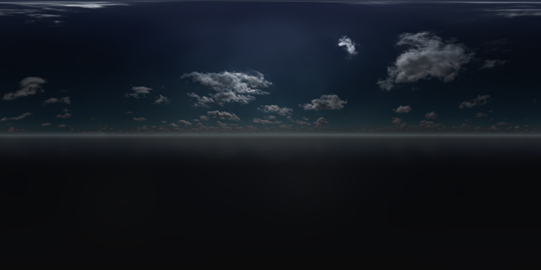

# Create a skydome texture

This page describes some points to keep in mind when you create a skydome texture to replace the default sky in a new level.

## Spherical distortion

Your texture will be mapped onto the inside of the skydome sphere. It therefore needs to be a projection of spherical coordinates into a rectangular texture.

Stingray expects your image to use *equirectangular projection*:

-	The X axis of the image wraps horizontally around the sphere (the longitude), and the Y axis of the image is up and down on the sphere (the latitude).

-	The center of the Y axis is the equator: around this line the image will appear on the skydome without any distortion.

-	The top and the bottom of the image represent the top and bottom poles of the skydome. As you approach these points, each horizontal line of pixels in your texture is compressed to fit a smaller circumference around the surface of the sphere.

For example, in the default skydome image, notice how the clouds appear stretched out at the top of the image. When projected onto the skydome, they converge and appear seamless.

## Dimensions

Your texture should be twice as wide as as it is high, like the default texture above. If not, it will be stretched or squashed as necessary to fit onto the sphere.

## Quality

You will likely need to keep your texture quite large in order to make sure that its features will look crisp enough when projected onto the skydome.

For example, the default skydome texture is 4096x2048. This does produce quite a large file, but avoids the artifacts or pixelation that you are likely to see in the sky with lower-resolution images.

## Dynamic range

For best results with image-based lighting, make your image HDR ([high dynamic range](https://en.wikipedia.org/wiki/High-dynamic-range_imaging)). This allows you to adjust the intensity or brightness of the image and of its effects on the scene without losing detail.

Note that real HDR images are not equivalent to *tonemapped* images, though the principle is the same. Both are typically produced by capturing multiple images from the same viewpoint but with different exposures, then combining those exposures together. However, a real HDR image keeps more than 8 bits per color channel after being combined. This allows it to preserve more detail about the lighting in each exposure. A tonemapped image, on the other hand, combines the different exposures into a file with the usual 8 bits per color channel, discarding much of the detail in the process. If your image is a *.png* or *.jpg* file, it won't be a true HDR image.

See [this tutorial](http://adaptivesamples.com/2016/03/16/make-your-own-hdri/) for a nice illustration of the difference between using a real HDR image and a tonemapped image to light a 3D scene, and for a tutorial on how to create real HDR panoramas.

For best results:

-	Save your skydome image as a *.DDS* file with 32 bits per color channel before importing it into Stingray. 16 bits is usually acceptable.

	For example, if you're using the Photoshop DDS plug-in from NVIDIA, set its output format to `32.32.32.32f ABGR` or `16.16.16.16f ABGR`

-	Do not use any compression on your image, either in Photoshop or in Stingray.

	After you import your image into a Stingray texture, make sure that you disable compression for the image in the ~{ Texture Manager }~.

-	You can import EXR files to use as skydome images. When imported, the files with `"hdri"`, `"skydome"` and `"_hdr"` suffix are set the appropriate texture compressions for the HDRI maps. The EXR files should be 32 bit HDRI images.

	Browse and import environment skydome textures from Autodesk using the **Online Assets** folder in the Asset Browser.

## Fog

If you enable fog for your level, you may want to blend in the fog color toward the horizon in order to enhance the effect of distance in your scene.

Fog applies to the objects in your scene, but not to the background skydome. If the skydome texture near the horizon contains elements that are clearly visible, but the objects in front of it are obscured by a different color of fog, the result can look unnatural.

For example, the default skydome texture shown above fades to a light grey at the horizon, which matches the fog color in the default shading environment.

## Samples

For some free sample equirectangular HDR textures you can play with, see the [sIBL Archive](http://www.hdrlabs.com/sibl/archive.html).

## Setting up the skydome

You set up your custom skydome texture in the properties of the Shading Environment for your level. See ~{ Change shading environment properties }~ and ~{ Shading environment properties }~.

You will also want to configure your shading environment to control the way your skydome emits light into the scene. For details on this, see ~{ Global environment lighting }~.
