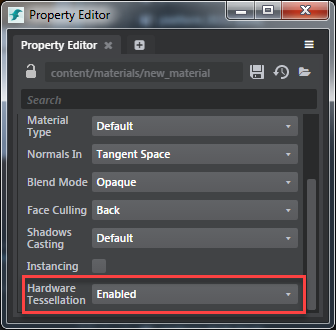

# Create a tessellation material

Tessellation adds more triangles to your mesh. Adding tessellation to your material can create a more realistic effect on your mesh.

1. Do the following to create a new empty material for customization:
    - In the **Asset Browser**, navigate to the folder where you want to create the material.
    - Right-click in that folder and select **Create > Material (Empty)**.
    - In the dialog box that appears, enter a name for your new material.
    This creates a new material that contains only one **Output > Standard Base** node by default.
    - In the **Property Editor**, click .
2. In the Shader Graph Editor, select the **Standard Base** node.
3. In the **Property Editor**, enable **Hardware Tessellation**.

	 

4. In the **Shader Graph Editor**, plug in values to the tessellation specific inputs. See ~{ Create or edit shader graphs }~.

	>**Tip:** You must use the **Domain Sample Texture** sampler node instead of the **Sample Texture** sampler node to drive the tessellation inputs. For more information on these nodes, see the **Sampling** category in the [Stingray Shader Node Reference](../../../shaders_ref/index.html).

5. Assign the material to a mesh with some amount of existing tessellation.
