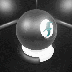
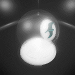
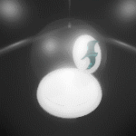

# Test Template: Standard Base Node Gifs

The standard base output node produces physically plausible shading based on a base color value and a variety of parameters that describe the physical properties of the object and the way it interacts with incoming light.

Animated Gif: | Node: | Description:
--- | --- | ---
  | **Offset** | An optional world-space offset to apply to the position of the pixel being shaded, changing the apparent placement of the object in the scene.
  | **Base Color** | The RGB color of the pixel being shaded.
  | **Opacity** | The opacity of the pixel being shaded. Values closer to 0 are more transparent; values closer to 1 are more opaque. Note that this value is used differently depending on the value of the Blend Mode option. Default value: 0.5
  | **Opacity Threshold** | When the Blend Mode option is set to Opaque, and a value is set for the Opacity input, this value sets the threshold at which the mesh becomes visible. When the opacity input value is below this threshold, the mesh is not shaded (fully transparent). When the opacity input value is above this threshold, the mesh is fully opaque. Regardless of the Blend Mode setting, whenever there is both an emissive color and an opacity value set, this value sets the opacity threshold at which the emissive effect becomes visible. Default value: 0.5
  | **Normal** | A directional vector perpendicular to the surface being shaded. Use this input to apply a normal map that contains small-scale details in the relief of the surface
  | **Metallic** | The "shininess" and reflectivity of the surface. Values closer to 0 produce a duller surface; values closer to 1 produce a shinier and more reflective surface. Default value: 0
  | **Roughness** | The amount of fine roughness on the surface. Values closer to 0 produce a more glossy finish; values closer to 1 produce a more matte finish. Default value: 0.5
  | **Tessellation Factor** | The RGB color of the pixel being shaded
  | **Density** | For partially transparent surfaces, this value determines how much the mesh scatters incoming light. Values closer to 0 produce more scatter and more of a glowing effect; values closer to 1 minimize the scatter. Default value: 1

---
Related topics:
-	~{ Shading }~
---
