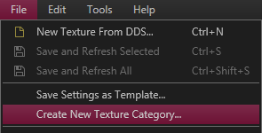
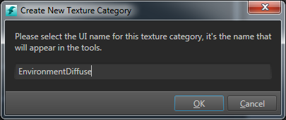

#Create a texture category

You can use texture categories to organize textures and to do runtime tasks, such as dropping mip steps.

1. In the ~{ Texture Manager }~ (**Window > Texture Manager**), select **File > Create New Texture Category**.

	

2. In the **Create New Texture Category** dialog box, type a name to represent the category in Stingray (for example in the **Texture Manager**, or **Quick Texture Import** window). Click Ok.

	

3. In the **Save As** dialog box, ensure that you save the texture category file inside your project.

	Your texture category is added to category panel at the top of the tool.

---
Related topics:
-	~{ Texture Manager }~
-	~{ Import textures }~
-	~{ Edit Texture settings }~
---
