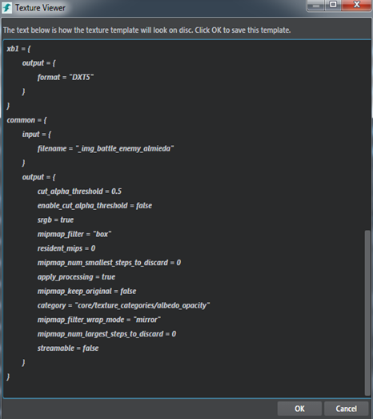

# Create a texture template

A texture template is a file in your project that typically contains the texture resource settings and compression formats of the texture on different platforms and enables an improved import workflow.

The **Texture Manager** includes default texture templates such as

-	Normal template for normal map textures.
-	Linear grayscale template for greyscale textures.
-	Albedo opacity template for textures with alpha channel.
-	Albedo template for textures without alpha channel.
-	Roughness/Metallic/AO template for RMA textures.
-	Lightmap template for lightmap textures.
-	HDRI/Skydome template for skydome textures.

In addition to the texture settings, you will find suffixes denoting the texture types defined in the texture templates. These are used to assign the texture templates to the textures you import by matching the file suffix to the suffix defined in one of the templates. See below for the file suffixes defined in the core texture templates:

~~~{sjson}
template_metadata = {
// Albedo
suffixes = [ "albedo", "diffuse", "color",  "_df", "_c"]
}

template_metadata = {
// Albedo_opacity
suffixes = ["_albo", "_dfo", "albedo-opacity", "diffuse-opacity", "color-opacity"]
}

template_metadata = {
//Normal:
suffixes = [ "normals", "normal", "_norm", "_n", "_nm", "_nrm" ]
}

template_metadata = {
//Linear Greyscale:
suffixes = [ "roughness", "metalness", "_ao", "_rough", "_metal", "_r", "_m", "bump", "_bmp" ]
}

template_metadata = {
//Roughness/Metallic/AO:
suffixes = ["rma"]
}

template_metadata = {
//HDR/Skydome:
Suffixes = [ "skydome", "hdri", "_hdr" ]
}
~~~

You can customize the texture templates to add texture suffixes of your own and use them on texture import. Core texture templates are located in `core/texture_categories` folder within your Stingray install. See ~{ Working with core resources }~ for details on overriding the texture template resources.

You can create texture templates to quickly configure imported textures without having to use the **Texture Manager**.

To create a new template:

1. Select one (and only one) texture in the **Texture Manager**.
2. Click *Create Template* icon .

	The window that appears shows how the actual template file will look internally, what settings it will contain for each platform, and what settings they have in common.

	

3. Click **OK** to save this as a new texture template.

4. In the dialog box that appears, ensure that you save the texture template within your project and give it a good name, since the interface name is based on this file name.

---
Related topics:
-	~{ Texture Manager }~
-	~{ Import textures }~
---
