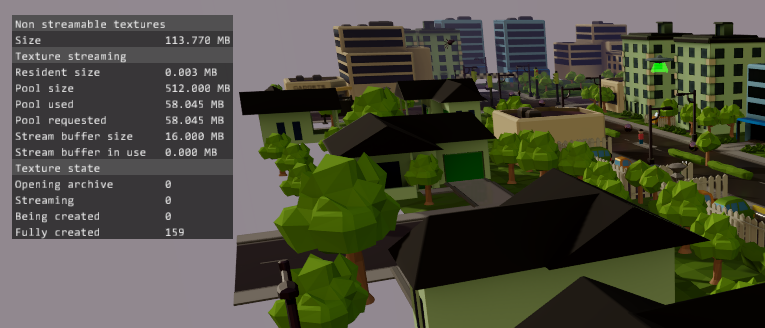
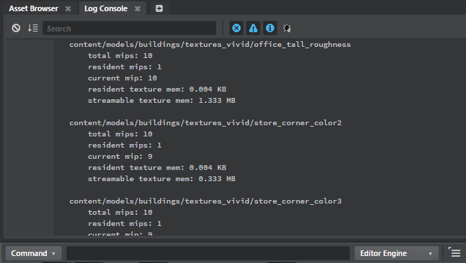

# Texture streaming

Texture streaming allows your game to defer loading detailed texture data into memory from disk until that data is actually needed in order to render the scene.

This can help you to increase the number of different textures you use in your game, and to increase the maximum resolution of those textures, without exceeding a fixed maximum amount of memory. It may also reduce the load time of your resource packages (and therefore startup time for your project) by reducing the amount of data that needs to be loaded up front.

## How texture streaming works

By default, when you load a resource package into your game that contains one or more texture resources, all of the data for those textures is loaded into memory immediately and kept in memory until that resource package is unloaded. All the mip levels for each texture are always available in memory, regardless of whether those mip levels are needed at any time.

When you use streamable textures, only a limited number of low-quality mip levels are kept in memory persistently for each texture. When the renderer needs to display a more detailed mip level for a given texture, the streaming system fetches that data from disk and loads it into a shared pool of memory.

If the new texture data that needs to be loaded would exceed the maximum size of the memory pool, the streaming system attempts to make room for the new textures. First, it removes old texture data that is no longer visible, starting with the textures that have been off-screen the longest. If there is still not enough room in the pool once all old textures have been evicted, it begins to progressively lower the resolution of other visible textures in the pool, starting with the textures that take up the least screen space. This keeps the overall visual quality of the rendering balanced, so that you do not end up with some very high-quality textures and some very low-quality textures as a result of the large textures taking up too much space in the pool.

### Popping

For streamable textures, the renderer does not have all mip levels available at all times. Therefore, it may not be able to interpolate or fade smoothly between multiple different mip levels for the same texture as it ordinarily does when the camera moves closer to or farther away from an object. Instead, higher-resolution mip levels may "pop in" and "pop out" of the rendered image. This popping in and out is usually not apparent when the streaming is smooth and quick, but can be noticeable if the streaming system is unable to load the texture data quickly enough.

This can occur for several different reasons, for example:

-	If the game needs to stream too many high-resolution textures at the same time. You may be able to address this problem by raising the buffer the system uses to load new texture data from disk (see memory settings below). If this problem always occurs in the same places in a level, you can alternatively try to disable streaming for some of the textures in that location so that fewer textures will need to be streamed.

-	If you have other data that needs to be loaded into the game from disk at the same time, such as streaming audio or video, background loading of other resource packages, etc.

-	If your project data is read from a slow physical medium such as a DVD or a slow hard disk, or the data is streamed over a network connection.

## Configure memory settings

The texture streaming system reads two settings from your project's `settings.ini` file to determine how much memory it uses.

These settings must be specified inside platform-specific blocks like this, using the keys `win32`, `android`, `ios`, `xb1`, or `ps4`:

~~~{sjson}
win32 = {
	streaming_texture_pool_size = 256
	streaming_buffer_size = 24
}
ios = {
	streaming_texture_pool_size = 128
	streaming_buffer_size = 16
}
~~~

`streaming_texture_pool_size`

>	Specifies the maximum amount of memory, in MB, that the texture streaming system can allocate to share between all of the streamable textures it loads into your game. When the number and size of the mip levels the engine needs to stream in is greater than this pool can accommodate, the streaming system begins to discard the highest quality mip levels from its loaded textures. This may reduce the apparent texture detail and visual quality of your game. Therefore, you should attempt to set this value high enough that your game always has an acceptable level of texture detail, even in areas with the greatest texture density (i.e. the largest variety of different textures).
>
>	The default maximum pool size is 512 MB for all platforms. Note that this is a maximum value: if you do not stream any textures, no memory is actually allocated.

`streaming_buffer_size`

>	Specifies the amount of memory, in MB, that the texture streaming system uses for loading new textures in from disk. The texture streaming system cannot load a texture whose requested mip levels take more space in memory than this buffer provides. Therefore, you **must** set this buffer at least large enough to contain all the mip levels for your largest streamable texture. Raising this value may also help to prevent high-resolution mip levels from noticeably "popping in" when many textures need to be streamed in at the same time.
>
>	The default buffer size is 16 MB for all platforms. Note that this buffer is allocated by the engine at startup: if you do not stream any textures, you can optimize your memory usage by setting this value to `0`.

## Set textures as streamable

By default, textures you import into your project are not streamed. You need to intentionally set them as streamable in the ~{ Texture Manager }~.

1.	Open the ~{ Texture Manager }~ and select the textures you want to stream.

1.	For each texture, enable the **Streamable** option.

1.	For each texture, use the **Resident mip levels** control to set the number of mip levels that should be pre-loaded into memory and always available. This value represents the "worst-case scenario" for rendering: even if the texture streaming system has no room to load in any more detailed mip levels dynamically, the engine can still use the largest *resident* mip level.

	The value of this setting counts up from the lowest-resolution mip level to the highest.  So, a value of `1` means that only the lowest-resolution mip level is always available, `2` means that only the two lowest-resolution mip levels are always available, etc. Note that at least one mip level is always loaded persistently, so setting this value below `1` has no effect.

	Note that resident mip levels do not take memory from the shared pool maintained by the texture streaming system. Resident mip levels are loaded into memory at the time their resource packages are loaded, along with any non-streamable textures and other types of resources in the same package.

## Monitor streaming

To see the current memory usage and status of the texture streaming system, send the `perfhud texture_streaming` console command to the engine.

See also ~{ Send commands from the Status bar }~.

One thing to watch out for is when the **Pool requested** value exceeds the **Pool size** value. When this happens, it means that the streaming system could not fit all the mip levels that it tried to load into the memory pool at the same time. This means that some of the textures in the scene could not be shown at their optimal quality. Since the streaming system does its best to keep the apparent visual quality balanced overall, this may not be a problem in your project. However, if you notice that visual quality is suffering on a target platform, you may want to increase your maximum pool size for that platform so that more high-quality mip levels can fit in the budget.

For a complete list of all texture resources managed by the streamer, along with their current mip levels and memory usage, use the `streamer_stats` command:

## Control streaming

You can control the texture streaming system in your game by calling Lua functions in the `stingray.Renderer` API. For example, you can:

-	enable or disable streaming, by calling `stingray.Renderer.set_automatic_streaming()`,
-	control the mip levels requested for your textures, by calling `stingray.Renderer.set_texture_requested_mip_level()` or `stingray.Renderer.request_textures_to_highest_mip_level()`,
-	empty the pool of all loaded texture data by calling `stingray.Renderer.flush_streamed_textures()`,
-	override the size of the shared memory pool by calling `stingray.Renderer.override_texture_pool_size()`, etc.

See the `stingray.Renderer` reference for details.
