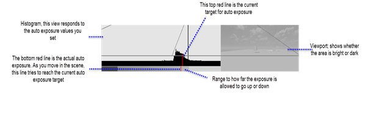

# Adapt scenes to different lighting environments

The auto exposure component for the default shading environment lets you automatically adjust the scene to changes in light levels, creating an eye adaptation effect as you move through differently lit environments, like exiting a dark room and moving into a brighter outdoor scene.

To add the auto exposure component to the default shading environment, click the + icon, and select **Shading Environment > Auto Exposure**. With this component enabled, the regular **Exposure** component has no effect in your scene.

To give you a visual aid in adjusting the auto exposure, the Level Viewport now includes a render mode called Auto Exposure (**Full Render > Debug  > Auto Exposure**), which displays a histogram of the scene lighting , showing where the brightest and darkest points are, with a mini-viewport to the right displaying the luminance value of the pixels in the scene.

The main property that you'll use to set auto exposure is the **Exposure Target** which adapts the scene exposure to light intensities.

To set the auto exposure for your scene:

1. Set up lights in your level. See ~{ Create a light source }~.

2. Add auto exposure component to the shading environment and enable it.

    Depending on the light settings, your scene will appear brighter or darker.

    >**Note:** The auto exposure is dependent on where you are in the scene.

3. Start to tweak the auto exposure component to the eye adaptation effect that you want:

    - Find an "average" area in your scene and then set "Exposure Target" to a reasonable value.

    - Go to the brightest area and see if the maximum value (brightest exposure) is good.

    - Go to the darkest area and see if the minimum value (darkest exposure) is good.

    - Adjust the **Exposure Max** and **Exposure Min** values to decide how much the auto exposure can change to be brighter or darker.

4. (Optional) Fine tune the other auto exposure properties to control the adaptation speed and input threshold values the eye adapts to.

## Auto exposure component properties

When you add the auto exposure component to the shading environment, the following properties are available:

<dl>
<dt>Enabled</dt>
<dd>Activates the auto exposure for the scene. When enabled, the Exposure component has no effect in your scene.</dd>

<dt>Exposure Target</dt>
<dd>Sets the brightness of the scene to adapt it to changing light levels. Higher values make the scene appear bright and lower values darken the scene. Adjust this setting to automatically adjust the scene for light level changes.</dd>

<dt>Exposure Max</dt>
<dd>Sets the maximum (brightness) level that the auto exposure can go up to.</dd>

<dt>Exposure Min</dt>
<dd>Sets the minimum (darkness) level that the auto exposure can go down to.</dd>

<dt>Threshold Darks</dt>
<dd>Adjusts auto exposure to exclude dark areas from being adapted to light exposure. As you tweak values here, you’ll see a blue shading on the left of the histogram reflecting the dark areas.</dd>

<dt>Threshold Highlights</dt>
<dd>Limits the auto exposure to exclude the highlighted areas from being adapted to light exposure. As you tweak values here, notice the red shading on the right of the histogram. Setting this threshold values is useful when you have highly reflective spots and visual effects that you don't want to be considered in light adaptation.</dd>

<dt>Max Adaptation Speed</dt>
<dd>The maximum amount of step the adaptation will move for a second. These are arbitrary units and don't correspond to a luma value.</dd>

<dt>Speed Dampening Up</dt>
<dd>Increases the speed of the adaptation effect.</dd>

<dt>Speed Dampening Down</dt>
<dd>Decreases the speed of the adaptation effect, to soften the movement of adaptation.</dd>

<dt>Scene Max Log Luma</dt>
<dd>Controls the maximum range of brightness that gets considered for auto exposure. This scales the histogram range to adapt for larger dynamic ranges of lighting in the scene.</dd>

<dt>Scene Min Log Luma</dt>
<dd>Controls the minimum range of brightness that gets considered for auto exposure.  This scales the histogram range down. Ideally, you don’t need to adjust these Log Luma values, but this can be useful when you need to adapt the auto exposure to a badly lit scene and fix it.</dd>

</dl>

**Notes:**

* You can set the auto exposure for each shading environment in your levels.
* Be consistent in your light settings. Popular effects like temporary blindness like going from light to dark areas rely on first setting up good lighting that works well with the scene.
* Luminance values of textures are considered in eye adaptation so it's best to avoid having too many emissive textures. If you have a white texture like a white wall, there will be a lot of eye adaptation whereas having a black texture will cause the eye adaptation to be down.
