# Shading environment properties

This page describes the properties that are available in the Property Editor panel when you select the shading environment for a level.

## Global Lighting

Sets up the default skydome image and global lighting effects.

See also ~{ Lighting and the sky }~ and ~{ Global environment lighting }~.

<dl>

<dt>Skydome Map</dt>
<dd>Specifies the texture resource that will be projected on the level's skydome. For instructions on creating a custom sky, see ~{ Create a skydome texture }~.</dd>

<dt>Skydome Intensity</dt>
<dd>Sets the brightness of the skydome map where the skydome unit is visible. Note that this does not directly increase the contribution of the texture to the way objects in the scene are lit, it controls only how bright the image appears on the skydome. However, increasing this intensity will also increase the brightness of any lightmaps that you bake for the level with the sky visible, which then indirectly increases the intensity of the lighting when those lightmaps are applied to the objects in the scene.</dd>

<dt>Global Diffuse Map</dt>
<dd>Sets a custom cubemap that contributes to the diffuse lighting of the objects in your scene. Typically, you will use the `diffuse_bake` texture generated by a reflection probe. Note that any objects that have baked indirect lighting will use the light saved in their lightmap textures rather than this global map.</dd>

<dt>Global Specular Map</dt>
<dd>Sets a custom cubemap that will contribute to the specular lighting and reflectance of the objects in your scene. Typically, you will use the `specular_bake` texture generated by a reflection probe.</dd>

<dt>Global Radiance Map</dt>
<dd>Sets a custom cubemap that the Stingray light baker uses to retrieve radiance from the skydome. Typically, you will use the `radiance_bake` texture generated by a reflection probe.</dd>

<dt>Emissive Particle Intensity</dt>
<dd>Adjusts the brightness of emissive particles spawned by particle effects.</dd>

<dt>Reflections Tint</dt>
<dd>Adjusts the color and brightness of all reflections in the scene. This includes reflections drawn from the global specular map set up above, reflections from other baked reflection probes, and screen space reflections.</dd>

<dt>AO Reflection Occlusion Intensity</dt>
<dd>Controls the intensity of which the light baked AO will occlude specular lighting; this applies to reflection probes, specular reflection and screen space reflection. Modify this value if the reflection is removing too much of the contact shadows in your scene.</dd>

<dt>AO Reflection Occlusion Falloff</dt>
<dd>Controls the falloff of how the light baked AO will occlude specular lighting; this applies to reflection probes, specular reflection and screen space reflection. Modify this value if the reflection is removing too much of the contact shadows in your scene.</dd>

<dt>Baked Diffuse Tint </dt>
<dd>Adjusts the color and brightness of both the global diffuse map set up above, and of any lightmaps that you have baked for your level. See ~{ Light baking }~.
</dd>

<dt>AO Baked Diffuse Intensity</dt>
<dd>Controls the intensity of which the light baked AO will apply to the diffuse lighting. Modify this value if you want more contribution to the diffuse lighting from your light baked AO.</dd>

</dl>

## Cascaded Shadow Mapping

This section contains global settings that control the shadows cast from dynamic lights.

<dl>

<dt>Shadow Distance</dt>
<dd>The maximum distance from the camera that shadows from dynamic light sources will be rendered. Reducing this value in large worlds may increase performance by reducing the number of shadows that need to be calculated. Reducing this value also may increase the quality of the shadows from directional lights, because it decreases the total area that their fixed-size shadow maps will need to cover.</dd>

<dt>Log/Linear Blend</dt>
<dd>Controls the edge bleed of your shadows. Lower values produce sharper shadows, higher values produce softer shadows.

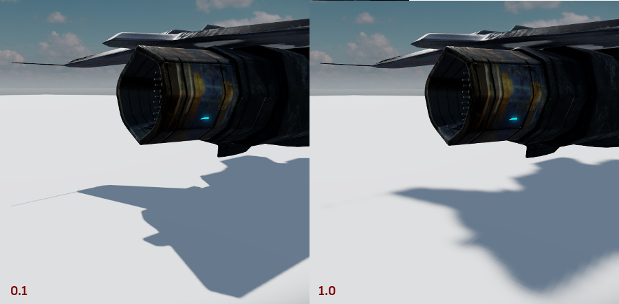</dd>

</dl>

## Fog

Fog covers up distant objects with a colored overlay that becomes progressively more opaque as the distance from the camera increases. Fog can enhance the feeling of depth and distance in a level by making far-off objects appear to become occluded by the atmosphere.

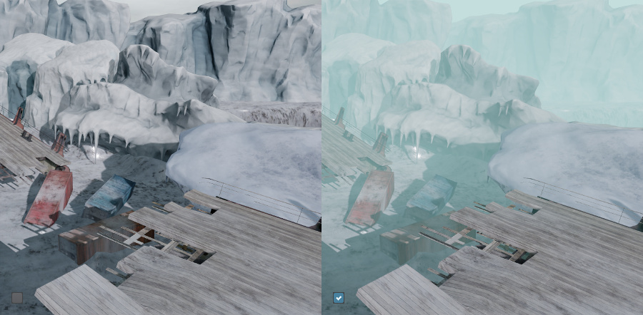</dd>

<dl>

<dt>Enabled</dt>
<dd>Turns fog on and off.</dd>

<dt>Depth Range</dt>
<dd>The **Min** value sets the distance from the camera at which the fog begins to affect the objects in the level.

The **Max** value sets the distance from the camera at which the fog reaches its maximum opacity.</dd>

<dt>Fog Color</dt>
<dd>Controls the color and the maximum intensity level of the fog overlay.</dd>

<dt>Sun Blend</dt>
<dd>Controls how much the color of the sun (that is, the first directional light in the scene) is blended into the color of the fog. At `0`, the color of the fog is unaffected by the color of the sun. Higher values make the fog pick up more of the sun color, starting in the direction the sun light is coming from.</dd>

<dt>Sun Exponent</dt>
<dd>Controls how deeply the sun color blend penetrates into the fog. Lower values make the sun color affect more of the fog; higher values make the sun color fall off more quickly as it begins to blend in to the fog.</dd>

<dt>Sun Strength</dt>
<dd>Controls the intensity of the sun light that is blended into the fog.</dd>

</dl>

## Exposure

<dl>
<dt>Exposure</dt>
<dd>Adjusts the overall brightness of the scene. Lower values produce a darker image, higher values produce a lighter image.</dd>
</dl>

## Screen Space Ambient Occlusion

Screen space ambient occlusion applies an extra layer of shadow where objects are close together. This simulates the way the presence of other adjacent objects tends to reduce the amount of ambient diffuse light that reaches a surface. This tends to deepen the shadows inside small gaps, at angles, and at corners.

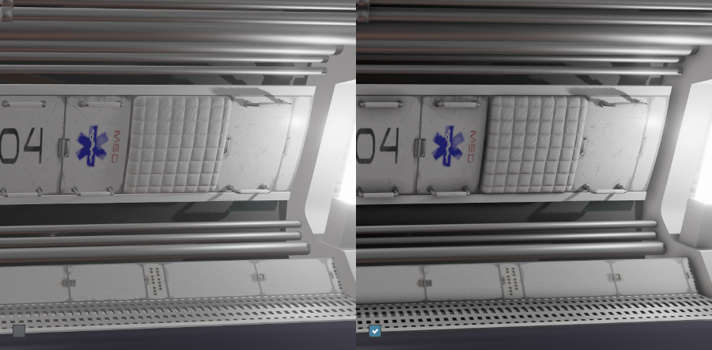

Screen space ambient occlusion is a post-processing effect that applies to all rendered objects in the scene, using the depth of the objects in the scene to determine which ones are close enough to occlude each other. Note that you can also set up ambient occlusion at the level of individual models or materials, by baking an ambient occlusion map from your content creation tool and assigning its texture to the AO Map slot of your Stingray material. See the topics under ~{ Shading }~ for more on setting up physically based materials.

The Stingray Editor viewport also offers a visualization mode that can be helpful to use when tuning the screen space ambient occlusion settings. Activate it from the viewport overlay by selecting **Full Render > Lighting > SSAO**.

<dl>

<dt>Enabled</dt>
<dd>Turns screen space ambient occlusion on and off.</dd>

<dt>Half-Res</dt>
<dd> When enabled (default), runs SSAO at half-resolution. Running the effect at a reduced resolution lets you gain performance without sacrificing visuals, optimizing your results.</dd>

<dt>Quality</dt>
<dd>Controls how many samples are used to calculate the shadow. Lower values produce a more blocky shadow, but are faster to calculate. Larger values produce smoother and softer shadowing, but require more processing.</dd>

<dt>World Space Radius</dt>
<dd> When enabled, calculates the radius of the ambient occlusion hemisphere in world units. When disabled, screen units are used.

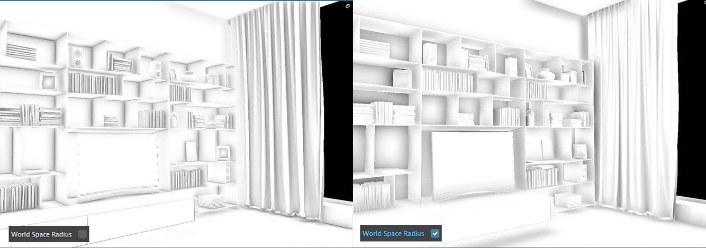

In the following example, the camera is zoomed in on objects. Screen space radius reveals different features on the objects, while World Space Radius remains constant.

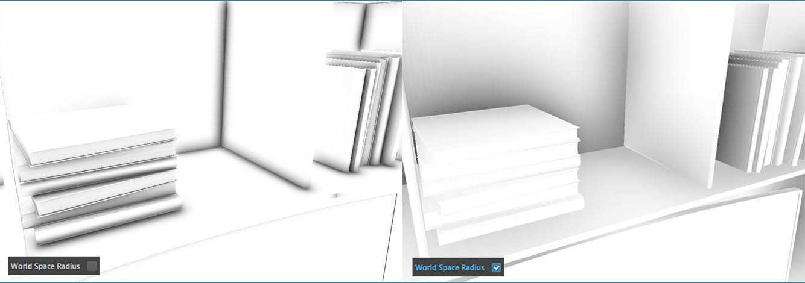
</dd>

<dt>Radius</dt>
<dd>The maximum size of the ambient occlusion shadow. Larger values produce larger shadows.</dd>

<dt>Intensity</dt>
<dd>The maximum opacity of the shadows. Larger values produce darker shadows.</dd>

<dt>Fall Off</dt>
<dd>The rate at which the shadows fade from maximum opacity to minimum opacity. Lower values produce a more sudden fade; larger values produce a smoother gradient spread over a greater percentage of the shadow radius.</dd>

<dt>Angle Bias</dt>
<dd>
**Angle Bias** prevents self occlusion in your scene.  In the following example, the self intersection issues are fixed by increasing Angle Bias to 0.2.

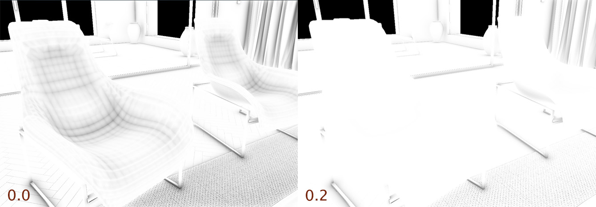
 </dd>

<dt>Reflection Occlusion Intensity</dt>
<dd> Controls the amount of baked data that is used where occlusion is high. Modify this value if the reflection is removing too much of the contact shadows in your scene.</dd>

<dt>Reflection Occlusion Falloff</dt>
<dd> Scales the contribution from the baked AO, offering more artistic control. Modify this value if the reflection is removing too much of the contact shadows in your scene. In the following example, Reflection Occlusion Falloff was increased, and AO vizualization mode is used to illustrate the results.

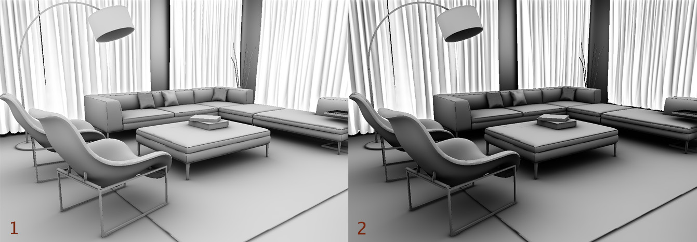
</dd>

<dt>Baked Diffuse Intensity</dt>
<dd> Controls the intensity of ambient data. Modify this value if you want more contribution to the diffuse lighting from your light baked AO.

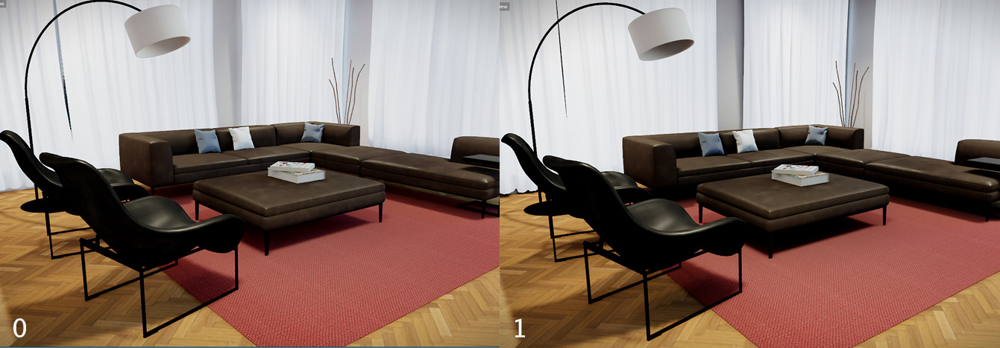
</dd>

<dt>Blur</dt>
<dd>Controls the amount of smoothing applied to the shadow. Lower values leave a sharper edge on the shadow, but can have a speckled or dithered appearance. Larger values produce smoother, more even results.</dd>

</dl>

## Screen Space Reflections

Screen space reflections are calculated for reflective materials in real time within each frame. This is a post-processing effect that bases the reflections on the depth of the objects rendered in the scene. For details on this technique and how it fits in with other techniques for making reflective surfaces, see ~{ Reflections }~.

<dl>
<dt>Enabled</dt>
<dd>Turns screen space reflections on and off.</dd>

<dt>Screen Edge Threshold</dt>
<dd>Controls the width of the screen area adjacent to the edge of the viewport in which the reflections are either faded out or bent.</dd>

<dt>Number of frames</dt>
<dd>Total number of frames to accumulate over time.</dd>

<dt>Samples per frame</dt>
<dd>Total number of samples per pixel for one frame, increasing this value will significantly impact performance.</dd>

</dl>

## Depth of Field

Depth of field simulates the behavior of a physical lens with a well-defined focal length. Objects within the focal region are rendered with crisp, sharp edges. Nearer objects and farther objects are both blurred.

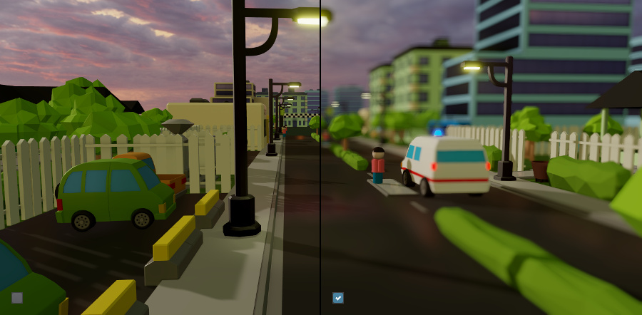

Depth of field can lend a cinematic quality to the rendered image, and can very effectively focus the viewer's attention on the part of the image that is in the zone of clarity.

You can set the focal distances for the effect using the properties in the shading environment as follows:

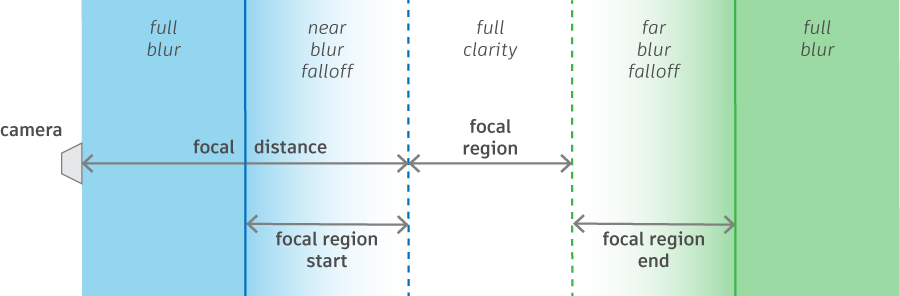

The Stingray Editor viewport also offers a visualization mode for the depth of field effect that can be helpful to use when tuning its distance settings. Activate it from the viewport overlay by selecting **Full Render > Post > Depth of Field**. Like the diagram above, objects colored blue are in the near blur area, objects colored green are in the far blur area, and objects rendered with their normal colors are in the clear center of the focal region.

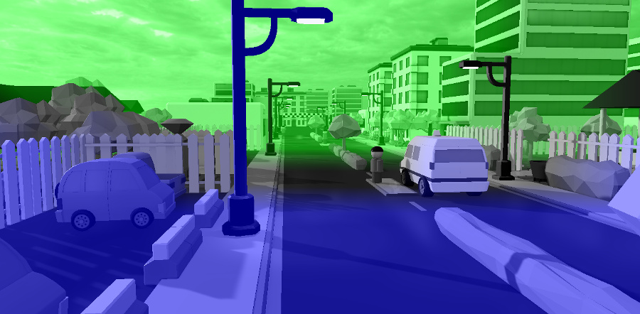

<dl>

<dt>Enabled</dt>
<dd>Turns the depth of field effect on and off.</dd>

<dt>Focal Distance</dt>
<dd>The distance from the camera at which objects start to be in perfect focus.</dd>

<dt>Focal Region</dt>
<dd>The distance that the area of full clarity extends past the focal distance.</dd>

<dt>Focal Region Start</dt>
<dd>The distance from the start of the focal region (i.e. the focus distance) to the point where the near blur reaches its full strength.</dd>

<dt>Focal Region End</dt>
<dd>The distance from the end of the focal region to the point where the far blur reaches its full strength.</dd>

<dt>Focal Near Scale</dt>
<dd>Adjusts the falloff for the near blur. Smaller values produce a smoother transition, making the amount of blurring increase more gradually over the distance set by the *focal region start* control. Larger values make the transition from clarity to blur happen more quickly and closer to the central focal region.</dd>

<dt>Focal Far Scale</dt>
<dd>Adjusts the falloff for the far blur. Smaller values produce a smoother transition, making the amount of blurring increase more gradually over the distance set by the *focal region end* control. Larger values make the transition from clarity to blur happen more quickly and closer to the central focal region.</dd>

</dl>

## Motion Blur

When the camera is moving, this effect causes the image to blur in the direction of the camera's movement. The blurring becomes more pronounced as the speed of the camera movement increases.

For example, in the following image, the camera is panning up and to the right, causing the scene to blur along the diagonal axis.

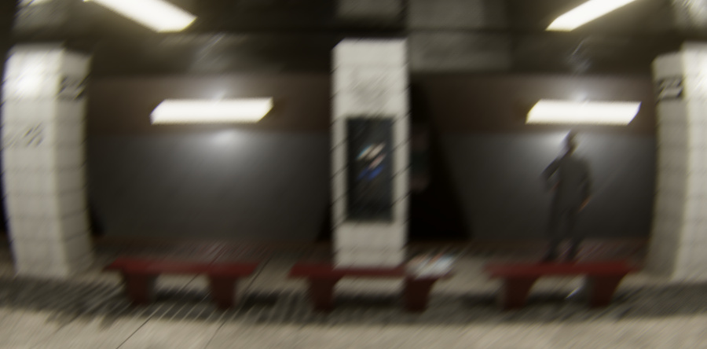

A small amount of motion blur can cause camera movement to appear smoother and more like a film camera. However, too much motion blur can be disorienting or jarring when the camera begins to move and when it stops moving, as the image snaps back to full clarity.

<dl>

<dt>Enabled</dt>
<dd>Turns the motion blur effect on and off. </dd>

<dt>Amount</dt>
<dd>Controls the intensity of the motion blur. Larger values produce more blurring.</dd>

</dl>

## Lens Quality

These settings simulate physical imperfections in a lens, increasing the perception that the viewport was captured by a real camera.

<dl>

<dt>Enabled</dt>
<dd>Turns the lens imperfection effects on and off.</dd>

<dt>Distortion</dt>
<dd>Simulates [pincushion and barrel distortion](https://en.wikipedia.org/wiki/Distortion_%28optics%29).

Positive values produce progressively more barrel or fisheye distortion, causing the center of the frame to appear more magnified than the edges. Straight lines appear to bow outwards toward the edge of the frame.

Negative values produce progressively more pincushion distortion, causing the center to appear less magnified than the edges. Straight lines appear to bow inwards toward the center of the frame.

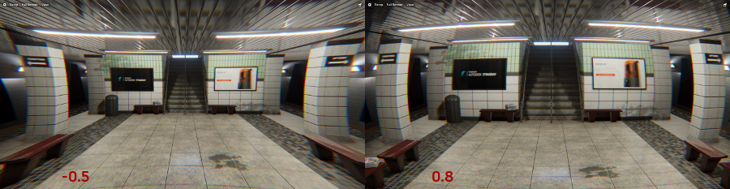
</dd>

<dt>Fringe Color</dt>
<dd>Shifts the colors of the [chromatic aberration](http://en.wikipedia.org/wiki/Chromatic_aberration) fringe, which simulates the inability of the lens to focus all colors of light with the same precision. This causes a vertical band of color to appear at the edges of objects.

Values closer to `0` make the fringes cyan and red. Values closer to `1` make the fringes purple and yellow.

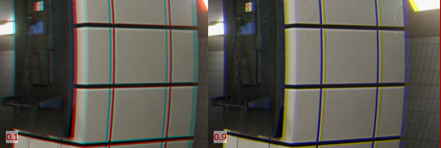
</dd>

<dt>Fringe Intensity</dt>
<dd>Controls how wide the chromatic fringes are.</dd>

</dl>

## Bloom

Bloom is a photographic effect that adds a glow around the edges of bright areas of the image. It makes the bright areas appear to bleed in to the surrounding parts of the image, increasing the apparent brightness of the lighter area.

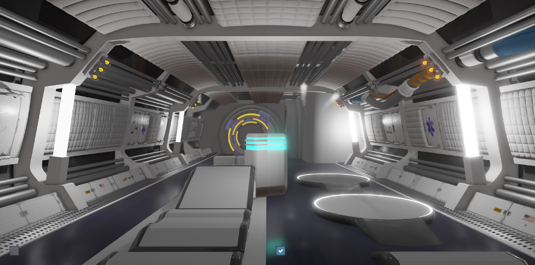

The Stingray Editor viewport also offers a visualization mode that can be helpful to use when tuning bloom settings. Activate it from the viewport overlay by selecting **Full Render > Post > Bloom**.

<dl>

<dt>Enabled</dt>
<dd>Turns bloom on and off.</dd>

<dt>Threshold</dt>
<dd>Controls how bright things in your scene need to be to trigger the bloom effect. Lower values trigger bloom more readily.</dd>

<dt>Offset</dt>
<dd>Controls how large each bloom effect will be. Lower values produce wider, bigger glow.</dd>

<dt>Falloff</dt>
<dd>Controls how long and how soft the falloff of the glow will be. Smaller values make the glow begin fading out closer to the maximum distance; this produces a brighter center that fades out more quickly. larger values make the glow begin fading out closer to the source; this produces a softer glow that fades out more gently.</dd>

<dt>Lens Dirt Map</dt>
<dd>Lets you apply a texture map to the camera lens that simulates dirt, grunge and scratches. Areas with bloom cause this texture map to become visible. You can use this effect to produce smudges, lens flares, water on the lens, and other similar artifacts.</dd>

<dt>Lens Dirt Amount</dt>
<dd>Controls the intensity of the dirt effect.</dd>

<dt>Tint</dt>
<dd>Adjusts the color tint and brightness of the bloom effect.</dd>

</dl>

## Vignette

The Vignette effect adds a grayscale overlay that darkens the corners of the viewport, simulating light falloff at the periphery of a camera lens. Subtle vignetting can effectively draw the viewer's attention to the center of the image.

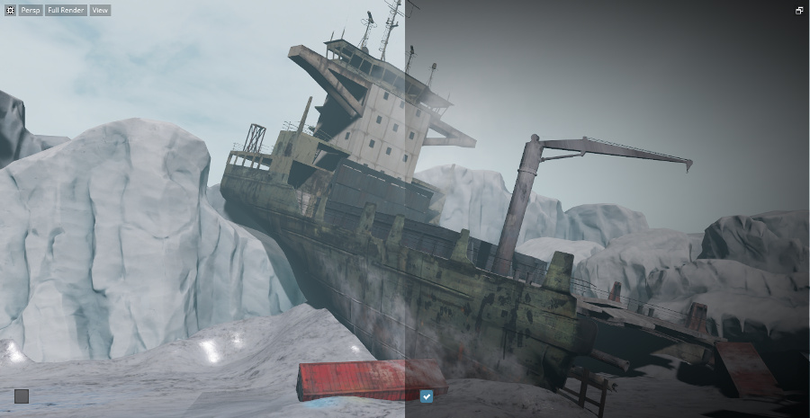

<dl>

<dt>Enabled</dt>
<dd>Turns the vignette effect on and off.</dd>

<dt>Radius</dt>
<dd>Controls the radius of the vignette overlay. Values closer to `0` make the effect extend farther into the center of the image; values closer to `1` produce minimal vignetting at the corners.</dd>

<dt>Falloff</dt>
<dd>Controls the rate of falloff in the middle of the vignette. Values closer to `0` produce a sharper edge between the opaque part of the overlay and the center of the image; values closer to `1` make a more gradual transition.</dd>

<dt>Opacity</dt>
<dd>Controls the transparency of the vignette overlay where it is darkest. At `0` the overlay is fully transparent and has no effect on the image; at `1` it is fully opaque until the point where the falloff begins.</dd>

</dl>

## Color Grading

Color grading changes the color space of the rendered images produced by the Stingray renderer. The effect is to adjust things like the colors, hue, saturation, and brightness of the game, based on a volume map texture that you provide.

For example, the following image boosts the contrast and shifts the colors toward blue.

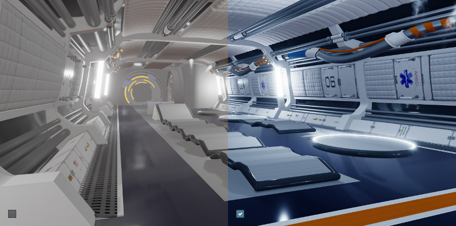

See also ~{ How to apply color grading to a level }~.

<dl>

<dt>Enabled</dt>
<dd>Turns the color adjustment on and off. </dd>

<dt>Color Grading Volume Map</dt>
<dd>Specifies a volume texture resource that defines the desired output color space.

The default texture, `core/stingray_renderer/environments/color_grading_identity`, causes output colors to be rendered as-is after color grading. You can adjust this default image in image processing software like Photoshop, import the modified image into your project as a new texture, and set this value to point to your new texture.

The texture has some specific format requirements. It should be saved as a volume map in `8.8.8.8 ARGB` format, without mip maps. In addition, you must open the texture resource in the Stingray ~{ Texture Manager }~ and disable any processing during compilation. See the tutorial under ~{ How to apply color grading to a level }~.
</dd>

</dl>

---
Related topics:
-	~{ Change shading environment properties }~
-	~{ Property Editor }~

---
