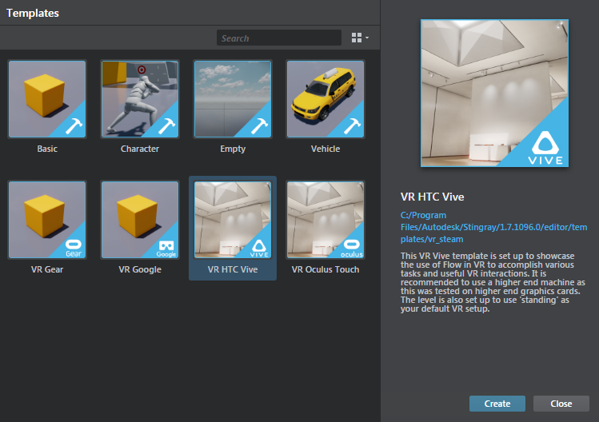

# Build VR experiences using Stingray

The Stingray Editor ships with a few sample projects to help you get started, including templates for HTC Vive, Oculus Rift and mobile VR devices. The best way to start a new VR project is to clone one of the VR templates instead of starting completely from scratch.

By default, template projects install in the following location: C:\Program Files\Autodesk\Singray\<version>\editor\templates.

You can also load templates from the **Templates** tab in the **Project Manager**.

In Stingray, you can build your desired behaviors and mechanisms using either Lua or the visual node-based Flow scripting language. The Oculus and Vive templates have an almost one-to-one Lua API, as well as a very similar set of flow nodes.

The VR templates come with premade functionality built in Flow for doing things like picking up objects, teleporting, playing sound effects, and setting up controller units. These Flow graphs are encapsulated in their own Unit objects.
