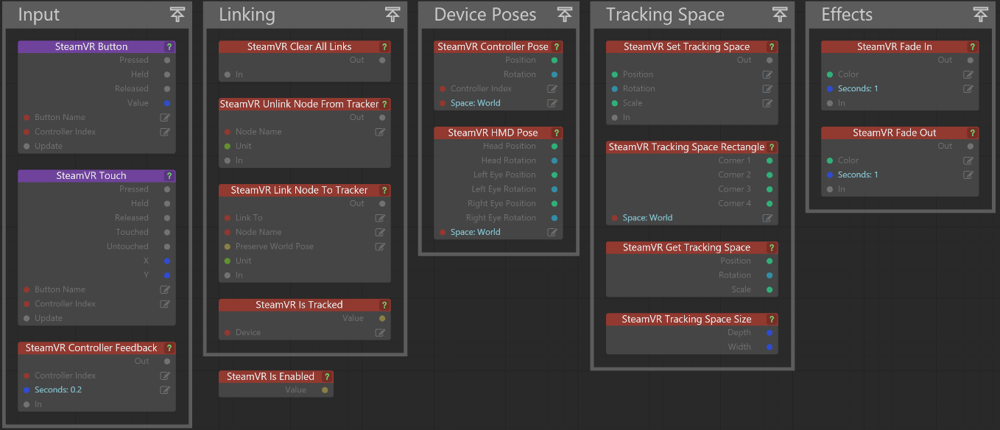
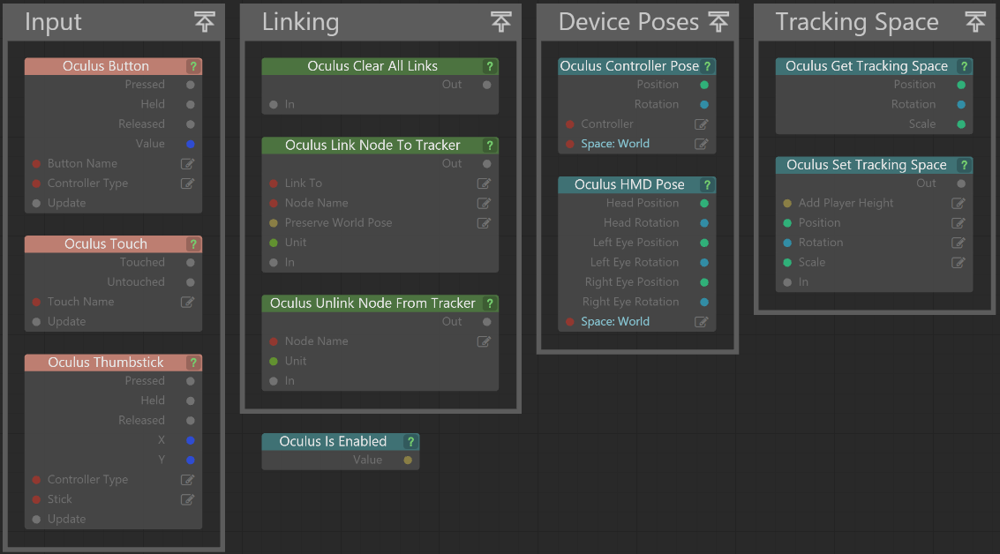

# VR Flow nodes

Although there are a few discrepancies between the Oculus nodes and the Vive nodes, most of the essential functionalities remain the same. These nodes, in conjunction with the other default Flow nodes, cover all of the functionality necessary to implement any behavior you want for either device.

## SteamVR Flow node

The following flow nodes are available in the Vive template:

# Occulus Flow nodes

The following flow nodes are available in the Occulus template:

## VR Flow node descriptions

- Input nodes: Used for Button presses, touch input, or haptic feedback
- Linking nodes: Used for attaching objects in your scene to the devices that are tracked by the VR system, like your controllers of HMD (Head Mounted Display)
- Device Poses nodes: Provide information about where your tracked deviced are located and how htey are orientated
- Tracking Space nodes: Used for mapping the real-world tracking space defined by yoru VR system into the virtual environment of your project
- Effect nodes: Let you create simple Fade In/Fade Out effects

   > **Note:** Effect nodes are only available in the Vive template.
