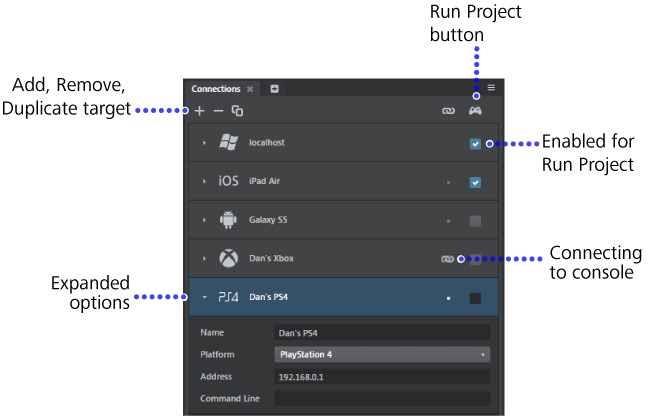

# Using the Connections panel

- **Window > Deploy and Connect > Connections**

You can use the **Connections** panel to configure remote devices as targets for the Stingray Editor. Once set up as a target, you can mirror the Stingray Editor viewport to the device or run your project on the device.

| To... ||
|---|---|
| Add a target platform | Click  in the toolbar, expand the new target and enter a name, platform type and IP address.  |
| Remove a target platform  | Select the platform and click  in the toolbar.  |
| Duplicate a target platform | Select the platform and click  in the toolbar.  |
| Launch a data compilation for a target platform  | Right-click the target and select **Compile Data** or **Compile and Bundle Data**.  |

## Common device settings

Each connection you configure requires the following settings:

<dl>
<dt>Name</dt>
<dd>A descriptive name for the target device. This name is used in the Stingray Editor and **External Console** to refer to the device.</dd>

<dt>Platform</dt>
<dd>Specifies the type of device represented by this connection.</dd>

<dt>Address</dt>
<dd>The IP address or network resource name of the target device. You **must** set this value to the correct address for your device, regardless of which platform you target.</dd>

<dt>Command Line</dt>
<dd>Any text that you enter in this control will be passed to the Stingray engine on the command line when the engine is launched on the target device. You can use this option to control certain aspects of the engine's operation.</dd>
<dd>For example, you could use the `--ini` setting to boot the engine from a different *settings.ini* file in order to test different configurations, or use the `--hold` option to make the engine pause on startup until a debugger attaches to the process.</dd>
<dd>For a list of all the parameters the engine accepts from the command line, see ~{ Stingray engine command-line reference }~.</dd>

</dl>

## Platform-specific settings

<dl>
<dt>Compile and install bundled game data on run project</dt>
<dd>For iOS and Android targets only. When this check box is selected, and you run your project on this device, your project data is saved on the device. The next time you start the Stingray engine app on the device, you can choose whether to wait for a connection from the Stingray Editor, or start up in an offline, standalone mode using the last set of project data saved to the device.</dd>
</dl>

>	**Note**: In order to connect to a remote device for mirroring or running your project, you also need to do some additional setup tasks specific to each platform, like installing software requirements. See the page for your device under ~{ Getting Started }~.

>	**Connecting to a remote PC is currently not supported.**

## Mirror the viewport

To make your device mirror the Stingray Editor viewport:

-   Click the dot below the link icon  in the **Connections** panel, or
-   Right-click in the **Level Viewport** and select **Connect to Device > *YourDeviceName***.

Orbit in the viewport to trigger a refresh. As you make changes or adjust your view in the Stingray Editor, you'll see the changes instantly on the device. Stingray sends the view from the editor camera to the device, letting you see how everything looks when rendered by the platform-specific renderer.

## Run the project

To run your project on the device in standalone mode:

1.  Select the check box for your target below the Run Project button  in the **Connections** panel. This marks the selected device as a run target.

2.  Click the Run Project button  at the top of the **Connections** panel.

## Connection status

When you initiate a connection to a remote device to either mirror the viewport or run the project, you can see the current status of the data transfer between your computer and the remote devices in the ~{ Log Console }~.

## Run multiple local project instances

You can set up the **Connections** panel to launch multiple instances of the engine when you run the project.

1.	Press  to add multiple new targets.

2.	Set each target to use the Windows platform, with IP address `127.0.0.1`. Make sure the **Run Project** box is checked for each target.

3.	Each target needs different command-line parameters. Two targets with the same name and same command line will only result in the engine launching once.

	You can read these parameters in your project's Lua script and change the gameplay behavior based on their values. See the `stingray.Application.argv()` function.

	For example, you could use `--server` and `--client` if you're testing a network setup. If you just want to open multiple windows without the parameters having any particular meaning, just add any strings as long as they're different for each target, like `--instance1` and `--instance2`.

	You can also have a look at the ~{ Stingray engine command-line reference }~ for a list of all the command-line parameters that the engine understands. Many of them won't be useful to include in the connection setup, but you could use parameters like `--editor-ini` to make the different engines load their settings from different *.ini* files.

While you have multiple instances of the project running, you may want to zero in on one particular instance when reading console output, sending Lua and console commands, debugging Lua, etc. The editor offers drop-down lists or filters that you can use to select the instance that you're interested in.
