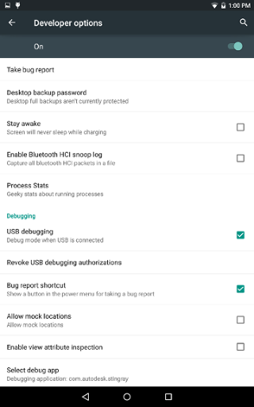
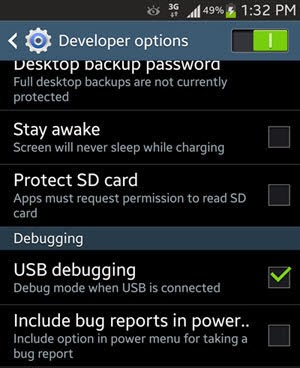

# Setting up remote connections for Android

To connect the Stingray Engine to an Android device:

1.	Make sure you have followed all the steps under ~{ Requirements for Android game development }~ in order to prepare your development environment.

2.	Plug your device in to a USB port on your Windows machine.

3.	Enable USB debugging on the Android device. This is typically found in the device's Settings, under **Developer options**. Two examples:

	 

	If you do not see the **Developer options** on your device, you may need to enable them. Find the Android **Build number** in the device's settings, and tap the build number seven times.

4.	In the Stingray Editor, use the **Connections** panel to set up a connection to the Android device, then mirror the Editor viewport or run your project.

	For details, see ~{ Using the Connections panel }~.

	>	**Note:** In the *Address* field of the **Connections** panel, you must enter the IP address of your An device. You should be able to find this in your device's settings.

When you connect the Stingray Editor to the Android device, the Stingray Editor automatically installs the engine on the device over the USB connection, runs the engine on the device, then sends your project data to the engine.

>	**Tip:** If you're unable to connect to your Android device, you may need to install ADB drivers specific to your device and try the procedure again.
