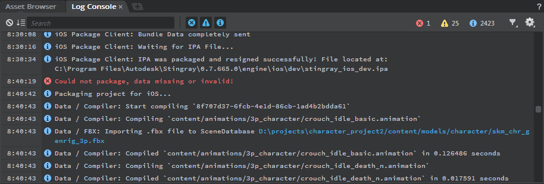

# Log Console

- **Window > Log Console**

Lets you view and filter the messages written to the Stingray log.

-	 indicates an error: a problem that prevented Stingray from doing something you asked.
-	 indicates a warning. Warnings indicate that there may be a problem with a resource or operation, but that Stingray was able to work around it.
-	 indicates an information message: feedback to let you know that something occurred in the engine.

-	To clear the log, click the  icon.
-	To show only messages that match a keyword or search phrase, enter some text (case insensitive) in the *Search* box.

## Filter by message type

You have two ways to filter messages by type:

-	 Use the blue icons to toggle which kinds of messages are shown in the console.
-	 Use the colored icons at the top right to "solo" a particular message type. While one of these icons is selected, only messages of that type are shown. Click the icon again to return to your regular filter setting.

## Filter by subsystem

Every time the **Log Console** receives a message from an instance of the engine, it records the name of the component or subsystem that sent that message. You can toggle the display of all log messages based on the subsystems that originated them. For example, you might want to hide all messages from a particular subsystem like the data compiler, or you might want to hide messages from other subsystems so that you can zero in on a particular subsystem.

-	Click the Filter icon  to see the list of all components that have sent messages to the log. Check or uncheck the box that corresponds to each component in order to show or hide all messages that originated from that component.

## Control scrolling

By default, the **Log Console** scrolls automatically so that the newest messages are always visible at the bottom of the panel.

-	When the auto-scrolling mode is activated, the  icon is highlighted.
-	If you scroll the **Log Console** manually, the auto-scrolling mode is automatically disabled, and the  icon loses its highlight.
-	To resume auto-scrolling, click the  icon or scroll manually all the way to the bottom.

## Open the log folder

The log messages you see in the **Log Console** are also written to files on disk within your Windows user directory. You can open the folder that contains these log files from the **Log Console**.

-	Click the Options icon , and select **Open Log Folder**.

---
Related topics:
-	~{ Status bar }~

---
