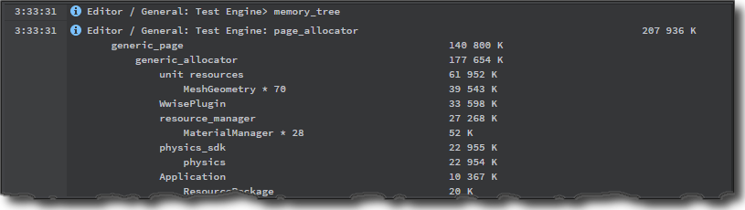
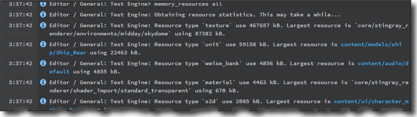
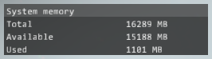
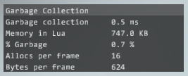

# Optimize memory usage

Your game needs to load your project's resources into memory in order to render them or work with the data they contain. And every device that can run your game has a hard limit on the amount of memory it makes available. This implies a limit on both the quantity and size of the resources the game can load at any given time. Needless to say, these limits are especially low on mobile devices. However, even on 64-bit PCs and consoles, memory becomes increasingly precious as the scope of your game project increases.

It is critical to ensure that your game never runs out of memory. If your game needs more memory that it can get from the operating system, it is likely to crash immediately and be terminated by the operating system before the engine even has a chance to respond.

Rather than ignore memory usage until your game gets so heavy that it crashes, a more proactive approach establishes budgets and best practices from the beginning of the project, and monitors the actual usage throughout the development cycle. This avoids panic in the final stages before release.

This page presents some tips and techniques for reducing the amount of memory your game needs. These fall into three main categories:

-	Loading only the resources you need, only at the time you need them.
-	Reducing the size in memory of individual assets or groups of assets, typically by trading off some quality.
-	Disabling or minimizing subsystems that you don't intend to use in your game.

## Set budgets or quotas

Before you begin optimizing and minimizing memory usage, it's helpful to have a clear idea of the targets you're trying to reach.

Your overall budget will depend on the specs for the hardware devices that you want to support. From this, you have to subtract the memory used by the operating system. Then, subtract a large percentage to account for memory space used by other apps -- you cannot simply assume that your game is the only app running on the device. Finally, shave off an extra percentage to give yourself the comfort of some extra "headroom". Depending on how safe you want to be from unpredictable crashes, your overall target might be a quarter of the available device memory, or even less.

Once you have an idea of the overall budget for the game as a whole, you may also find it useful to divide the total into smaller budgets for different subsystems or different kinds of resources, such as textures, audio, meshes. The numbers here are likely to vary depending on the kind of game you intend to develop. For example, if the aesthetic of your game involves intentionally low-poly art but complex music and audio cues, you may need to assign a larger budget to your audio resources as a percentage of the overall budget than you do for games that are heavy on visuals. These budgets do not need to be absolute rules and may be subject to negotiation over the course of your project, but if you have multiple team members working on different areas of the project, setting some rough expectations up front can help the teams collaborate more smoothly.

## Monitor runtime usage

If you don't have clear data about the real memory usage of your game at runtime, you won't be able to identify where the problems are that you need to solve. Without data, you can easily spend time and effort in the wrong places: for example, aggressively reducing your texture quality even though your problems are really caused by enormous, highly detailed models.

It's also essential to evaluate the memory used in the game at runtime, because the size in memory of a resource is often very different from the size of the resource on disk. For example, image textures in your project folder will often be stored on disk in a compressed *.png* format that can make the files tiny on disk. However, in runtime memory the texture data are uncompressed and take up much more space than you might expect from their file size.

There are several console commands you can use to get information about the memory usage in your game:

-	`memory_tree`: Prints to the ~{ Log Console }~ a hierarchical tree of all memory allocated by different sub-systems within your game.

	

-	`memory_resources`: Prints to the ~{ Log Console }~ a list of the memory taken up by the resources loaded into your game, organized by type.

	

-	The `perfhud` command offers two modes for accessing useful memory statistics:

	-	`perfhud memory`: A simple comparison of the total, available, and used system memory.

		

	-	`perfhud lua`: Shows the memory used by the Lua environment, including the percentage used by the built-in garbage collection system. See the [Optimize Lua environment and scripts] section below.

		

	You can also show these visualizations in the Stingray Editor viewport. Click the **View** overlay on the viewport, and select **performance hud** from the contextual menu.

For details on sending commands from the Stingray Editor to a running game, see ~{ Send Commands from the Status Bar }~. For more detail about the commands themselves, see ~{ Console commands }~.

## Remove unused resources, or disable auto-loading

By default, the Stingray template projects are set up with a boot package that loads **all** resources in the project into memory when the game starts. If your game crashes on startup, particularly when testing on mobile devices with low available memory, the most likely cause is that the boot package is trying to load in too many resources. Often, game projects end up with lots of clutter: old, unused resources that aren't actually needed at all, but still take up space in memory.

If your project is still using the default boot package from a template, a quick way to reduce your runtime memory usage is to simply delete from your project folder any extra resources that you're not using in the game.

Alternatively, you can remove the auto-load line from the top of the boot package:

~~~{sjson}
// WILL AUTOLOAD ALL CONTENT AND SCRIPTS. PLEASE REMOVE TO CONTROL CONTENT LOADING
* = ["*"]
~~~

and identify in the boot package only the specific resources that you want your game to load. See also ~{ About the boot package }~ and ~{ Defining resource packages }~.

## Use resource packages

The most powerful and flexible option that you have for controlling your game's memory usage is to divide your project's resources into multiple separate packages, and to stream these packages in and out of memory dynamically during the game when they are needed.

Any project that needs different sets of resources at different times can usually benefit from this approach. For example, if your game has multiple levels, you could create a separate resource package for the assets used in each level. That way, each level can take up the full memory budget for the game without having to share the available memory with other levels. Even if you only have a single level, you might be able to use resource packages for different isolated parts of the level, or for different characters.

For more detail on how to set up this kind of system, see the topics under ~{ Loading and unloading content at runtime }~.

Note that even if you decide to set up a custom system for streaming resource packages in and out of memory, you can still benefit from applying the other techniques listed below for optimizing the individual resources that you do load.

## Optimize textures

Textures are usually by far the largest memory consumers for most games. Of course, they are also a large part of the visual appeal of the game. Therefore, finding a good balance between visual quality and memory size can be tricky. This is especially true if you need to support multiple different platforms with very different screen sizes and available memory. On a device with a large screen, you might need to put more of a priority on image quality. By contrast, on a smaller screen, you can use lower quality or smaller textures without a noticeable difference in the rendering quality.

The following sections provide some tips to help you achieve the best balance of memory and quality for your project.

### Reduce texture sizes

The first step in optimizing your textures is to start with an appropriate image size. If you make every texture in your game 4096x4096 pixels, you will quickly run out of memory on any system.

There is no hard and fast rule about what sizes your textures should be. Ultimately you make this decision depending on:

-	The maximum amount of screen space that the texture will take up when rendered in game. This will in turn depend on the size of the model that the texture is applied to, and on how close the camera will get to the model. For example, a mountain may be large, but if it remains far in the distance you can still use smaller textures for it without noticing a difference. Similarly, a small object like a newspaper or book may need larger textures if the player is able or encouraged to inspect it closely.

-	The visual quality or fidelity that you need to have for the object. For example, you might consider that some blocky artifacts are acceptable for parts of the level that the player will only see for a short time, or where the player will likely be focusing elsewhere due to the gameplay.

You can also experiment with using different sizes for the different texture maps that you assign to each material. For example, you can often use smaller images for roughness maps and metallic maps than for color maps and normal maps without losing much apparent quality in the way a material appears when rendered.

Note that for streaming compressed textures, the pixel sizes need to be multiples of 4.

### Use per-platform compilation settings

You can use the Stingray **Texture Manager** to control the way Stingray compiles your textures for each different target platform.

-	The most important setting to adjust is the **Output Format**, which defines the kind of compression that is applied to your texture.

	By applying a compression algorithm like PVR for iOS, or DXT5 for other platforms, you can often lower the in-game memory consumption of your textures dramatically at the cost of introducing some compression artifacts into the images.

	Note that the errors and artifacts introduced by the texture compression are usually least apparent for textures that contain straightforward color maps. However, you may want to avoid compressing normal maps, since the compression tends to introduce very obvious irregularities into the surface.

-	You may also want to **discard the largest mip map steps** for different platforms. For example, if you have a texture that is 1024x1024 pixels, but you want that texture to be limited to 256x256 on iOS only, you can set the **Texture Manager** to discard the largest two mip map steps only when compiling to iOS. This will remove the 1024x1024 and 512x512 resolutions of the image in the iOS data, effectively acting as if it were originally a 256x256 pixel image, but will leave it at its full resolution for other platforms.

	Note that mip maps are particularly costly for volume maps or cube maps, since the memory required is multiplied by the six sides of the cube. Therefore, if you bake reflection probes for your level, you may want to remove some or all of the mip map steps in the generated textures.

For details on using the **Texture Manager**, see also the topics under ~{ Working with Textures }~.

### Take advantage of texture streaming

By default, Stingray treats textures like any other resource. It loads them into memory along with all the other resources in a resource package, keeps them in memory persistently, and unloads them only when you unload the resource package. This means that all the mip levels for each texture are taking up memory in your game even when those mip levels are not actually being used due to the texture being off-screen or very distant.

Instead, you can set up Stingray to stream texture data into memory only when that data is actually needed for rendering. With texture streaming, you can increase the number of textures you use in your game without increasing memory usage, and without decreasing the maximum resolution of those textures.

For details on how this system works, see ~{ Texture streaming }~.

### Or, reduce texture streaming memory

The engine reserves 16 MB of memory at startup for use by the texture streaming system. If you choose not to use texture streaming in your game, you can avoid allocating this memory by setting the value of the `streaming_buffer_size` key to `0` in your project's *settings.ini* file for each of your target platforms. See ~{ Stingray engine settings.ini file reference }~.

### Reduce lightmap texture size

When you bake the lighting for a level, you generate additional textures that your game needs to load. Although baking typically achieves higher quality rendering with lower CPU and GPU usage, this always comes at the cost of higher runtime memory requirements.

Try using only dynamic lighting in conjunction with the global diffuse map provided by the shading environment. Doing this will let you eliminate the lightmap textures altogether. Or, you can restrict light baking to only some important objects in the scene, and leave others to use the global baked diffuse lighting. See ~{ Global environment lighting }~.

If you must bake lightmaps in order to get the look you want, but you still need to lower the memory consumption of the textures, you can lower the *lightmap resolution* setting in the **Light Baking** dialog. This will make the generated textures smaller in size. See ~{ About baking with the Stingray baker }~.

After this step, you can control the texture compression and mip map generation settings for your lightmaps in the **Texture Manager** just like any other texture resources in your project. See [Optimize textures] above.

## Optimize models

The more vertices and data channels in each model asset that you add to your project, the more memory it will take to load that mesh into the game. You may be able to save some memory by optimizing your meshes in your modeling tool (i.e. 3ds Max or Maya) to reduce their vertex count and to remove any channels that aren't needed in the game (for example, extra UV sets).

There are no strict rules about what vertex counts you should aim for. Like with texture size, you have to balance memory requirements against the visual quality of the model when rendering in game, which depends on the size of the model, its distance from the camera, and its importance to the gameplay or the scene. Remember that you may be able to treat some models like movie set dressing: if the player will never see the back of a particular building or object, it can be a flat plane with minimal vertices.

Unless your mesh sizes are really excessive to start with, you probably will not see as dramatic a difference in memory consumption as you do when optimizing textures. However, the more different meshes you have in the game at the same time, the more your small optimizations will add up.

## Optimize audio

After textures and meshes, the type of resource that typically uses the most memory in your game is audio files.

As with textures and meshes described above, you can reduce memory requirements by trading off sound quality. However, there are many other complementary techniques that you can use in addition, such as streaming audio direct from disk, and tuning the size of the memory pools allocated internally by the Wwise engine.

For a complete discussion, see ~{ Optimize audio memory usage }~.

## Optimize physics

The main memory optimization you can make in the physics subsystem is to avoid creating actors and movers for any units that don't require them. Whenever you spawn a unit, some additional space is reserved in memory for its actors and movers.

-	Only create actors for units that represent physical objects that need to be considered by collision detection.

-	Only create movers for units that represent controllable characters or objects.

-	If you don't need to use physics in your game at all, you can save memory by disabling it when the Stingray world. To do this, pass `stingray.Application.DISABLE_PHYSICS` in the call to `stingray.Application.new_world()` that creates the world. If you are using the Appkit, this is done in the *core/appkit/lua/simple_project.lua* file.

## Compress animation clips

When you select an animation clip in the ~{ Asset Browser }~, the ~{ Property Editor }~ offers a set of compression settings that you can apply to that clip when it is compiled. Enabling these compression settings can save you some memory at runtime, at the cost of slight inaccuracies introduced into the animation curves.

You can fine-tune the compression settings for each clip by enabling and disabling compression on the position, rotation and/or scale curves individually, and by adjusting a tolerance value that controls the balance between how aggressively the data is compressed and how large the allowable errors are.

For more details, see also ~{ Animation clip properties }~, ~{ Animation compression }~ and ~{ Animation optimization }~.

## Optimize Lua environment and scripts

To keep the memory used by the Lua environment down:

-	Avoid creating large numbers of full userdata objects, like `stingray.Raycast`.

-	If you save temporary objects like `Vector3` and `Quaternion` across frames during the game using "box" objects like `Vector3Box` and `QuaternionBox`, try to create the boxes in a reusable pool at initialization time in order to avoid repeatedly creating new instances on the heap during the game. See also ~{ Object lifetimes and userdata binding }~.

-	Use the typical best practices for coding in Lua to avoid placing too much strain on the built-in garbage collection system. For example, avoid concatenating strings together in loops; instead, insert the string fragments into a table and concatenate it once.

-	If you are comfortable configuring the Lua environment's garbage collection settings, you can do so using the functions offered by the `stingray.Script` object.

See also [this blog post](http://bitsquid.blogspot.com/2011/08/fixing-memory-issues-in-lua.html?_sm_au_=iVV0tf531VtrP5n5) on Lua memory issues.

## Check for leaks in level design and gameplay

If a level is still taking up too much memory after you've gone through the options above for reducing the memory consumed by the various resource types and sub-systems in your game, check thoroughly to make sure that your level isn't consuming memory unnecessarily or without your knowledge.

-	Don't spawn huge numbers of units at runtime in Flow or Lua without unspawning them afterward. Extra instances of a unit don't take up much extra space in memory, so you can spawn them pretty freely. However, if you spawn thousands of them -- for example, projectiles like bullets or arrows -- they will increase memory usage, especially if they have physics actors.

-	Check for units that will never be seen, hiding under the ground or inside other meshes. Remove them from the level and from your resource packages if you can.
