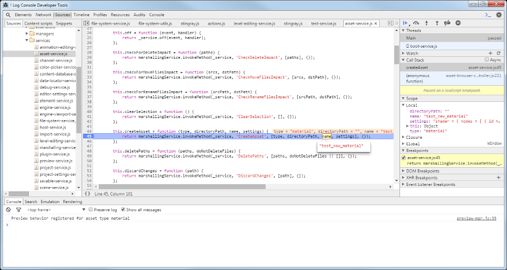

# Tips for developing plug-ins

Developing a custom plug-in that integrates with the editor's JavaScript environment can be a tricky task. This page provides some tips and background information that may help you get started.

## Reloading

When you make changes to your plug-in, you don't need to shut down and restart your editor. You don't even have to go to the **Plugin Manager** to unload and reload your plug-in.

-	If you've changed your *.plugin* file, you can make the editor reload it by pressing **F5**. This recompiles your project resources, and refreshes all currently loaded plug-ins from their configuration files.

-	If your plug-in adds any JavaScript to the editor environment, you may also need to refresh the editor's HTML front-end. Press **Alt+F3**.

## Debugging and using the Developer Tools

The Stingray editor's front-end HTML5 environment runs in the Chromium Embedded Framework (CEF). This means that you have access to the Chrome Developer Tools panel, which offers many essential development resources. You can use the DevTools to place breakpoints and debug your JavaScript code, explore the HTML of your panels, run JavaScript commands in a console, etc.

To launch the DevTools, press **Ctrl+F12**.

Each Stingray editor window gets its own instance of the DevTools. If you want to zero in on a particular panel, you can undock that panel into its own floating window and press **Ctrl+F12** while that window has focus.

For details on all the capabilities of the DevTools, see its home page on [the Google developer site](https://developers.google.com/web/tools/chrome-devtools/).

## Asynchronous JavaScript

Most of the editor's JavaScript architecture is built around the principle of *asynchronous* interactions.

When you call a function in an editor service, you can't depend on that call to be finished when the next line of your JavaScript code is run. Instead, services typically return `Promise` objects, which *resolve* at some point in the future after they are invoked. Typically, if a JavaScript service needs to interact with the C# backend, it will only resolve the promise and produce an actual value when its interaction with the backend is complete.

Think of a promise as a guarantee that what you've asked for will be done eventually, at some unspecified point in the future. If you need to rely on the real values produced by those instructions, you need to call the promise's `then()` function, and give it some extra work to carry out when its original instructions are done. For example:

~~~{js}
// This won't print the expected value, since the promise returned by getCurrentProjectPath()
// has not resolved yet when the value is logged:
var project_path = projectService.getCurrentProjectPath();
console.info(project_path);

// Instead, we use then() to hook up new functions that will be called when the promise is finished:
projectService.getCurrentProjectPath().then(
	function( project_path ) { console.info(project_path) },
	function( error_message ) { console.error(error_message) }
);
~~~

Anytime a function returns a `Promise` (like `getCurrentProjectPath()` in the example above), you can call `then()` on the returned promise in order to delay a block of code until the work represented by that promise has been finished. The `then()` function takes two parameters, each of which is a callback function:

-	the first callback function gets run if the original promise is resolved successfully. This function often gets passed a parameter by the original function when it resolves the promise, like the `project_path` in the example above.

-	the second callback function gets run if the original promise is "rejected" -- if an error occured and it can't resolve successfully. This function is usually passed a string that describes the error.

If you return a value from these callbacks, that value becomes the return value of the `then()` call. This means that you can chain multiple `then()` calls together in order to create longer sequences. You could make use of this in order to transform a value multiple times, or to carry out multiple asychronous calls in a definite order. You can also nest `then()` calls within the resolution of other `then()` calls.

For more information about promises in JavaScript, see [this page](https://developer.mozilla.org/en/docs/Web/JavaScript/Reference/Global_Objects/Promise) on the Mozilla Developer Network.

## Defining and requiring modules

The editor's front-end is a highly complex system that needs to integrate a huge number of JavaScript modules together into a coherently functioning whole. We use `require.js` as a way to keep all these modules organized, and to give our modules and code blocks a structured way to "include" other modules that they depend on.

This has some important consequences on your plug-ins. For example, in order to gain access to any of the services or other modules provided by the Stingray editor, you have to use either the `require()` function or the `define()` function provided by `require.js`.

For code examples that show how this works, see the page about how to ~{ Use built-in editor services }~.

For more in-depth information, you can also see <http://requirejs.org/>

---
Tags:
-	plugin
-	plug-in
---
