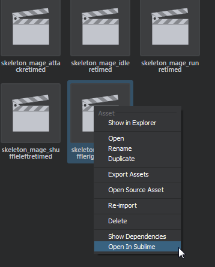
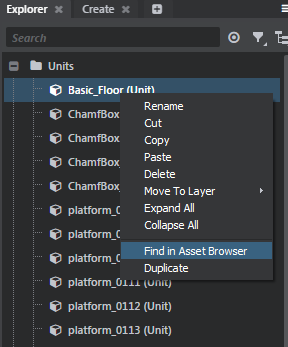
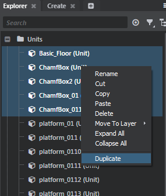

# Contextual actions
Contextual action encapsulate an action sequence that are made available in right-click contextual menu (ex: right click on a Stingray asset, right click on a Level object). Contextual actions can be specified with multiple predicates to decide if they should be available for a specific context (ex: should only display this action for units or lights).

## Contextual action format

You can specify a contextual actions block in a plugin descriptor file:

```lua
contextual_actions = [
	// Multiple contextual actions can be specified for a single plugin.
    {
        type = "asset"
        label = "Open In Sublime"

        when = {
            extension = "*"
        }

        do = [
            {
                type = "process"
                path = "\"C:\\Program Files\\Sublime Text 3\\sublime_text.exe\" \"$project\\$1\""
            }
        ]
    }
]
```
`type`

> Action type. **Required**. Currently can be: **asset**, **level_object**. But a user could defined its own type. The action type act as a global predicate for a contextual action. As an example the asset browser checks for all contextual actions of type "asset" and then run their custom predicates to find the right mix of actions to populate the right click contextual menu. The Scene Explorer, looks for all "level_object" actions in the same manner.

`label`
> User defined pretty label. **Required**. This is the unique name of the action as well as its presentation label used in the Context menu.


`when`

> Predicate(s). **Optional**. Contextual predicates. Can vary depending on the type of the contextual actions. The predicates are describe below.

`do`

> Action sequence. **Required**. A list of action to run if the contextual action is executed. Each of these action will be passed the "context" on which to operate (ex: asset path, levelo objectdescriptor). Check action extension to see how to define new action.


### Single Asset Predicates
There are a few ways of defining predicates for a **single selected asset** contextual actions. The more important is the extension field.

Extension can be an array of asset file extension (or a single extension string):

```lua
{
    label = "Open in Paint"
    type = "asset"

    when = {
    	// Matches both types of image file
        extension = [
            "png"
            "jpg"
        ]
    }

    do = [
        {
            type = "process"
            path = "\"C:\\Program Files\\paint.net\\PaintDotNet.exe\" \"$project\\$1\""
        }
    ]
}
```

Or a wildcard (*):

```lua
{
    type = "asset"
    label = "Open In Sublime"

    when = {
        // Matches any asset type
        extension = "*"
    }

    do = [
        {
            type = "process"
            path = "\"C:\\Program Files\\Sublime Text 3\\sublime_text.exe\" \"$project\\$1\""
        }
    ]
}
```



Alternatively, for more involved predicate (some that requires actual processing) you can use the "predicate" key which needs to map on an action:

```lua
// In tests-actions.plugin
{
    label = "Checkout"
    type = "asset"

    when = {
        extension = "*"
        predicate = {
            type = "js"
            module = "module-actions"
            function_name = "isReadOnly"
        }
    }

    do = [
        {
            type = "js"
            module = "module-actions"
            function_name = "checkout"
        }
    ]
}
```

```javascript
// In module-actions.js

define(['common/file-system-utils', 'services/file-system-service', 'services/project-service'], function (fileUtils, fileSystemService, assetService, projectService) {

    return {
        // First paramaters to an asset predicate is the **relative** path to the asset (effectively the
        // asset resource name and its extension). Ex: content/models/character.unit
        isReadOnly: function (assetRelativePath) {

            // The api for predicate invocation is Promise based (thus asynchronous). The final Promise must returns something
            // "truthty" for the contextual actions to be populated in the contextual menu.
        	return projectService.relativePathToAbsolute(assetRelativePath).then(function (absPath) {
            	return fileSystemService.isReadOnly(absPath);
            });
        },
    }
});
```

#### Asset multi-selection
If you want to register an action that can handle multi-selection of assets, the workflow is similar except no extension needs to be specfied. Also, when the user triggers the action sequence associated to a contextual action all the selected assets are passed as parameters.

```lua
// Example in tests-actions.plugin
{
    type = "asset"
    label = "Duplicate"

	// Note that this action works both for single asset and multi selection of assets
    when = {
        extension = "*"
    }

	// mutli_select is a predicate.
    when_multi_select = {
    	// This is a nice trick when_multi_select should always be true: invoke an inplace script returning true.
        type = "js"
        script = "true"
    }

    do = [
        {
            type = "js"
            module = "module-actions"
            function_name = "duplicateAssets"
        }
    ]
}
```

```javascript
// In module-actions.js
define(['common/file-system-utils', 'services/file-system-service', 'services/project-service'], function (fileUtils, fileSystemService, assetService, projectService) {

    return {
        // Since this action can be invoked both for  single and multi selection, we need to check if its param is an array or not.
        duplicateAssets: function (assets) {
			if (!_.isArray(assets)) {
                assets = [assets];
            }

			// Note that each elements in the assets array is a relative asset path.
			_.each(assets, function (assetRelativePath) {
            	// Do something to duplicate an asset
            });
        },
    }
});
```

### Single level objects predicates
Predicate specification for level objects are really similar to asset. The global catchall predicate checks for the **category** of level objects being selected (ex: "unit")

```lua
// From asset-browser.plugin
contextual_actions = [
    {
        type = "level_object"
        label = "Find in Asset Browser"

        // Context specific for asset types
        when = {
                category = "unit"
        }

        do = [
            {
                type = "js"
                module = "asset-browser-actions"
                function_name = "findLevelUnitInAssetBrowser"
            }
        ]
    }
]
```

The list of supported category is built dynamically according to the object filters in the folder **core/editor_slave/resources/filters**. By default the categories available are:
- camera
- entity
- group
- level_reference
- light
- marker
- note
- particle_effect
- prototype
- scatter_pool_settings
- sound
- spline
- story
- trigger
- volume
- NOTE: a category key specified with a "*" will match any categories.

Note that you can also specify multiple categories:

```lua
{
    type = "level_object"
    label = "Reset position"

    when = {
        category = ["unit", "light"]
    }

    do = [
        {
            type = "js"
            module = "asset-browser-actions"
            function_name = "setPosToZero"
        }
    ]
}
```



You can write a custom predicate similar to what can be done with an asset:

```lua
// In test-actions.plugin
{
    type = "level_object"
    label = "Close door"

    // Context specific for asset types
    when = {
        category = "unit"
        predicate = {
        	type = "js"
            module = "module-actions"
            function_name = "isDoor"
        }
    }

    do = [
        {
            type = "js"
            module = "module-actions"
            function_name = "closeDoor"
        }
    ]
}
```

```javascript
// In module-actions.js
isDoor: function (levelObjectTreeNode) {
    // If the unit resource corresponding to the level object is a door allow the user to close it.
    return levelObjectTreeNode.dataContext.Type &&
        levelObjectTreeNode.dataContext.Type.startsWith('model/content/door_');
}
```

#### Level objects multi-selection

If you want to register an action that can handle multi-selection of level objects the workflow is similar except no category needs to be specified. Your predicate (and the triggered action sequence) will be called with the list of selected level objects.

```lua
{
    type = "level_object"
    label = "Duplicate Objects"

	// Works both for single level object selection and for multi selection.
    when = {
        category = "*"
    }

    when_multi_select = {
        type = "js"
        script = "true"
    }

    do = [
        {
            type = "js"
            module = "module-actions"
            function_name = "duplicateLevelObjects"
        }
    ]
}
```

```javascript
// from module-actions.js
duplicateLevelObjects: function (levelObjects) {
	if (!_.isArray(levelObjects)) {
    	levelObjects = [levelObjects];
    }

    _.each(levelObjects, function (levelObject) {
    	// dataContext corresponds to the level object Backend Remote Object. Id is the Level Obejct unique id in the level.
    	levelEditingService.duplicate(levelObject.dataContext.Id);
    });
}
```


