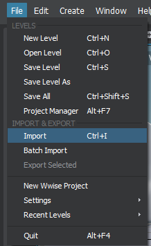

# Create a new importer
With version 1.6 of Stingray it is now possible to write custom importer. This will allow client to drag and drop (or to use the import menu) any file type (ex: .obj, .ttc) and convert those files to Stingray assets (.texture, .bsi).

All the different ways to import files in Stingray:

Drag and drop:


Import button in Asset browser:


File / Import menu:


## Importer format

core/plugins/asset_browser/asset-browser.plugin defines different importers:

```lua
imports = [
    {
        types = ["fbx", "bsi"]
        label = "Scenes"
        regroup = true
        priority = 1 // Low priority because there is a dialog involved.
        options = {
            types = ["types/material_import_options", "types/scene_import_options"]
            validate = {
                type = "js"
                module = "asset-browser-actions"
                function_name = "validateSceneImportSettings"
            }
        }
        do = "import-fbx"
    }

    {
        types = ["dds", "tga", "png", "jpg", "jpeg", "tif", "tiff"]
        label = "Textures"
        regroup = true
        do = "import-core-assets"
    }

    {
        types = ["srz", "zip"]
        label = "Packages"
        regroup = true

        do = [
            {
                type = "js"
                module = "asset-browser-actions"
                function_name = "importPackages"
            }
        ]
    }
]
```

`types`
> List of file extensions supported for import. **Required**.

`label`
> Name group of files supported for import. **Required**. This is displayed in the file selector whe using the File import menu or the Asset browser Import button. Not that all the importer supported by Stingray are available in the Import File Selector.


`regroup`
> boolean. **Optiona**

`do`
> lklk

`priority`
> ollklk

`options`
> lklk

## Fbx Use case

### Extend Fbx import

## Font importation

## Using the Generic import dialog

## Mesh importer


---
Tags:
-	plugin
-	plug-in
---
