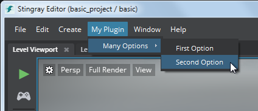
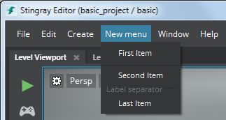

# Create a new menu item

You can use the `menus` extension to add new items into the main menus of the Stingray editor.

Each custom menu item can either launch an HTML panel, or carry out an *action* that you define in your plug-in. For background about actions, see also ~{ Register an action }~.

## Basic configuration

Every menu extension accepts the following configuration parameters.

~~~{sjson}
extensions = {
	menus = [
		{
		    path = "Window/Custom Editor"
			shortcut = "Ctrl+F8"
			order = 200

			// ... add other parameters here
		}
	]
}
~~~

`path`

>	Determines where your menu item appears in the main menu. Required.

`shortcut`

>	A key sequence that causes the menu item to be invoked. Optional.

`order`

>	A number that indicates the placement or ordering of this item relative to the other items in the same menu. Lower numbers place the item closer to the top of the menu; higher numbers move it toward the bottom. Optional. If omitted, `0` is used, which puts the new item at the top of the menu.

## Open a panel

To make a menu item that opens a new panel, set up your menu extension as follows.

You will also need to accompany your plug-in with an *.html* file and a *.js* file that have the same name as the `panel` setting. The *.html* file provides the content for the new panel, and the *.js* file is automatically loaded in order to set up any resources or services that may be required by the *.html* page.

~~~{sjson}
extensions = {
	menus = [
		{
		    path = "Window/Custom Editor"
			shortcut = "Ctrl+F8"
			order = 200

			panel = "my-custom-editor"
		    width = 400
		    height = 400
		    title = "My custom editor"
		}
	]
}
~~~

`panel`

>	When your menu item is selected, the Stingray editor attempts to load *.html* and *.js* files with this name. Required.

`width` and `height`

>	Sets the initial size of the panel the first time it is opened. Optional.

`title`

>	The name displayed for your panel inside its tab. Optional. If omitted, the name of your plug-in is used.

You can write the content of your HTML panel however you like. There are no particular restrictions.

Stingray does ship with some default widgets and components. If you're comfortable with using a framework like [Angular.js](https://angularjs.org/) or [Mithril](http://mithril.js.org/) to separate the HTML UI view from the JavaScript controller logic, you may be able to take advantage of these components by modeling your HTML and JavaScript code on the standard plug-ins in the *editor/plugins* folder.

## Run an action

To make a menu item that runs an action, you need to add a single parameter: `action`.

`action`

>	The action that the Stingray editor should take when the user selects the new menu item. This value can be either the name of an action that you have already set up in the `actions` extension, or an inline action definition. For more information, see ~{ Register an action }~.

## Create new menu hierarchies

You can create a new menu by using the `path` parameter without specifying any `action` or `panel` to trigger. You can then follow this entry with other menu extensions that populate the menu with new items.

If the path contains no `/` delimiters, the new item is created in the main menu bar.

For example:

~~~{sjson}
extensions = {
	menus = [
		{
		    path = "My Plugin"
			order = 200
		}
		{
		    path = "My Plugin/Many Options"
		}
		{
		    path = "My Plugin/Many Options/First Option"
			action = "..."
		}
		{
		    path = "My Plugin/Many Options/Second Option"
			action = "..."
		}
	]
}
~~~

This configuration produces the following:

## Create separators

You can create simple menu separators, or separators with a label.

~~~{sjson}
extensions = {
	menus = [
		{
			path = "New menu"
			order = 500
		}
		{
			path = "New menu/First Item"
			action = ...
		}
		{
			path = "New menu/Separator with no name"
			separator = true
			order = 100
		}
		{
			path = "New menu/Second Item"
			order = 200
			action = ...
		}
		{
			path = "New menu/Label separator"
			section = true
			order = 300
		}
		{
			path = "New menu/Last Item"
			action = ...
			order = 400
		}
	]
}
~~~

This configuration produces the following:

`separator`

>	When set to `true`, specifies that this menu item should be represented by a plain separator line with no text.

`section`

>	When set to `true`, specifies that this menu item should be represented by a separator line with a label drawn from the `path` value.

Only one of the `separator` and `section` parameters can be set for any menu item. Both of these may only be set for menu items that have no `panel`, `action` or `event` configured for them.

## Check and uncheck a menu item

You can make menu items with the type `action` checkable, and assign them a default checked or unchecked state. Each time the user selects the menu item, the checkbox state toggles between these states.

~~~{sjson}
extensions = {
	menus = [
		{
			path = "Window/Show My Plugin"
			action = ...
			checkable = true
			checked = false
		}
	]
}
~~~

`checkable`

>	When set to `true`, the menu item will toggle between the checked and unchecked state each time it is selected.

`checked`

>	When `checkable` is set to `true`, this parameter determines whether or not the menu item is checked by default when the editor starts up. Optional. The default value is `false`.

---
Tags:
-	plugin
-	plug-in
---
