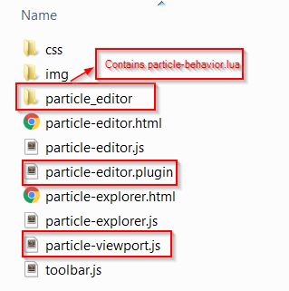

# Viewports

Viewports extension allows a user to to instantiate a viewport in a panel and to control the viewport behavior with a set of custom javascript and lua files. Basically you can write plugin that will package a 3D Viewport and control how the user interacts with the viewport. 

Viewport extension are a generalization of ~{ Define previews for custom assets }~ so there will be a lot of similarities between these 2 extensions.

## Viewports module
- **$stingray_install_dir\editor\core\extensions\viewports.js**: You can find Jsdoc on the different functions this module provide.
- **$stingray_install_dir\editor\plugins\particle-editor.plugin** : draft of the future Particle editor that will use the viewport extension to instantiate a preview 3D viewport for Particle editing.


## Viewports extension format

```lua
// From article-editor.plugin
extensions = {
	// This is the viewport extension definition that binds the lua and javascript to create a named viewport.
    viewports = [
        {
            name = "particle-viewport"
            engine = "particle_editor/particle-behavior.lua"
            module = "particle-viewport.js"
        }
    ]

	// Map the folder containing the lua file so it is made available to the engine.
    resources = [
        {
            path = "particle_editor"
        }
    ]
```



`name`
 > Unique name of the viewport. **Required**. This name must be unique among all views registered within Stingray. This will be used to instantiate the viewport and to send it lua commands.

`engine`
 > Lua file relative to the plugin descriptor file. This file will need to override some of the functions exposed in **$stingray_install_dir\core\editor_slave\stingray_editor\viewport_behavior.lua**

`module`
 > Relative path to a javascript file that will allow you to setup some initialization code before instantiating the viewport as well as to control a lot of the viewport highlevel interaction (ex: mouse behavior). **Required**.

## Viewport setup (javascript)

Your viewport setup javascript file should return a module containing a `setup` function. This function will get called when the viewport is instantiated and ready to be used. This function allows you load an initial level, implement a ViewportBehavior of tweak any kind of interaction between the viewport and various Stingray's services.

The return value of the setup function is a ViewportBehavior that will receive user events directly from the Viewport window.

```javascript
// Example from particle-viewport.js

define([
    'services/engine-service',
    'services/engine-viewport-service'
], function () {
    'use strict';

    var engineService = require('services/engine-service');
    var engineViewportService = require('services/engine-viewport-service');

    /**
     * Viewport extension test controller. Implements a viewport extension controller module.
     * @module ParticleViewportController
     */
    var ParticleViewportController = {
        /**
         * Setup the viewport extension controller.
         * @memberof ParticleViewportController#
         * @param {string} engineViewportId - id of the newly created viewport.
         * @param {EngineViewportInterops} engineViewportInterops - engine viewport interop utility class
         */
        setup: function (engineViewportId, engineViewportInterops) {
            this.mouseBehavior = new MouseBehavior(engineViewportId, engineViewportInterops);

            var off = null;
            // Setup will be resolved when it receives a Viewportcreated event.
            return new Promise(function (resolve) {
                off = engineViewportService.on('ViewportCreated', function (id) {
                    if (id === engineViewportId) {
                        resolve();
                    }
                });

                engineViewportService.getViewportNameFromId(engineViewportId).then(function (name) {
                    if (name) {
                        // Viewport has already been created, so no need to wait any longer.
                        resolve();
                    }
                });
            }).then(function () {
                return engineViewportInterops.raise(engineViewportId, 'load_background_level', 'core/editor_slave/resources/levels/empty_level');
            }).then(function () {
                if (off) {
                    off();
                }

				// Notice how the result
                return this.mouseBehavior;
            }.bind(this));
        }
    };

    return ParticleViewportController;
});
```

The object `engineViewportInterops` is a helper used to package communication between the lua environment and javascript. It helps in writing new ViewportBehavior The API to this helper is as follow:

```javascript
// From editor\core\components\engine-viewport.js
// All of these functions returns a promise and sends lua command directly to the engine through a websocket connection.
var EngineViewportInterops = {
    invoke: function (viewportId, method) {},

	// Will eventually do a "Editor:raise()
    raise: function (viewportId, method) {},

    keyDown: function (viewportId, keyCode) {},

    keyUp: function (viewportId, keyCode) {},

    mouseLeftDown: function (viewportId, x, y) {},

    mouseLeftUp: function (viewportId, x, y) {},

    mouseMiddleDown: function (viewportId, x, y) {},

    mouseMiddleUp: function (viewportId, x, y) {},

    mouseRightDown: function (viewportId, x, y) {},

    mouseRightUp: function (viewportId, x, y) {},

    mouseMove: function (viewportId, x, y, dx, dy) {},

    mouseWheel: function (viewportId, delta) {}
};
```

The helper can be used to create ViewportBehavior from javascript:
```javascript

// This MouseBehavior implements all functions supported by a ViewportBehavior.
var MouseBehavior = function (engineViewportId, engineViewportInterops) {
        this.viewportId = engineViewportId;
        this.engineViewportInterops = engineViewportInterops;
    };

    MouseBehavior.prototype = {
        mouseDown: function (evt) {
            var x = evt.originalEvent.detail.positionX;
            var y = evt.originalEvent.detail.positionY;
            var buttonNumber = evt.originalEvent.detail.button;
            console.log(buttonNumber);

            engineService.sendToLocalEditors('Editor:set_camera_control_style(%s, %s)', luaUtils.toSyntax(this.viewportId), luaUtils.toSyntax("MayaStyleTurntableRotation"));

            switch (buttonNumber) {
                case 0: this.engineViewportInterops.mouseLeftDown(this.viewportId, x, y);
                    break;
                case 1:this.engineViewportInterops.mouseMiddleDown(this.viewportId, x, y);
                    break;
                case 2:this.engineViewportInterops.mouseRightDown(this.viewportId, x, y);
                    break;
            }
        },

        mouseUp: function (evt) {
            var x = evt.originalEvent.detail.positionX;
            var y = evt.originalEvent.detail.positionY;
            var buttonNumber = evt.originalEvent.detail.button;

            engineService.sendToLocalEditors('Editor:set_camera_control_style(%s, %s)', luaUtils.toSyntax(this.viewportId), luaUtils.toSyntax("None"));

            switch (buttonNumber) {
                case 0: this.engineViewportInterops.mouseLeftUp(this.viewportId, x, y);
                    break;
                case 1:this.engineViewportInterops.mouseMiddleUp(this.viewportId, x, y);
                    break;
                case 2:this.engineViewportInterops.mouseRightUp(this.viewportId, x, y);
                    break;
            }
        },

        mouseMove: function (evt) {
            var x = evt.originalEvent.detail.positionX;
            var y = evt.originalEvent.detail.positionY;
            var deltaX = evt.originalEvent.detail.deltaX;
            var deltaY = evt.originalEvent.detail.deltaY;
            this.engineViewportInterops.mouseMove(this.viewportId, x, y, deltaX, deltaY);
        },

        mouseWheel: function (evt) {
            this.engineViewportInterops.mouseWheel(this.viewportId, -evt.originalEvent.deltaY);
        },

        keyDown: function (evt) {
            this.engineViewportInterops.keyDown(this.viewportId, evt.originalEvent.detail.keyCode);
        },

        keyUp: function (evt) {
            this.engineViewportInterops.keyUp(this.viewportId, evt.originalEvent.detail.keyCode);
        },

        viewportResized: function () {

        },

        viewportDrop: function () {

        }
    };
```


## Viewport behavior (lua)


## Viewport instantiation (using Mithril)
