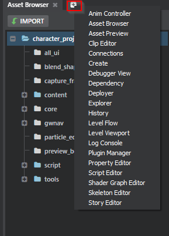
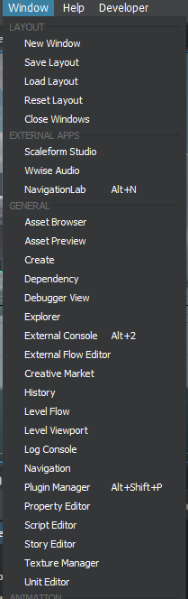
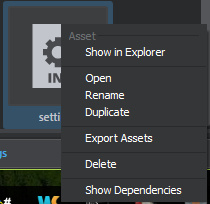
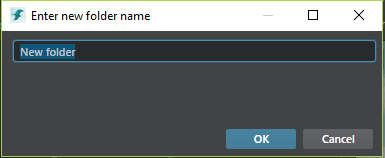

# Views and Dialogs

Views extension allows a user to define named "views" (either panel or dialog) that can be either registered to global menu or shown using the hostService. Named views can even be shown from plugin who haven't registered the view as long as the view unique name is know in advance (ex: popping the color picker from any plugin).

## Views extension format

```lua
// From stingray-editor.plugin
views = [
    {
        type = "dialog"
        name = "about"
        path = "about"
        title = "About"
        width = 500
        height = 600
    }

    {
        name = "project-manager"
        type = "dialog"
        path = "project-manager"
        title = "Project Manager"
        width = 910
        height = 600
    }

    {
        name = "plugin-manager"
        type = "panel"
        path = "plugin-manager"
        title = "Plugin Manager"
    }
]
```
`name`
 > Unique name of the view. **Required**. This name must be unique among all views registered within Stingray. Will be used to specify which views to show by multiple API.

`type`
 > Can be either **dialog** (generally modal), **panel** (tool window) or **window** (top level window). **Required**. Note that any registered **panel** will also be available in any of the `Tab Activator + Button`.



`path`
 > Relative path to the html file within the plugin that will be used to load the view. **Required**.

`title`
 > Main title of the view. **Optional**.

`width`
 > Default initial width of the view (in pixel). ** Optional**.

`height`
 > Default initial height of the view (in pixel). ** Optional**.

## Registering menu

A registered view can easily be registered as a menu item. Almost of the tools in the Singray Window menu comes from registered named view.



To register a new menu bound to a view, you use a menu extension:

```lua
// From stingray-editor.plugin
menus = [
    {
        path = "Help/About"
        view = "about"
        order = 510
        width = 600
        height = 400
    }

    {
        path = "File/Project Manager"
        order = 190
        shortcut = "Alt+F7"
        view = "project-manager"
    }
]
```

## Open view action
In the stingray-editor.plugin file there is a global action called open-view that allows a user to pop open a view from within an action sequence:

The contextual action extension allows a user to bind a sequence of action to a contextal menu:
```lua
contextual_actions = [
	// Basically right clicking on any asset should add the "Show dependency" to the contextual menu
    {
        type = "asset"
        label = "Show Dependencies"

        when = {
            extension = "*"
        }

        do = [
        	// use the globally defined open-view to open the named view called "dependency".
            "open-view \"dependency\""
        ]
    }
]
```



## Opening panel
Alternatively, from within javascript you can use the view module to open a panel:

```javascript
// From dependency-actions.js
define([
    'app',
    'lodash',
    'extensions/views',
    'services/event-service'
], function (app, _, views, eventService) {
    'use strict';

    return {
        showDependencies: function (dependencyPath) {
        	// use the views module to open a view called "dependency" passing this view a custom resource query parameters
            return views.open('dependency', {}, {
                resource: encodeURIComponent(dependencyPath)
            });
        }
    };
});
```

## Opening modal dialog
Using the views module, you an also open a modal dialog and get back its return value when the dialog is closed.

```javascript
// From asset-browser-controller.js
function createNewFolder(uniqueDirectoryEntry) {
	return hostService.openModalTextInputDialog("Enter new folder name",
    	uniqueDirectoryEntry.Filename);
}

```

```javascript
// From host-service.js
define([
    'app',
    'lodash',
    'extensions/views'
], function (app, _, views, eventService) {
    'use strict';

    return {
        openModalTextInputDialog = function (title, defaultValue, options) {
        	// Open the dialog called "text-input-dialog"
            return views.openDialog('text-input-dialog', {
                title,
                defaultValue,
                settings: options
            }).then(function (result) {
                // When the dialog is closed, if its result is valid (dialog hasn't been canceled) returns the
                // dialog result to the caller
            	if (result.accepted)
                	return result.result.TextValue;
        	});
		}
    };
});
```

It is worth noting that when a custom view is opened, we inject a few useful API into the global window object to allow a user to manipulate the view more easily:

`window.options`
> The thrid parameter passed to the views.openDialog function. Allow a caller to pass a plain Json object to be retrieve back by the dialog view.

`window.accept(result)`
> Function that will close the dialog passing back the `result` to the dialog invoker. Dialog will be considered valid.

`window.reject(result)`
> Function that will close the dialog passing back the `result` to the dialog invoker. Dialog will be considered rejected or cancelled.

```javascript
// From text-input-dialog.js

// Fetch initial values from the openDialog options
$scope.dataContext = {
    TextValue: window.options.defaultValue
};

$document.on('keydown', function (evt) {
    if (evt.keyCode === keycodes.KEYCODE_ENTER) {
    	// 'Enter' to accept
        $scope.close(lastValidationState);
        // Stop propagation
        return false;
    } else if (evt.keyCode === keycodes.KEYCODE_ESCAPE) {
    	// Discard dialog (cancelling it) on escape
        window.reject('discarded');
        // Stop propagation
        return false;
    }

    return true;
});

$scope.close = function (accepted) {
    if (accepted && lastValidationState) {
    	// Accept the dialog result passing back the TextValue in the dataContext object
        return window.accept($scope.dataContext);
    }
    window.close();
};
```

