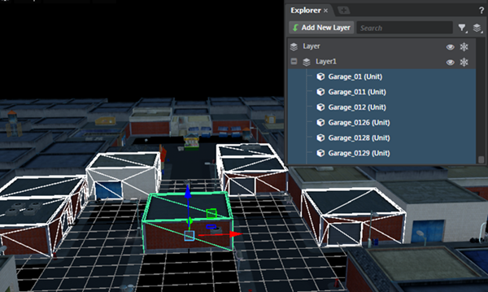
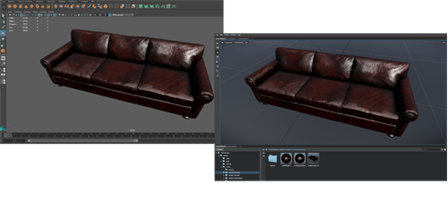
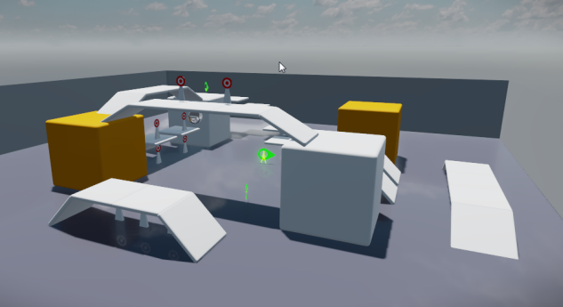
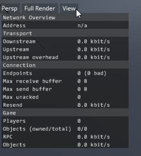

# Stingray 1.1 Release Notes

Stingray 1.1 (1.1.247.0) includes improvements to many editors and workflows. In addition to smoother interoperability with Autodesk 3D animation tools, this release includes extensive updates to the Stingray renderer, **Level Editor**, animation tools, and audio tools. This update also provides support for additional Android device GPUs as well as the latest Oculus Rift SDK. For information on updates to the Scaleform Studio UI tools, visit the Scaleform Studio 1.1 Release Notes in the  [Scaleform Studio Help](http://www.autodesk.com/scaleformstudio-help "Scaleform Studio Help").

Sections in this topic:

-	[What's New](#whats-new)

	This section lists all the major new features available with this latest version of Stingray.

-	[What's Fixed](#whats-fixed)

	Here you'll find lists of the bugs and known limitations that we fixed, sorted by workflow area.

-	[Known Limitations and Workarounds](#known-limitations)

	This section includes any new known limitations we've found since the last release of Stingray.

-	[Upgrade Requirements](#upgrade-requirements)

	If you're working on a project that you started in an earlier version of Stingray, this section lists the steps you may need to take in order to successfully upgrade to the latest version.

-	[Source updates](#source-updates)

	If you have access to the Stingray source code, see this section for information about what's new for this release in the master branch.

## What's New

* * *

## Screen Space Reflection Ray Bending

Near the edges of the screen, you can now make screen space reflections rays bend instead of fade out.

 

<iframe width="854" height="432" src="http://player.ooyala.com/iframe.html?pbid=6055f5a2061d4016b11ebf1fa8a7751e&amp;platform=html-fallback&amp;ec=9xeGFxdzocv3yRXVRpJRbmautS2S7Ghp" frameborder="0" allowfullscreen></iframe>

## Refraction

Transparent materials can now refract the opaque objects behind them using the refraction input on the material.

 

<iframe width="854" height="432" src="http://player.ooyala.com/iframe.html?pbid=6055f5a2061d4016b11ebf1fa8a7751e&amp;platform=html-fallback&amp;ec=p2YWpneDqZwefuzloXX8ZGjXbMdt0FZ6" frameborder="0" allowfullscreen></iframe>

- ~{ Create a standard transparent material }~

## Temporal AA blur reduction

Improvements to temporal anti-aliasing now produces sharper results.

 

<iframe width="854" height="432" src="http://player.ooyala.com/iframe.html?pbid=6055f5a2061d4016b11ebf1fa8a7751e&amp;platform=html-fallback&amp;ec=RzeGFxdzrW25c4crvLVSTWwsUWM1m91D" frameborder="0" allowfullscreen></iframe>

##Subsurface Scattering (translucency)

To simulate the look of sub-surface scattering, you can now make materials translucent using the Density input on the Material Variable node.

 

<iframe width="854" height="432" src="http://player.ooyala.com/iframe.html?pbid=6055f5a2061d4016b11ebf1fa8a7751e&amp;platform=html-fallback&amp;ec=4wZGZneDqOO32fOsa6VwQ5-sl3KOoRJ5" frameborder="0" allowfullscreen></iframe>

## Also new in Rendering

- Screen Space AO performance improvements and ghosting reduction

- Improved skydome workflows

	The skydome is now a regular Unit placed on a frozen layer named 'Background'. If you remove it, you can recreate it 	in the current layer by selecting ***Create > Skydome*** from the main menu bar.

- Support for V-Ray materials

	You can import texture maps from V-Ray materials with the following file name properties:

	-	texmap_diffuse
	-	texmap_self_illumination
	-	texmap_bump
	-	texmap_opacity

## Organize objects on layers

Organize groups of related level objects using the new **Layers** view (Hotkey: L) in the **Explorer** window. Layers let you quickly select, show, hide, or freeze groups of level objects all at once, helping you isolate the objects you want to work with. You can also filter your level objects by type to further unclutter levels that contain many objects. To get started in the **Layers** view, click , and then drag and drop objects between layers.

For new information, see ~{ Organize level objects in layers }~.

## Improved interoperability with linked viewports

When you enable a live camera link between Stingray and your Autodesk DCC tool (Maya, Maya LT, and 3ds Max), the acting master/slave viewport now switches automatically depending on which application is active. See ~{ Interop with Maya, Maya LT, or 3ds Max }~ for updated information.

## Updated Character template

An updated version of the Character template project is available in the ~{ Project Manager }~ when you start Stingray. Improvements include:

- the camera position
- the projectile Flow graph
- animation tree nodes
- Lua source code

- ~{ Template projects }~

## Support for additional Android devices

The Stingray engine now supports Android devices equipped with Qualcomm Adreno 330, Adreno 420, and Adreno 430 chipsets. These GPUs are found in many devices, including Google Nexus devices, Amazon Kindle HDX series tablets, Amazon Fire phone, Nokia Lumia devices, Samsung Galaxy devices, Samsung Galaxy Note devices, Sony Xperia devices, and LG G2/G3 smartphones, and many more.

*The Android robot is reproduced or modified from work created and shared by Google and used according to terms described in the Creative Commons 3.0 Attribution License.*

For updated information, refer to ~{ Supported platforms }~.

## iOS 9 binary size

Stingray now supports *only* iOS 9 targets. This change allows us to significantly decrease the size of the engine binaries.

## Light workflow improvements

You can now toggle the visibility of lights using the new light property **Enabled**. Disabling this option turns off the light's contribution in the current level and in the game.

In addition, hiding lights in the **Level Viewport** now hides only the visual representation of the light. It no longer turns the light off.

## Material workflow updates

### Smoother material import workflows

Importing assets with pre-assigned materials is now easier. When the new **Shared Materials** check box is turned on in the **FBX Import** window, Stingray searches your project for existing materials for the asset. If a match is found, Stingray applies the existing material to the asset on import.

For new information, see ~{ Import a model with textures and materials }~.

### Drag and drop materials in the viewport

Drag and drop a material from the **Asset Browser** onto an object in the **Level Viewport** to quickly assign a material to a unit in your level. You can also hover your cursor over an object to preview the material before it’s assigned.

For new information, refer to ~{ Assign a material to an object }~.

### Better workflow when creating parent materials

When you click **Make Unique** in the **Property Editor** for a material, a new **Open Shader Graph** button displays, making it easy to start editing the shader graph. See ~{Create a parent material }~.

## Improved **Asset Browser** experience

Additional filtering and config options available in the **Asset Browser** let you toggle filters on and off, show file extensions, and set whether searches are case sensitive.

In addition, you can now move more than one asset at a time from folder to folder, and right-click to create new empty materials and animation controllers.

## More performance HUDs for visual debugging

New options in the **View > Performance HUD** menu (found in the **Level Viewport**) make it even easier to visually debug your game performance. You can now toggle the HUD display for the following categories:

- FPS
- Memory stats
- LUA performance
- Audio
- Culling performance
- Network performance
- Artist performance

## Easier gameplay navigation in **Level Viewport**

When in gameplay navigation mode (right-click and hold in the **Level Viewport**), new hotkeys let you move the camera up (Q) and down (E).

See ~{ Navigate in the Level Viewport }~ for updated information.

## Improved editing in the **Property Editor**

You can now view and edit large amounts of script data in the **Property Editor**. Unit script data is displayed in an editable tree view, and supports number, string, and boolean values.

In addition, you can now edit multiple assets at the same time. For example, select multiple lights and adjust them all simultaneously.

## Simplified audio workflows

New drag and drop functionality lets you quickly add audio files to environments and characters. Simply drag an audio file from the **Property Editor** on to the animation timeline or in to your level, and then preview it directly in the editor, without playing your level. You can tweak your sound in Flow, using the corresponding logic that is created each time you add a sound.

## **Log Console** improvements

The ~{ Log Console }~ window now includes a filter widget that lets you filter out data from different components of Stingray, making it easier to debug issues. In addition, any errors and warnings that result when you select **Project > Run** now output directly to the **Log Console**. See ~{ Test a project }~.

## Updated PhysX plug-in

The PhysX plug-in installers for Maya, Maya LT, and 3ds Max that ship with Stingray are now updated to install the latest version of the PhysX plug-in, version 3.3.10930.12522. This plug-in includes several improvements and bug fixes by Nvidia. For related information, see ~{ Install the PhysX plug-in for your DCC }~.

## What else is new?

- Hotkey **Ctrl + P** launches the new **Omni Tool**, which lets you quickly access all assets and menu items in Stingray.
- The **Asset Preview** window now has a **View** menu that lets you show and hide grids, gizmos, bones, and meshes.
- The **Explorer** panel now has filters and categories to make it easier to navigate large levels with many objects in the tree view.
- The **File** menu now displays a list of recently opened levels.
- You can now paint in negative space in the Terrain tool, which makes it easier to create basins and valleys.
- A ~{ Documentation Archive }~ page is available if you plan to continue using an earlier version of Stingray or Scaleform Studio and you want to download documentation for previous versions. The Stingray online help always reflects the content and features of the current Stingray release.
- Support for *.stingrayignore* file. Use this file to list files and directories you want Stingray to ignore using a syntax similar to *.gitignore* files, then place the file in the root of your Stingray project. The data compiler will ignore these files when compiling your project resources. Note, however, that the Stingray Editor will still show the files in the **Asset Browser**.
- Launch Stingray in maximized windows mode on Windows
- PhysX heightfields are cooked to avoid long stalls when heightfields are spawned.
- Xbox One Multiplayer: Live Presence, Suspend/Resume, Voice chat, Invites, SmartMatch making
- LuaJIT interpreter support on Xbox One
- Allow to link dynamically against LuaJIT in Windows
- Updated to SteamWorks SDK 134

###Toggle the visibility of lights

Disable the new **Light** property, **Enabled**, to turn off a light’s contribution in the current level and in the game.

[Return to top](#top)

## What's Fixed

* * *

### Authoring Tools and Animation:

- GAME-3930 Flow: need to add a unit based input port for light set nodes.
- GAME-4042 Changing animation properties in the **Property Editor** is not always reflected in the viewport
- GAME-7129 Flow: Pick content browser does not show items in an alphabetical order
- GAME-7016 Setting parent material clears referenced textures
- GAME-5068 ObservableDicitonary needs proper notification
- GAME-8909 Deleted asset shows in the **Asset Preview** on doing undo or clicking it in the **History** tool
- GAME-8890 Custom Flow; Clearing a string value results in an empty string instead of nil
- GAME-8820 Animation - HumanIK bone list dropdown in Flow
- GAME-8813 Animation Controller: All event buttons, variables & constraint targets should be shown in Alphabetical order
- GAME-9224 Cannot switch project when compiling
- GAME-9227 Pressing Delete to delete the selected unit just drag-and-dropped into the level does not work
- GAME-9169 Compression settings not showing up on clips when selected in **Asset Browser**
- GAME-9168 Skeleton Editor - Need to adjust icons in tree where animaiton is off to be more transparent, color should match the darker/grayed text
- GAME-9195 **Asset Browser** search by Path returns an asset whose name matches but whose path does not
- GAME-9194 **Property Editor**: Clicking on the color swatch no longer brings up the color picker dialog
- GAME-9172 [AnimController] engine errror on unwanted motion mixer refresh
- GAME-9215 **Asset Preview** is not showing the mesh and showing Bones
- GAME-9167 **Asset Preview** viewport is grey on remote device
- GAME-9165 **Dependency** tool does not allow expanding the size of the Uses list box
- GAME-9126 Double-clicking on a story in the **Explorer** list deselects the story
- GAME-9124 Cancelling the save level prompt that appears on moving an asset still moves the asset (and gives an internal error)
- GAME-9104 **Asset Browser**: Pressing Enter twice after creating a new folder (to enter it) sometimes tries to create another new folder instead
- GAME-9153 Creating a new project shows previous level name and a mixed up level with previous level units in **Explorer** panel and **Level Viewport**, pink question marks, and "ResourceManager: Can't find `29d29d9e31317c02.unit` -- using default `08528ddc343e2806`" warnings
- GAME-9133 Script crash when moving object in editor
- GAME-9117 shared Tree-View does not work anymore
- GAME-8805 Flow; "Custom script node ... is missing" errors on switching projects
- GAME-8803 Animation Controller Preview - Error when clicking the Gear Button
- GAME-8793 Shader Editor; Duplicating a node in **Shader Graph Editor** gave "Target Invocation error : Config value cannot handle type"
- GAME-8785 File > Project Manager > other project, Yes to Save Changes, but Cancel in Save dialog should cancel the project switch
- GAME-10103 **Asset Browser**: searching for and double-clicking into a folder shows it as empty (after flashing the contents)
- GAME-9071 Error message is not clear when .fbx missing or corrupt
- GAME-10614 **Asset Browser**: deleting folders doesn't pop up any kind of confirmation dialog
- GAME-10359 Asset resource still gets deleted even if unchecked in Delete Related Assets dialogue
- GAME-10512 Spinner lags and can take a long time to resolve..
- GAME-10484 Data compiler reports out of range progress updates, crashing **External Console**
- GAME-10465 Animation Controller: Hide Anim End event
- GAME-10466 **Asset Preview**: textures are displayed in a 3D perspective vewport instead of a 2D orthogonal one
- GAME-10458 Animation Controller: Missing animation list in 1d/2d blendstates
- GAME-10414 **Anim Controller** Editor: The Preview should be set as the focused viewport after Anim Controller save
- GAME-10355 Data driven filters ui_order not working for number >= 10.0
- GAME-10309 Cannot load saved .level file - 'Cannot set a constant field'
- GAME-10562 Undo / redo of rotation set from the spinner is not correct
- GAME-10154 Slaving on android doesn't work properly.
- GAME-10133 Cannot delete folders from the **Asset Browser**
- GAME-10139 Crash occurs when importing an FBX asset
- GAME-10085 Flow: Got into a state where the level could not be saved and play level fails
- GAME-10278 **Asset Browser**: filtering for sound banks doesn't work
- GAME-10229 Flow: Modifying an item choice slot breaks all connections to a node
- GAME-10227 lock property panel button no longer works
- GAME-10266 Crash in **Script Editor** when closing down remote engine
- GAME-10248 Placement tool and spline tool place objects/control points even when holding ALT to rotate viewport
- GAME-10219 **Level Viewport**: Gizmos sometimes are not visible after loading a level
- GAME-10053 Editor waits 24 seconds at startup trying to connect to data compiler
- GAME-9645 **Unit Editor** has Lua error on startup: unit_object.lua:51: bad argument #2
- GAME-9638 Standard Base (Opaque) doesn't take the emissive value
- GAME-9567 Report error message when Maya tries to connect to Stingray
- GAME-9554 Having a space in the project name makes it impossible to run the project on xb1
- GAME-9591 [AnimController] - Reset Should only reset Preview not Values
- GAME-9588 [AnimController] - Preview Reset should not reset Playback Rate
- GAME-9549 Named object has empty string error
- GAME-9605 "Continue" function in Lua debugger launches Test Level
- GAME-9584 Animation Timeline - Timeline should not show decimals for Frames, should show better increments for Seconds
- GAME-9585 Animation **Story Editor** - Timeline text should not show f or s
- GAME-9519 Hiding lights should not turn the lights off
- GAME-9613 Error previewing a unit - AssetPreviewViewModel PreviewUnit
- GAME-9522 Animation Controller: Unit preview management
- GAME-9523 Change Decoration Slider Density to Spinner
- GAME-9335 Fix layout of single input dialogs (create)
- GAME-9001 Empty template has no sound banks generated
- GAME-8983 It is very difficult to right click -> create asset in the content browser list view
- GAME-8970 Animation: **Anim Clip** Editor bones not highlighting in the view when selected in the hierarchy
- GAME-9085 **Property Editor**: Typing in a numerical input field gives key-validator.js (81) Uncaught InvalidStateError: Failed to read the 'selectionStart' property from 'HTMLInputElement': The input element's type ('number') does not support selection.
- GAME-9080 Selected file name truncated in the FBX Import dialog (possibly due to hyphen in path)
- GAME-8952 On changing projects, the **Script Editor** continues to show files from other projects leading to possible confusion
- GAME-8943 TestPatchUnsavedLevel causes unreported engine crashes
- GAME-8922 Multiple color picker instances can be opened but are all synchronized, and cancel no longer works properly
- GAME-8915 **Property Editor**: Renaming a unit does not update its name in the tree view
- GAME-7966 Rename; Moving multiple assets in **Asset Browser** doesn't work
- GAME-8030 Animation Controller: Change color of the aim target
- GAME-7908 Resource browser/picker does not display longer strings well (should perhaps resize or have a horizontal scrollbar)
- GAME-7693 "Unit Editor > Create > Physics Actor" should set Physics node to unit first node by default
- GAME-5845 Story - Float fields are missing tool-tips.
- GAME-4884 Double-clicking on a story in the **Explorer** list doesn't frame it in the viewport
- GAME-5736 Skeleton Editor - subtree context menu renaming
- GAME-7210 When in wasd, scrolling too much makes stingray crash
- GAME-4178 Color Picker Issues
- GAME-9989 **Asset Browser**: thumbnail generation fails after editing a material's properties
- GAME-9997 Material settings seem to transfer from one project to another
- GAME-9858 Terrain creation with Height Map Resolution that's not a power of 2 fails with Error in dispatcher when processing method Void b__43()
- GAME-9869 Terrain: trying to rename a terrain asset crashes the engine
- GAME-9902 Slaving from the editor doesn't work
- GAME-9927 Typo in viewport right-click menu item "Move Seletion to Layer"
- GAME-9926 Terrain: Undergrowth thumbnails are no longer properly shown
- GAME-9892 **Anim Clip** Editor: timeline and viewport are not always in sync
- GAME-9820 Creating a terrain object sometimes gives TypeError: Cannot read property 'SelectedUndergrowthUnit' of null
- GAME-9773 Errors are returned when switching projects
- GAME-9711 Access violation engine crash on trying to add a decal projector or bot configuration to the level after adding an audio source
- GAME-9848 Color picker not working
- GAME-9751 Project Shutdown happens before Engine Shutdown when switching projects
- GAME-9789 Clicking on a pink question mark missing unit gives error "Cannot obtain a non-null value from a None option" and does not select the missing unit
- GAME-9709 Replace button in **Dependency** tool does not seem to actually replace references
- GAME-9696 Animation [**Asset Preview**] timeline state should be kept between asset selection operations
- GAME-9669 Terrain: In the **Property Editor**, the up/down spinners do not work
- GAME-9665 Loading progress badly reported when creating the first empty level
- GAME-9505 Renaming files in the editor should not allow trailing white space
- GAME-9478 When opening a skeleton asset, the corresponding unit and skeleton are briefly displayed in the main viewport
- GAME-9495 Color wheel sometimes jitters with no hue value
- GAME-9489 Deleting a unit or asset should clear any **Property Editor** instance locked to it, otherwise errors can occur
- GAME-9482 Renaming an asset does not update the **Asset Preview** or **Property Editor**, leading to possible errors
- GAME-9458 Deleting a material with its shader graph open leads to node-editor-directive-controller.js (661) Uncaught TypeError: Cannot read property 'Id' of null
- GAME-9467 Impossible to select extremely small triangles
- GAME-9450 After deleting an asset, the **Asset Preview** continues to show it
- GAME-9347 Data compiling progress bar stayed up indefinitely showing "Data compiling (33/39)... 100%"
- GAME-9418 Create Terrain causes an error in property-editor.js
- GAME-9362 When switching projects, errors are printed out and Stingray becomes somewhat unresponsive
- GAME-9346 Flow Script Node Outputs Do Not Trigger
- GAME-9411 **Asset Browser**/Preview: selection is partially remembered from one project to the next
- GAME-9364 Changing tabs and resizing panels gave "TypeError: Cannot read property 'firstThumbnailGenerated' of undefined" at AssetBrowser/Views/list-controller.js:960:30
- GAME-9658 Users can add bad assets to level causing errors and viewports to be unresponsive
- GAME-9657 Disable importing lights and cameras will still import the light and camera transforms
- GAME-9646 **Asset Browser**, show in **Explorer** does not function and errors
- GAME-9292 Manual re-import of a texture crashes viewport
- GAME-9293 Flow: The Get Active Camera node is missing its Camera and Unit output pins
- GAME-9675 Right-click in the Viewport won't rotate the camera anymore
- GAME-9205 The legacy editor should not destroy entity data when opening a level built in the new editor containing entities
- GAME-8635 Premature/unwarranted warnings "Failed to generate thumbnail for ..."
- GAME-10594 **Unit Editor** often crashes on startup
- GAME-8894 Wwise error when creating a minimal project
- GAME-9072 Changing viewport to 4-way-split view and back crashes the engine/viewports
- GAME-9219 Engine crashes during asset browse: Another frame capture is already in progress
- GAME-9771 Reflection probe workflow not working
- GAME-9687 Editor does not link if you have a space in your build path
- GAME-9445 Deselecting a terrain gave TypeError: Cannot read property 'TerrainModel' of undefined at new (... /terrain-undergrowth-controller.js:205:53)
- GAME-8799 Import Dialog: "New Skeleton" label and check box shown incorrectly as disabled
- GAME-9661 [AnimController] - replace "Nested To/From State" and "start from all states" with 2 dropdowns.
- GAME-10226 Test Level gives "Test Engine: Game data not found. Are you missing command line parameters?"
- GAME-8725 Path at top of **Asset Browser** is too long and project name is redundant here, please remove the project name
- GAME-8762 Animation Controller Preview Viewport Options button does nothing
- GAME-8784 Opening another level in the same project from the Project Manager does not prompt to save unsaved changes
- GAME-8806 Named viewports don't restore viewport settings at creation
- GAME-8699 Open Source Asset with Maya LT Steam causes dialog to pop up
- GAME-8700 Interop; "Send to Maya" for Maya LT on Steam opens Maya but does not connect
- GAME-8721 Rename an asset with extensions visible can cause backend crash
- GAME-8720 Create a dir with invalid directory causes backend crash
- GAME-8572 Misaligned buttons in getting started screen
- GAME-8396 (Non-Gameware-Navigation) Navmesh error when opening `test` level in `testbed` project
- GAME-8137 Material; Deleting the parent material of another material makes it unusable
- GAME-8269 Move gizmo arrow hit boxes are too short
- GAME-2431 Flow: Double-clicking on the **Level Flow** Editor tab to toggle the panel height leads to flickering
- GAME-6949 Missing help button in the **Story Editor** and **Asset Preview** panels
- GAME-8164 **Level Viewport** sometimes found showing motion blur-like effect until interacted with
- GAME-3596 Animation; Clip Editor display appropriate icon based on custom compression
- GAME-7317 Flow; Generic Animation Play from Current may be missing an input pin for Loop
- GAME-8987 Animation Controller: Rotation Glitch with Additive rotation
- GAME-9035 Animation Controller Preview - Getting HumanIK errors
- GAME-8962 Animation Editor + Skeleton Editor : add support to hierarchy where animated bones are under non-animated bones
- GAME-9089 [AnimController] Adjust MultiTransition Visuals, names and arrows
- GAME-7879 Flow; Missing context in level error messages
- GAME-6544 Flow: Slot input should not always strip white space
- GAME-8971 Animation Import: Adjust text on Skeleton check box
- GAME-9062 UnitResource throws Null exception
- GAME-9101 Animation Controller: Camera Lags behind when user adjusts it
- GAME-9093 Animation Controller: possible exception when deleting selection
- GAME-7253 Different **Asset Preview** behavior when selecting a unit in the **Level Viewport** vs. in the **Explorer**
- GAME-5299 When console slaving to Android the initial view does not match until the camera is moved in the **Level Viewport**
- GAME-6521 Navigation UI doesn't scale when sidebar is pulled out.
- GAME-9166 Tree expansion is not drawing correctly
- GAME-8009 Escape to dismiss a right-click context menu does not work in the case of a tab loaded for the first time
- GAME-9040 Animation Controller: Specific items selected is difficult to see with transition highlighting
- GAME-9416 "Play Level"/"Run Project" throws an exception
- GAME-8400 Crash when creating a StateMachineTrigger node for `character` in `testbed` project
- GAME-4491 The skydome should be a regular, placeable unit in the scene
- GAME-10231 Performance HUD no longer shows counter statistics
- GAME-9714 Bake Reflection Probes after a test play level gives cubemap_generator.lua:13: attempt to index a nil value
- GAME-7919 Editor repeatedly compiles data forever if data compiler crashes
- GAME-9287 Assertion failure when trying to frame Chamfbox in basic project main_menu level when the props folder is missing
- GAME-9218 **Property Editor**: Typing a minus sign in a numerical input field gives Unhandled JavaScript exception, key-validator.js (102), ... The input element's type ('number') does not support selection
- GAME-9092 Open in Material Editor button in **Unit Editor** causes unhandled exception
- GAME-9044 **Property Editor**: up and down arrow keys (currently limited to -0.5 to +0.5) should act exactly like the up and down spinners (unlimited)
- GAME-9084 Terrain property editor panel sometimes does not match the full width
- GAME-8525 Mouse cursor visible when it shouldn't be
- GAME-8953 **Script Editor**; top of tabs get clipped a little when a scrollbar is present
- GAME-7891 Camera clipping settings not respected in-game
- GAME-8865 Hidden units or gizmos are still displayed on devices during a live link
- GAME-7304 Wwise; Cannot trigger event on existing non-unit source
- GAME-8490 Engine does not reload Wwise banks when they change on disk.
- GAME-9369 In the Delete Assets confirmation dialog, when there is no check box selection and only row selection, the "Delete Selected" button can be confusing
- GAME-3342 **Level Viewport**: Toolbar button highlighting is offset when the viewport is resized smaller
- GAME-8819 Animation Compression/Playback pops when looping
- GAME-5353 The viewport only updates when the mouse cursor is over it: the transform gizmo becomes disconnected from the unit it controls
- GAME-7217 Clearing material parent reference field results in errors
- GAME-5696 "Wwise Silence" sound type not supported in Stingray
- GAME-7884 Wwise; event trigger copy and paste not working properly
- GAME-6851 After double-clicking a material, the **Shader Graph Editor** background still shows "No shader selected for editing"
- GAME-5719 Ctrl-LMB click-drag off a port to reconnect looses a connection if user releases LMB
- GAME-8924 **Property Editor** search finds only section headings, not properties
- GAME-8691 **Asset Browser**: Rename should focus the text field, show a blinking caret, and accept keyboard input right away
- GAME-8666 Enter and Exit Flow Events do not show up in Flow on the "On Animation Controller Events" node
- GAME-8638 **Asset Browser** search by Name returns a folder whose name does not contain the search pattern
- GAME-8629 Viewport context menu stays on top of other applications
- GAME-8558 Selecting elements in the **Level Viewport** causes a JavaScript exception
- GAME-8319 Flow: grouping a group causes inner group to ungroup
- GAME-8309 Rename; Drag-and-dropping an asset in the same folder gives "Cannot rename a file to an existing name"
- GAME-8212 Animation Controller: when moving the animation constraint and the rootmotion is on in the viewport the constraint target gets left behind
- GAME-8211 Animation Controller: When rotating the camera and the rootmotion is on in the viewport the camera gets left behind
- GAME-8224 **Property Editor**; Pressing Enter on an empty Rotate field gives "Trying to set a value type to null, which is not allowed."
- GAME-8221 Level view submenus stay on screen after Escape, and stay longer on Escape or right-click after Alt-Tab
- GAME-8172 Alt-Orbit often starts with a camera jump and almost always does when in 4-way split view
- GAME-5690 Skeleton Editor: selection is not cleared when deleting a blendmask
- GAME-10405 Wwise: flow node error thrown when opening a project
- GAME-9749 Animation Controller - Show Selection of Events by highlighting the row
- GAME-10478 **Script Editor**: Debugger: incorrect file tab is shown as active when stepping into a different file
- GAME-10476 Debugger: breakpoints do not take effect the first time the level is test played
- GAME-10060 Wwise flow node Lua support mixed indexing
- GAME-8867 Editor status bar only connects to test engine once
- GAME-10168 **Asset Preview**: Customize Animation Options per Asset Type
- GAME-10169 Viewports: Reset Unit Position and Rotation when Root Motion is turned off
- GAME-10538 Animation Story Auto-Keyframe setting keys on scrub/play
- GAME-10541 Animation Story - Animation not affecting Materials
- GAME-9786 **Script Editor**: Pressing the Shift key gives Unhandled JavaScript exception, script-editor-controller.js (551) Uncaught TypeError: Array.prototype.shift called on null or undefined
- GAME-10596 Flow: test play with a Compare Numerics node where the user forgot to specify A or B crashes
- GAME-10743 **Script Editor**: Pressing Shift gives "Uncaught TypeError: Array.prototype.shift called on null or undefined"
- GAME-10383 **Unit Editor** viewport crash
- GAME-9102 The Save Changes modal dialog sometimes ends up behind the **Project Manager** so UI no longer responds
- GAME-9313 Unable to edit shader options
- GAME-10751 Switching projects can show **Property Editor** and **Asset Browser** from previous project while compiling new one
- GAME-9726 Flow: Unhandled JavaScript exception, pixi.min.js (2) Uncaught TypeError: Cannot read property 'parent' of undefined
- GAME-7386 Change the empty background color of default panel and dialog when loading

### Rendering:

- GAME-9530 deleting many nodes in node graph is slow
- GAME-6729 Flow: Screen To World node Depth parameter gives unexpected results
- GAME-10095 translucency should use with shadow/density
- GAME-10141 PS4: engine crashes when attempting a live link
- GAME-10416 PS4: enabling the performance HUD returns an error
- GAME-10315 world_pos does not include vertex_offset in standard_base in glsl
- GAME-9400 Terrain: control when faces are clipped
- GAME-9095 The groups in the shader editor that are collapsed expand after you re-launch Stingray
- GAME-10402 XB1 "Heap cannot grow" crash
- GAME-9867 Terrain occlusion issues with customer scene
- GAME-10004 Perfhud appears in the editor but there are no stats showing under "frame counters"
- GAME-9901 broken normals with customer scene
- GAME-9826 Terrain - Graphics card crash
- GAME-8919 Beast crashes often trying remove target0_pass0.xml
- GAME-9514 Bake lights with Beast_Examples gave render_config.lua:11: bad argument #4 to 'create_skylight' (userdata expected, got nil)
- GAME-10287 Improve Oculus pose prediction
- GAME-10627 transparent objects receive fog, even if fog is disabled.
- GAME-10304 Oculus: If desktop mirror window is resized scaleform menu is not centered in VR anymore
- GAME-8856 material var with same name appear multiple times in property panel
- GAME-8951 decouple back_buffer_size when rendering to different output size targets
- GAME-9003 output nodes menu in material graph editor does not show in VR project
- GAME-9971 replace the sliders with spinners
- GAME-4484 Performance Optimize SSAO
- GAME-9817 post effects have a problem when viewport is smaller then back buffer
- GAME-9880 Decals doesn't work on PS4
- GAME-9684 when there is no sun in the scene, we still get sunlight in forward pass
- GAME-6905 Terrain: broken normals for terrain with sunlight shadow
- GAME-9173 Terrain: undergrowth doesn't use ambient light
- GAME-10006 if-statement node fails to compare float3's
- GAME-10598 terrain_basic material is black
- GAME-10421 iOS:   performance issue on an iPad Mini (first generation)

### Core:

- GAME-9249 PhysX library for VS2013 is faulty
- GAME-9250 Wwise library for VS2013 is missing
- GAME-9136 XB1 - Unhandled exception on failed SDA
- GAME-9145 Skeleton Editor: bone scale can get to negative values
- GAME-9137 XB1 - Handle MultiplayerSubscriptionsLost
- GAME-10447 Engine crash after saving an anim controller with sounds
- GAME-10329 Mover sometimes passes through walls
- GAME-10439 Animation Controller: in certain cases changing the default state of a layer indicates an error when actually everything is fine
- GAME-10295 xb1 and PS4: Screen flickers for a second with character template in PS4 and xb1
- GAME-10018 Flow crash the game - no error reported at all
- GAME-9558 When running in Visual Studio on XB1 Lua callstacks are not displayed.
- GAME-9069 json parse errors are missing messages
- GAME-7920 Data compiler crash with top-down-space-shooter
- GAME-7867 .character files get cleared during data compile
- GAME-8494 Fix compile error when not using LuaJIT
- GAME-8157 Flow: for flow subroutines, not providing the .flow file assertion-fails: Resource not loaded, type: `flow`, name: `65ecdd256278cd7a` ... resource_manager.cpp:151`
- GAME-9986 XB1 - Account picker + controller disconnect issues
- GAME-9988 XB1 - Can't free session if leave_session fails.
- GAME-9903 Editor data compiler launch crash
- GAME-9750 MeshObject::set_flags Crashes in data compiler for most fbx files
- GAME-9384 XB1 - Async job freezes
- GAME-9436 GetActiveCamera flow node is broken
- GAME-10092 Connection to asset server does not work on a multihomed machine
- GAME-10440 Error thrown when editing an anim controller
- GAME-6233 Ensure unit_scale_factor is correctly managed at import time for FBX exported from Maya & Max
- GAME-10020 SimulatedTouchPanel ghost contact
- GAME-9177 Compiler Loop trying to open older project's .level file
- GAME-10448 Flow-generated mover/actor/mesh movement is wrong
- GAME-10427 Asset server leaks threads when connected to XB1
- GAME-8824 The mouse cursor is not shown in the game menu when using release builds
- GAME-5048 Capitals in trigger names don't work in StateMachine flow nodes
- GAME-9884 PhysX swept sphere against triangle mesh sometimes returns wrong hit (position and normal)
- GAME-9753 Mover pass through geometry
- GAME-10259 iOS Broken When Connecting Using the File Server
- GAME-2830 Script Flow Nodes with any uppercase letters in the output name don't output correctly
- GAME-10218 Android: Run Project fails with Data / FileServer: For safety reasons, the file_server will never serve directories without a `settings.ini` file
- GAME-10474 Debugger: a breakpoint is accompanied by "Test Engine / Lua: error in error handling"
- GAME-8837 XB1 - Crash when starting from game invite (with patch)
- GAME-8836 XB1 - Session browsing does not show session after leaving it.
- GAME-8852 Flow: Get Unit Actor still seems to be 0-based instead of 1-based
- GAME-8574 .character files becoming empty
- GAME-10488 Animation Root Motion returning 0 in Flow
- GAME-7942 PhysX: Paint button of clothing causes crash after several clicks

### Platforms and Deployer:

- GAME-10286 Android: Crash occurs when trying to launch template specific template
- GAME-10079 **Deployer**: Trying to run the deployed game fails "The program can't start because lua51.dll is missing from your computer."
- GAME-9544 Subfolders do not get copied when using the iOS Package server
- GAME-9026 Cannot package projects when using certain characters in the title
- GAME-10412 Run Project with localhost deselected and another platform selected only starts game on the local host
- GAME-10082 iOS/Android: gizmos are not displayed on the device during a live link
- GAME-8592 Android: The templates does not resume properly when user close the app and relaunch again
- GAME-10216 Incorrect or missing error messages on live link and run project
- GAME-10483 Android Copy Data check box Broken And Package Data Broken
- GAME-10807 Android 6.0: adb command to get IP address doesn't work anymore

### Gameware Navigation:

- GAME-8961 Lua error in gwnavgen_new.lua when opening a new level
- GAME-9747 Changing levels after having done a test play gives [string "return GwNavGen.hide_navmesh()"]:1: attempt to index global 'GwNavGen' (a nil value)
- GAME-9713 Graph Connector gizmos come up pink (missing material or texture?)
- GAME-9712 Clicking on Create > Nav World (menu or **Create** panel) gives Global table not found: `GwNavFlowCallbacks` / Flow Lua reference is not a function: `GwNavFlowCallbacks.create_navworld`
- GAME-9355 gwnav-sample project has Lua error after pressing F2 while testing level
- GAME-8860 NavPlugin - Run the NavMesh Generation with root=MyProject_gwnav instead of root=MyProject.

### HumanIK:

- GAME-9326 Popping in moving root during HumanIK ground contact (Even when it's Blend Alpha is o)
- GAME-9517 Trying Run Project with the Human IK example gives app.lua:9: module 'core/animation/lua/runtime/animationrequires' not found
- GAME-9516 Test play level of humanik-project/intro gave an access violation

### Templates:

- GAME-9893 Character template crash on ios when switching to freecam
- GAME-10230 Android: Crash occurs in character manager template by clicking on running mode option
- GAME-6942 Basic Template - Test play level gives ResourcePackage: Failed loading `texture` named ``

[Return to top](#top)

## Known Limitations

* * *

This section lists known limitations and workarounds for Stingray.

Unless otherwise noted in the **What's Fixed** section, please be aware that this release contains the same **Known Limitations** described in ~{ Stingray 1.0 Release Notes }~.

- **GAME-9185: Stingray Editor needs to support High DPI monitors**

	**Workaround:** If working with Stingray on a high resolution display, change your Display settings (in the Control Panel 'Appearance and Personalization' settings) to Larger (150%).

- **GAME-10794: Tank vehicles can cause crash if wheels are different shape/size**

	**Workaround:** If you configure vehicles as a tank type (with vehicle_physics_model = "tank" in the .physics json), ensure that you author tank wheels with identical shapes. If you need the visual meshes to be different sizes, configure them as children of the physics wheels.

- **GAME-10666: Newly added sounds/events do not work until Stingray is restarted**

	**Workaround:** Restart the engine (without restarting the editor) after you generate new sound banks. Hit 'Ctrl + F6' or select **Edit > Engine >  Restart Engine**

- **GAME-10584: Bundling Oculus projects does not work when Configuration is set to "Release"**

	**Workaround:** When packaging the project using the **Deployer** window, set **Configuration** to **Develop** instead.

- **GAME-10854 Transparent materials in old levels not rendering correctly**

	**Workaround:** Add a light source to the level and set it to be directional.

[Return to top](#top)

## Upgrade Requirements

* * *

The full installation guide for Autodesk products including Stingray is included in the Stingray online help, [here](http://www.autodesk.com/stingray-install-ENU "here").

This section explains the improvements and fixes that require specific upgrade steps for users currently using a previous version of Stingray.

## iOS 9 and Xcode 7

Stingray now supports *only* iOS 9 targets. If you develop for iOS, you must upgrade your Mac development machines to use Xcode 7.

## Script Flow node casing

Script Flow nodes no longer have their arguments and return values transformed into lower case by default.

Up until version 1.1, input values were transformed to lower case. For example, an input parameter named `MyInputValue` was available to the Lua script function as `t.myinputvalue`. Similarly, a return value named in the node definition as `MyOutputValue` used to be set from Lua as `r.myoutputvalue`. As of version 1.1, the casing specified in the *.script_flow_nodes* file is retained, so the variables used in Lua must now be `t.MyInputValue` and `r.MyOutputValue`.

You will need to make changes if:

-	Your project contains any script Flow nodes that contain any upper-case characters in the names of their input parameters or return values in the *.script_flow_nodes* JSON file,

-	OR your project uses Flow events that contain any upper-case characters in their names, whether in the *.script_flow_nodes* JSON file, the animation controller, or a level Story.

Alter either your Lua code or your node definition so that both use the same casing.

## Flow node changes

For a complete list of all new, modified, and removed Flow nodes in this release, see the [version history](../../flow_ref/versions.html).

If your project contains any of the Flow nodes that have been modified or removed, you will need to make sure that your graphs are wired correctly by deleting any old versions of the node and re-inserting the new version.

**Major changes:**

-	The **Camera > Get Active Camera** node provided by the Stingray Appkit is now a query node, which means that its In and Out events have been removed. This makes the node much more convenient to use, as its output values are fetched on demand whenever a downstream node requires those values.

-	Light nodes now allow you to specify the unit that owns the light.

-	HumanIK: The **Reference Target Bone** input of the **HumanIK > Character Add Constraints > HumanIK Add Aim** node is now a string (a bone name) instead of a bone index.

	The following errors can indicate that your project contains the old version of the HumanIK Add Aim node:

	- Test Engine / humanik plugin: character_declare_context: unspecified resource name (null or empty)
	- Test Engine / humanik plugin: character_declare_context: unspecified resource name (null or empty)
	- Test Engine / Lua: core/humanik/lua/humanik_flow_callbacks.lua:284: attempt to concatenate local 'unit' (a userdata value)

-	**Material > Get Mesh Material** has been replaced by **Material > Get Mesh Slot Material**.

## Lua API changes

For a complete list of all new, modified, and removed elements in the Lua API in this release, see the [version history](../../lua_ref/versions.html).

If your project contains any API elements that have been modified or removed, you will need to adjust your code accordingly.

**Major changes:**

-	New `Vector2` and `Vector4` object types have been added. These are temporary objects like the existing `Vector3` object, with their own `Vector2Box` and `Vector4Box` objects to store values across multiple frames. This change has several consequences, particularly for the `Gui` and `LineObject` objects.

-	Colors are now represented internally by `Vector4` objects instead of `Quaternion` objects. `stingray.Color()` returns a `Vector4`, and all functions in the `Gui` object that previously required color values expressed as a `Quaternion` now require a `Vector4`.

-	Functions that previously returned `Vector3` objects for 2D size values, such as `Gui.text_extents()`, now return `Vector2` objects instead. If you use any of these functions, make sure that your code treats the returned objects as `Vector2` values instead of `Vector3`. If you see the message:

	>	*attempt to perform arithmetic on field 'z' (a nil value).*

	it may indicate that your code is treating a returned `Vector2` value as if it were still a `Vector3`.

-	Functions that previously accepted `Vector3` objects for 2D sizes now require `Vector2` objects instead. If you see the message:

	>	*The size parameter for Gui functions is a Vector2 and not a Vector3.*

	it may indicate that you are still passing a `Vector3` into a function that now expects a `Vector2`.

-	The *position* parameter of 2D `Gui` functions used to always be a `Vector3` that grouped the 2D position and the draw layer. If you want to use layer 0, you can now use a `Vector2` instead. This allows you to simplify the parameter initialization from `Vector3(x, y, 0)` to `Vector2(x, y)`.

-	Several items in the Navigation interface have changed, including the `GwNavBot` and `GwNavAStar` objects.

## Oculus SDK upgrade

Stingray's Oculus plugin has been updated to use SDK 0.7.0.0-beta.

To run correctly, you'll need to download and install the latest Oculus runtime for windows and verify that your graphics card is compatible to install VR beta drivers. See details at https://developer.oculus.com/downloads/pc/0.7.0.0-beta/Oculus_Runtime_for_Windows/.

Since this is a major revision, previous VR templates will not work. Expect to port any previous projects to use the new template.

## `render_config` files

Because we streamlined the data compiler code, *.package* files for *.render_config* resources are no longer automatically generated.

If you have created custom *.render_config* files for any projects or plug-ins, create a *.package* file in the same folder as your *.render_config* file, with the same name. In the *.package* file, add the full path to your *.render_config* file, without the file extension:

~~~{sjson}
render_config = [ "<full path to render_config>" ]
~~~

For example, for the existing file 'core/stingray_renderer/renderer.render_config', add a new file 'core/stingray_renderer/renderer.package', with the following contents:

~~~{sjson}
render_config = [ "core/stingray_renderer/renderer" ]
~~~

Without this update, the data compilation fails with an error about the missing package file.

[Return to top](#top)

## Source updates

* * *

## Source re-organization

The Stingray repository has been re-organized and refactored for clarity and consistency.

-	All runtime code has been moved under a single `runtime` folder.
-	Nested folders in the hierarchy with redundant names (such as `application/application`) have been simplified.
-	Editor code files are moving to lower-case file naming.
-	All code specific to private platforms has been re-located under `runtime/platforms`. If you have access to closed repositories, you will notice that the code in the repositories is now nested under a `runtime/platforms` folder.

## Default binary output location

The build process now puts the generated files under `build/binaries`.

## Build system updates libraries by default

The `make.rb` script now automatically updates your library directory with the latest versions of all the dependencies you need in order to carry out the build configuration you've requested. Now, all you need to do in order to do a full Windows build of the engine and editor is run `make.rb` with no arguments.

## Package manager

The Stingray Package Manager, or `spm`, actually introduced in version 1.0.1, simplifies the management of third-party library dependencies. It is used automatically by the Stingray build system to keep your library requirements up to date; you can also invoke it on the command line yourself. See the [Developer Help](http://www.autodesk.com/stingray-help?contextId=DEVELOPER_HOME) for more details, or run `spm --help`.

## Plug-in changes

-	The resource manager plug-in API now allows type-specific callback registration.
-	Added Android LifeCycle Event API.
-	New shared `plugin_foundation` header-only library to ease the development of plug-ins.
-	While developing a plug-in on Windows, you can now specify a hot-reload directory for your plug-ins. When the engine detects that a DLL file in that directory has changed, it will immediately reload the plug-in and begin using the newer version. Set the directory by calling the `stingray.Application.set_plugin_hot_reload_directory()` Lua function in your gameplay code or in the Stingray Editor.

[Return to top](#top)
