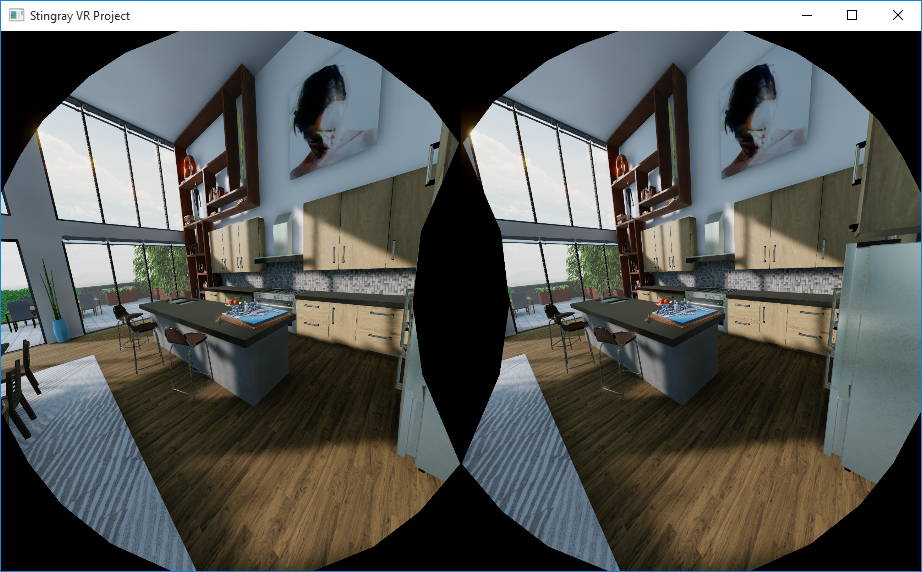

# Stingray 1.2 Release Notes

Stingray 1.2 (1.2.526.0) adds support for the HTC Vive virtual reality platform, multi-threaded project compilation, and several workflow improvements that make it quicker to accomplish everyday tasks.

For information on updates to the Scaleform Studio UI tools, visit the Scaleform Studio 1.2 Release Notes in the  [Scaleform Studio Help](http://www.autodesk.com/scaleformstudio-help "Scaleform Studio Help").

Sections in this topic:

-	[What's New](#whats-new)

	This section lists all the major new features available with this latest version of Stingray.

-	[What's Fixed](#whats-fixed)

	Here you'll find lists of the bugs and known limitations that we fixed, sorted by workflow area.

-	[Known Limitations and Workarounds](#known-limitations)

	This section includes any new known limitations we've found since the last release of Stingray.

-	[Upgrade Requirements](#upgrade-requirements)

	If you're working on a project that you started in an earlier version of Stingray, this section lists the steps you may need to take in order to successfully upgrade to the latest version.

-	[Source updates](#source-updates)

	If you have access to the Stingray source code, see this section for information about what's new for this release in the master branch.

# What's New

* * *

## Interactive, GPU-based lightmap baker

 

<iframe width="854" height="480" src="http://player.ooyala.com/iframe.html?pbid=6055f5a2061d4016b11ebf1fa8a7751e&amp;platform=html-fallback&amp;ec=JncmdoMDE6t0H__vQ6IKWGN4quy1i2jg" frameborder="0" allowfullscreen></iframe>

## Improved quality of Screen Space Ambient Occlusion

 

<iframe width="854" height="480" src="http://player.ooyala.com/iframe.html?pbid=6055f5a2061d4016b11ebf1fa8a7751e&amp;platform=html-fallback&amp;ec=A0cmdoMDE6tf4doj1tA35lI4rkL4FURq" frameborder="0" allowfullscreen></iframe>

## More stable Depth of Field, new debug view

The new debug view makes it easier to see the in-focus and out-of-focus areas.

 

<iframe width="854" height="480" src="http://player.ooyala.com/iframe.html?pbid=6055f5a2061d4016b11ebf1fa8a7751e&amp;platform=html-fallback&amp;ec=FjcmdoMDE6ADvaShQREdCMXtSmaKkXIH" frameborder="0" allowfullscreen></iframe>

## Shadow bias control

A new **Shadow Bias** option for lights lets you control shadow artifacts and grounding of objects.

 

<iframe width="854" height="480" src="http://player.ooyala.com/iframe.html?pbid=6055f5a2061d4016b11ebf1fa8a7751e&amp;platform=html-fallback&amp;ec=A2cmdoMDE6T1BLd5eloCiSTVaM3dXHi9" frameborder="0" allowfullscreen></iframe>

## Selection highlighting: from wireframe to outline

New rendering options let you set the selection highlight to a (customizable) outline mode. This new selection highlighting option creates less occlusion, making it easier to find and evaluate objects in the level.

 

<iframe width="854" height="480" src="http://player.ooyala.com/iframe.html?pbid=6055f5a2061d4016b11ebf1fa8a7751e&amp;platform=html-fallback&amp;ec=JpcmdoMDE6JdbD7rZiD78T0VoUqnbZKF" frameborder="0" allowfullscreen></iframe>

## Reconstructed Normals debug view

This new view lets you compare your object's normals with what they should look like.

This can be helpful when you are not sure if the normals of your objects are correct, or if you suspect one of your normal map channels may be flipped:

 

<iframe width="854" height="480" src="http://player.ooyala.com/iframe.html?pbid=6055f5a2061d4016b11ebf1fa8a7751e&amp;platform=html-fallback&amp;ec=FlcmdoMDE6m7F6FPaFXypZjR5giFhPPs" frameborder="0" allowfullscreen></iframe>

## Additional VR platform support

Stingray now supports deployment to HTC/Valve Vive virtual reality headsets. In addition, (as noted in the *Upgrade Requirements* section below), Oculus Rift support has been upgraded to SDK 0.8.

Check out the new **vr_steam** template project in the **Project Manager**.

## Performance improvements in Property Editor, all tree views

Refactored using the Mithril framework, performance in the **Property Editor** is now vastly improved. Even when you're working with large objects that have many properties, the editor feels lightweight and responsive to work with. Similarly, the tree view used in many tools (such as the **Explorer** panel or **Animation Controller**) is now refactored for smoother, faster browsing and selection.

## Entity support in Story Editor

New entity support in the **Story Editor** lets you configure the shading environment properties of your level. You can now animate an entity’s component properties over time to simulate scenarios like time of day. Add a new entity track to your story, and right-click to browse its keyable components and component properties.

For new information, see ~{ Animate a shading environment with the Story Editor }~.

## Select and animate sub-objects

Sub-object mode lets you select and animate objects within a unit's hierarchy. Turn on **Sub-object mode** in the toolbar () to select and manipulate any of a unit's nodes in the **Level Viewport**.  You can also key individual nodes in the **Story Editor**. When a new unit track is added, right-click in the tree view and select **Add Sub-object > Object name** to quickly add a new sub-object track.

For new information, see ~{ Animate sub-objects with the Story Editor }~.

## Material interop

The new material interop workflow lets you quickly send material updates between Stingray and Maya. With the Stingray DCC Link plug-in installed, you can import and export Stingray Physically Based Shaders directly to and from a Stingray project folder. When sending a new material between applications, its properties, including all of its input connections and nodes, are preserved.

For new information, see ~{ Send materials to Maya, Maya LT, or 3ds Max }~.

## Improved flexibility with Stingray Editor windows

If you like to rearrange and change the docking of your Stingray tools and editors, customizing the interface is now even easier than before. All tools and editors now  move, maximize/minimize, and snap into position independently. You can also drag tools outside of the main Stingray Editor window to work with them as separate windows, making it easier to take advantage of multiple monitors.

##Drag and drop states in the Animation Controller Editor

New drag and drop support in the Tree view and Node Graph of the **Anim Controller Editor** lets you quickly organize states in the hierarchy. For example, you can drag a selection of states over a group state to move the states, along with any associated transitions, into the group.

## Updated Vehicle Physics

**Wheel raycast collision filters:**

Vehicles now support collision filters for their wheel raycasts. The filters can be set per wheel in the vehicle's *.physics* file.  These filters are defined in the *global.physics_properties* file.  If a filter isn't specified for a given wheel then it defaults to collide with everything except the vehicle's chassis and wheels' geometry.

*Example:*

'my_project/content/vehicles/my_vehicle.physics'

~~~{sjson}
		wheels = [
			{
				wheel_raycast_filter = "car_wheel"
		...
~~~

'my_project/global.physics_properties'

~~~{sjson}
collision_filters = {
	vehicle = {is = ["vehicle"] collides_with_all_except = ["trigger" "projectile"]}
	wheel = {is = ["wheel"] collides_with = ["obstacle"]}
	wheel_raycast = {collides_with_all_except = ["vehicle" "wheel"]}
}
~~~

**Wheel moment of inertia:**

- **moi** - Explicitly sets the moment of inertia per wheel. If it is not specified then it defaults to the (backward compatible) method using the point mass formula (mr^2)

**Chassis moment of inertia settings:**

The moment of inertia can now be set in one of three ways:

- **raw** - Explicitly sets the x,y,z values of the moment of inertia
- **cuboid** - Auto-calculates the moment using the formula for a cuboid (with an additional scale)
- **default** - The default (backward compatible) method, from the PhysX example, that uses the cuboid formula with a responsiveness setting that scales the z axis.

**Suspension settings:**

- camber_rest
- camber_max_compression
- camber_max_droop

##Updated Navigation plug-in

The Gameware Navigation plug-in, which provides AI and pathfinding in Stingray, has been updated from version 2016.1.2 to version 2016.1.5.

This latest version of the plug-in fixes the following issues:

- AStarQuery ending with lack of working memory error even for very short paths when the database is huge (for example, 20km x 20km).

- iOS libraries not embedding full bitcode.

- Navigation and VisualDebug issues related to wrong Bot config values, discarded frames, wrong frame index, and inappropriate cleaning of the log.

Earlier updates to the plug-in also added the following improvements:

- (2016.1.4) Fixes to MultiDestinationPathFinderQuery and NavigationLab

- (2016.1.2) Fixes Navigation Mesh Generation where some parts of the NavMesh (cell) could be missing on very rare occasions.

##Core

- DLL linking for iOS & Android

- Multi-core compilation

	Stingray now supports parallelized data compile, taking advantage of multiple threads during compilation, making the process much faster.

- 	Flag to control parallel or serial

- 	Reduce memory footprint

- 	Progress and timing reports

##Scaleform UI tools

*	Improved Scaleform and Stingray interop
	*	You can now select a Scaleform project in Stingray Flow using the **Asset Browser**
	*	You can create a new Scaleform Studio project using the **Create > Scaleform Studio Project** option in the **Asset Browser**. See more in ~{ Integrating a Scaleform Studio project into Stingray }~.
	*	Run the current Stingray project from Scaleform Studio using the **Player > Run in Stingray** option in Scaleform Studio.

##FBX Version 2016.1.2

This release of Stingray picks up the latest version of FBX (2016.1.2), which provides various bug fixes.

##Updated PhysX plug-in

The PhysX plug-in installers for Maya, Maya LT, and 3ds Max that ship with Stingray are now updated to install the latest version of the PhysX plug-in. This plug-in includes several improvements and bug fixes by Nvidia. For related information, see ~{ Install the PhysX plug-in for your DCC tool }~.

##Improved accessibility to Stingray help resources

It is now easy to find all the help you want in one place!

Check out the updated landing page in the Stingray help with all the resources you need to get going with Stingray. The landing page features an improved live search with results from the help, Youtube, blogs and the forum threads. The **Hot Topics** list the helpful topics to create a game, the **Links** take you to places where you can download Stingray updates, example projects and game kits, view tutorials and find answers to questions or problems you encounter. You can also send your queries directly to Stingray experts Paul and Dan.

Inside Stingray, click the new  button at the top right of the Editor for direct access to the Stingray help.

##Stingray online help in Korean

Coming soon! Localized online help for Stingray will soon be available in Korean. We're translating the last-minute updates for Stingray 1.2, but soon we'll publish the new online help system including help articles, the Flow reference, and the shader reference. Localized video captions for Stingray tutorial videos on YouTube are also coming soon.

[Return to top](#top)

# What's Fixed

* * *

### Authoring Tools and Animation:

- GAME-11309 Sub-object mode node tree disappears when panning camera
- GAME-11324 Pressing the trashcan to delete a Story shows a modal dialog with cropped text
- GAME-9349 Stingray menus are drawn on top of other windows when switching apps
- GAME-13263 Intensity is not capped to 0 in Shading Environment color
- GAME-11358 Dragged folders cannot be dropped on the tree view
- GAME-11431 User must manually click 'replay' to see particle in asset preview
- GAME-11435 Imported character appears completely transparent when placed in the viewport
- GAME-11322 Creating a key for light color in Story makes the light become over-bright
- GAME-11496 Property editor: edits do not reflect to other instances
- GAME-11608 Particle editor: clicking 'Replay' unselects the component you were editing
- GAME-11572 Deleting multiple stories in the explorer bugs the Story Editor
- GAME-11611 Terrain: Terrain does not reapply import after undoing a delete
- GAME-11628 Terrain: Importing an height map of a different size cause the engine to crash
- GAME-12244 Terrain: brushstroke doesn't keep up with cursor
- GAME-11474 Story Editor: Snap does not work in the Curve Editor
- GAME-11547 Story Editor displaying curves can have playback performance issue
- GAME-12398 Asset Browser focus doesn't update when selecting an asset by keyboard press
- GAME-11577 Layers; Show/Hide icon cannot be used if it overlaps the Layer name
- GAME-11559 Layers: Long layer names overlap the UI on the right
- GAME-7644 Level settings only saved when level is saved
- GAME-12331 Using recently opened projects will not save current level changes
- GAME-11499 An unit can be renamed to the empty string
- GAME-12208 Project Manager: Level list does not show busy icon while searching project for levels
- GAME-11556 story editor Deleting then CTRL+Z a story gives JS unhandled exception
- GAME-12540 Framing units does not take into account camera near range
- GAME-11378 Tools behavior is inconsistent when working with Read-only files
- GAME-11448 "\r" in PATH makes live link crash
- GAME-12808 Animation - enabling Autostep may cause assert in data compilation
- GAME-12863 Reset property context menu missing
- GAME-10502 Anim Controller editor: adding a clip to a clip state plays the animation automatically even though auto-play is disabled in the editor prefs
- GAME-10796 Audio - Sound Emitters if their positioning is set to "2D" is Wwise do not make sound unless they are shape is set to "box" or "sphere" – “Point” does not work
- GAME-12846 Property editor allows editing and saving of core files.
- GAME-11353 After folder rename, asset browser does not show all resources
- GAME-11247 Frequent engine crash on navigating into certain folders: thumbnail_generator_viewport_behavior.lua:286: bad argument #2 to 'Vector3Box' (userdata expected, got userdata) with customer scene
- GAME-11163 Asset Browser: Delete folder continued to show the contents of the deleted folder
- GAME-11319 Index out of range exception when importing fbx on specific files
- GAME-11937 Command box auto-completion sometimes stops working
- GAME-12061 Double-clicking on a sound asset in the Asset Browser doesn't open Wwise
- GAME-9361 Asset Browser: thumbnail labels sometimes get left-justified
- GAME-12169 audio 2D sound source causing crash
- GAME-5145 Asset Browser: Importing a DDS file overwrites the existing file but does not update the thumbnail
- GAME-10771 Sliding a tab to change its order makes it invisible during the move
- GAME-11599 Docking; Panels can be dropped when no docking icon is highlighted -- results in a weirdly minimized window
- GAME-12343 Asset browser does not update content if current folder is deleted
- GAME-11975 Flow: Set Light Type node only shows omni and spot, and is missing box and directional
- GAME-11633 Right click on a fbx file in the asset browser pops error
- GAME-12119 Property Editor: Using the spinners on a material variable gives only "-0.4751" and nothing else
- GAME-9037 Terrain;Creating a terrain object with Height map resoluton of 0 gives Assertion failed `bytes <= available()` at `...\io\input_buffer.h:43`
- GAME-9774 Asset Browser: Right-click context menu on a unit with no skeleton should not show "Create Animation Controller"
- GAME-11059 Asset Browser: using the control for the icon size results in an error
- GAME-10595 Asset Browser thumbnail generation clipping plane issue with some objects
- GAME-12176 Cursor gets stuck on "iron cross" in flow and shader graph
- GAME-12336 Drag and drop does not work if file inside project
- GAME-11297 Move/rotate tool popup help does not have keyboard shortcut
- GAME-11749 Level Viewport: Right-click > Find Asset in Browser and Open in Unit Editor appear even if nothing is selected in the level
- GAME-12321 Clicking a folder in the asset browser causes the position to change and defeats double click
- GAME-11754 Asset Preview: tab menu button > Reload causes the selection to no longer be shown in its viewport
- GAME-10959 BSI exports no geometry
- GAME-10666 Newly added sounds/events do not work until Stingray is restarted
- GAME-9102 The Save Changes modal dialog sometimes ends up behind the Project Manager dialog so UI no longer responds
- GAME-11369 Entering illegal characters for file name locks editor in Project Manager and Asset Browser
- GAME-11311 [HIGH-DPI] Unable to interact with viewport after resize
- GAME-11397 Panels not belonging to the default layout are not remembered from one session to the next
- GAME-12160 Script Editor instances do not stay in sync.
- GAME-12417 Test play doesn't work if no pre save handlers are registered
- GAME-12159 Script Editor closes without saving file.
- GAME-12301 Exporting selected object in the level no longer works with customer scene
- GAME-6190 Frame (F) and Frame All (A) while the active camera is selected do not do the right thing
- GAME-13022 Creating an Audio Source in the level gives "Error: No component registered for display type Element"
- GAME-6070 Story Editor: curves and tangents can be edited when the story is not in live mode
- GAME-9733 Flow: Ungrouping a parent group ungroups all child groups
- GAME-10187 Flow: Mover Actor Collision node's Touched Mover pin is of the wrong type (Actor vs Mover)
- GAME-9034 Terrain: Giving a maximum height of 0 (or a negative value) crashes engine with PhysX: [invalid parameter] Supplied PxGeometry is not valid. Shape creation method returns NULL.
- GAME-9667 Terrain: Undo brush stroke leaves undergrowth behind
- GAME-8858 Translating a large number of units via the Property Editor raised an exception
- GAME-9412 Undocked panels become lost in the background when clicking in the main window
- GAME-8008 renaming particle materials breaks the particle effect
- GAME-10777 Double prompt for saving unsaved script changes on switching projects
- GAME-11942 File > Save Level sometimes gives "Failed to save level to ... Path is not part of project"
- GAME-12075 External In Event Flow node - double click string gives two dialogues, one crashes
- GAME-12742 Terrain: Undergrowth mesh chooser pulldown always reverts to the first mesh
- GAME-12108 In the legacy level editor, trying to do Alt-Orbit (Alt-LMB-drag) crashes the engine
- GAME-11637 Lose collapse/scroll state of "Local Variables" when stepping while debugging
- GAME-12015 Thumbnails not generated for specific PNG files
- GAME-12168 resizing property editor tree window - mouse gets stuck.
- GAME-12158 Wrong Panel displayed after closing a Panel in a Group
- GAME-12298 Some confirmation dialogs (ex. Terrain Height Map import, Script editor save) come up with UI clipping/spacing/widget issues
- GAME-13105 Story Editor: right-click in the empty left panel gives "TypeError: Cannot read property 'getContextualMenu' of null"
- GAME-12308 Asset Browser: right-click rename hangs with "Unknown remote call error : Method 'Stingray.Foundation.Asset.AssetService.IsEntriesReadOnly' not found"
- GAME-12700 Particle: specifying mesh visualizer material causes acess violation
- GAME-12496 Flow: Unit Flow input values are 0
- GAME-12962 After Make Unique, Open Shader Graph fails with "Cannot edit child materials. To edit this graph either open the parent material or make this one unique."
- GAME-12857 Interop: Updating asset from 3DS Max results in wrong sizes
- GAME-10920 Level flow is not updated when unit is renamed
- GAME-11620 Animation controller; asset_preview_viewport error in crossfade_animation_set_speed after setting Isadditive
- GAME-11517 A lot of error messages sometimes after a light map bake which makes the editor unresponsive
- GAME-11580 Script Editor - Step Over Shortcut (F10) doesn't work
- GAME-11661 Animation Controller State; Clip state with Random clips sometimes play the same animation twice
- GAME-9897 Black boxes appear over all editor windows after letting monitor sleep
- GAME-8561 Undoing multiple duplicate in the level viewport generates an exception and breaks the undo stack
- GAME-10981 3dsmax bsi exporter does not show options dialog
- GAME-11179 Unit Editor should save Mover Slope Limit angle as cosine (and not radians)
- GAME-11429 Viewport max framerate does not work
- GAME-11352 Exiting out of story does not restore object instance properties
- GAME-11389 popping-out the asset preview clear its content
- GAME-11461 You can create a terrain with a ridiculously large height map resolution -- causing a crash
- GAME-11218 Set variable flow nodes missing output events
- GAME-11192 Apply transform to active camera with spinner crashes the engine
- GAME-11412 Editor does not gracefully handle a 0 byte .scene_cache file
- GAME-11338 File system change can cause JavaScript error in Asset Browser
- GAME-11422 Particles in Asset Preview Interaction Only mode costs CPU usage until editor-restart
- GAME-11249 The Level Viewport sometimes continues to show the spinning wait animation instead of the level
- GAME-11384 Possible to select non-existent build configuration
- GAME-11265 Ensure quoting works for all commandline paramets on XB1
- GAME-11618 Particle editor: Exception assigning position: mesh unit
- GAME-11533 Add Component / Add Child in entity properties doesn't work
- GAME-11590 Story Editor keys can use Invalid values for components
- GAME-10835 Animated Cameras from Max have bad first frame transforms in skeleton
- GAME-11022 Crash in External Console engine reload via ctrl+r
- GAME-11460 Saving terrain unit outside project generates exception
- GAME-11164 Level viewport rendering sometimes gets squashed/stretched by the layout
- GAME-11561 Log console overwrites manual scroll state when new lines are added
- GAME-11475 Level can be saved outside project giving crash
- GAME-7966 Rename; Moving multiple assets in asset browser doesn't work
- GAME-10520 Audio - Sometimes I have to hit F5 after makeing new events to hear them in game.
- GAME-12039 Asset Browser: Ctrl-Click selection returns to the folder of the first selection
- GAME-11127 Crash in Stingray Frontend (StingrayApp) when closing down
- GAME-10604 Wwise - Empty sound banks property editor is not updating properly.
- GAME-11320 "Find Asset in Browser" doesn't scroll the window to the selected asset
- GAME-11601 Property Editor: Mismatched checkbox for script data properties
- GAME-11548 Editor layout is reset when switching projects
- GAME-11757 Printing HTML from Lua can break the console log
- GAME-11931 The on-view-loaded callback of the view-selector directive can be called before controllers are constructed
- GAME-11333 Pause then Stop stingray bake lightmap crashes the engine
- GAME-10707 Wwise Exporter crashes when output metdata files are not-writable
- GAME-11853 Level Viewport sometimes does not render
- GAME-11638 Debugger view; nil type icon missing
- GAME-10098 Cannot close offscreen Story Editor
- GAME-10812 Project Manager: Level list does not update when adding new projects
- GAME-11211 Send to Maya on a stingray material renamed with numbers imports to Maya but material is broken
- GAME-11953 Bad viewport scaling after window resize
- GAME-9891 Stingray Out of Memory when loading large game level
- GAME-10397 Material color swatches are incorrectly displaying white
- GAME-11299 Moving an object scaled to zero creates an engine crash
- GAME-11128 Find Asset in Browser doesn't always appear in right click menu
- GAME-11129 Additive Animation Clip: problem when compiling old additive clips in 1.1
- GAME-11883 Lua crash on new project with specific scene
- GAME-8502 Interop - FOV is not linked when 3DS max viewport slaving
- GAME-10322 Marker names not updating properly
- GAME-9658 Users can add bad assets to level causing errors and viewports to be unresponsive
- GAME-9686 Dropdown in project manager on wrong screen, won't follow property page
- GAME-10723 Send to 3ds max automatically re-imports the asset
- GAME-9154 Stingray title bar flickers when opening the app
- GAME-9644 Flow - Multiple instances of the same Subroutines write over each other's variables
- GAME-10457 Material dropping on 'no object' sets material to last hovered mesh
- GAME-10745 [AnimController] [AnimClipEditor] Viewport Focus is lost when user saves the Anim Controller/Clip
- GAME-10575 Backspace in Asset browser search dialog is not captured
- GAME-9460 Shared TreeView directive : If my selection is collapsed, pressing F may not scroll to the selected item
- GAME-10704 Text in input fields should be selected on focus
- GAME-11326 Middle-mouse drag from Property Editor locks UI
- GAME-11150 3DSMax Interop: Sometimes connection does not work
- GAME-11034 Maya crashes when sending a material from Stingray to Maya if the name of the material matches maya default material
- GAME-11977 Toggling visiblity on/off does not generate distinct undoable actions (they are merged)
- GAME-12008 unicode character in Scaleform Studio source files causes build error on Japanese OS
- GAME-11748 Have runtime player size change the player settigns
- GAME-11747 Fix initial default player settings so it's centered on the monitor that's running the editor.
- GAME-10868 Tweener API non-functioning
- GAME-11956 Template touch ui interaction is on 'mouse up' causing unintended inputs
- GAME-10870 Animation layers parented in a group display an extra frame when played back
- GAME-10971 Resizing Dimensions of a Multi-selection is incorrect
- GAME-11026 Open dialog for components don't save the last directory you were in.
- GAME-10936 Should be able to move the Mask without moving what's under it.
- GAME-10741 Android: Crash occurs with sfstudio player when switching to landscape/portrait modes
- GAME-10802 Recent projects sometimes use a backslash which can duplicate projects in the list.
- GAME-10779 Actor names should be named after the actor thats being created.
- GAME-10832 Text edit mode selection bugs out when the parent actor is scaled.
- GAME-9368 svg files not rendering
- GAME-10506 Reset to zero in properties does not move the actor after you do it once.
- GAME-10507 Reset to zero for size/scale should reset the actor to its default size.

### Rendering:

- GAME-11728 Global lighting of particles broken when running without shadow casting directional light
- GAME-9513 Adding undergrowth to a terrain layer crashes the engine
- GAME-12003 Outline color cause a streaking effect when restarting the engine
- GAME-12959 Android: when switching back to the Stingray app, a flash of red is seen
- GAME-12539 Depth bias potentially causing artefacts on iOS/android
- GAME-12578 translucent objects fail to receive shadows
- GAME-9981 Android: Pressing the Square task switcher button to return to the game gives rendering issues
- GAME-10153 Increased shadow banding seen during gameplay in some cases
- GAME-10016 Black artifacts along one or two Level Viewport edges on opening a level
- GAME-11869 A decal projection continues to be rendered in Level Viewport after being deleted
- GAME-12136 Memory leak occurs when closing RTT project from Run Project
- GAME-12507 Crash in ClusteredShading::render
- GAME-13006 Access violation on camera looking around in terrain/grass project
- GAME-12745 Terrain: Assertion failure on reimporting a unit being used as undergrowth, terrain\decoration.cpp:197 'mesh'
- GAME-11409 Engine crashes after clicking Test Level in render_target function
- GAME-11890 Erroneous "Cannot edit child materials" when trying to open materials
- GAME-11443 Stingray Baker does not take all geometry into account
- GAME-10923 roughness improvements in shader
- GAME-11816 Baker: when baking progress is canceled, lightmaps in scene are still updated
- GAME-11832 Baker: Error if choosing new level while baking
- GAME-11346 Open shader graph and selecting a node doesn't update the Property Editor the second time around
- GAME-10769 Light Baking: Decals affect light baking, causing suble but visible shadows
- GAME-11345 Crash when removing instancing from a material from an object that has been baked
- GAME-10756 fresnel node seems to interpolate as if it is doing things in the vertex shader
- GAME-13252 Engine crash when creating particle effect, due to improper render_config reload

### Core:

- GAME-10318 PhysX Errors are returned when painting vertex behaviours
- GAME-10307 Clipped window shows "Export Files to New Folde" in Export settings for type APEX/PhysX
- GAME-12371 PhysX plugin: Clicking on rigid body tab in Attribute editor gives Error: AEnxRigidBodyTemplate.mel line 1294: Cannot convert data of type undefined to type string
- GAME-10164 Anim Controller Editor: reverting changes after selecting a sound bank leads to an engine crash
- GAME-11250 Closing Texture Manager window gives "Data / FileServer: 127.0.0.1: Lost connection, recv(): 10054"
- GAME-11809 Stingray with nView, causing access violation on opening projects, testing levels, running projects on particular systems
- GAME-10166 Anim clips are played automatically even though auto-play is disabled in the editor settings
- GAME-12368 Engine Freeze with old anim controller and APEX cloth build
- GAME-11013 Outputting results from query nodes do not work in flow subroutines
- GAME-11074 PhysX joint free-end anchor are miss-placed
- GAME-11881 NVTT Thread Pool should be deactivated when compiling in parallel.
- GAME-9992 Run Project does not work and gives no errors if checkbox for a closed platform is also on but is not installed
- GAME-10858 Mover separation should register a collision
- GAME-10885 World.link_unit() can break scale (in doc hands)
- GAME-10847 Lua Out Of Memory Crash - Windows 10 - 64bit
- GAME-11243 PS4 texture compile crashes in Parallel
- GAME-11374 Compile crash when opening unit editor in a project with UTF-8 characters in the name
- GAME-11945 Plugin API should expose a single luaL_newState() that uses our Lua allocator
- GAME-11836 lib_newState always returning null from plugin_api Platforms and Deployer:
- GAME-9609 Connect to device gives error messages about Flow button nodes invalid values
- GAME-10724 Android: debug builds of the game do not exit cleanly
- GAME-11636 Error when live linking to an Android device that is locked.
- GAME-9544 Subfolders do not get copied when using the iOS Package server

### Gameware Navigation:

- GAME-11689 NavMesh Generation does not take into account primitives.
- GAME-11491 NavGraphConnector (off-mesh links) are inverted compared to their gizmo

### HumanIK:

- GAME-10857 HIK: foot planting degrades with each level switch

[Return to top](#top)

# Known Limitations

* * *

This section lists known limitations and workarounds for Stingray.

Unless otherwise noted in the **What's Fixed** section, please be aware that this release contains the same **Known Limitations** described in the previous versions of Stingray Release Notes.

- **GAME-13222 Lightmapper will pause if the UI is set to background**

	**Workaround:**  Enable the Viewport “Update mode” to “Always” and do not minimize Stingray.

- **GAME-11326: Middle-mouse drag from Property Editor locks UI**

	The Stingray editor is based on CEF (Chromium Embedded Framework), and this [known limitation](https://code.google.com/p/chromium/issues/detail?id=336373) in Chromium affects Stingray. Because of this issue, drag & drop with the middle mouse button sometimes freezes parts of the Stingray interface.

	**Workaround:** Stingray editor doesn't support middle-drag operations, so avoid middle-dragging.

- **GAME-12879: Crash with Dell Backup and Recovery (DBAR) Application installed**

	Stingray crashes on Dell systems running version 1.8.1.71, A00 of the Dell Backup and Recovery (DBAR) application, which was released in August, 2015.

	This version of the DBAR application is incompatible with all QT5 applications, including Stingray.

	**Workaround:**  Install an updated version of the Dell Backup and Recovery Application, version 1.9.2.8 or later.

[Return to top](#top)

# Upgrade Requirements

* * *

The full installation guide for Autodesk products including Stingray is included in the Stingray online help, [here](http://www.autodesk.com/stingray-install-ENU "here").

This section explains the improvements and fixes that require specific upgrade steps for users currently using a previous version of Stingray.

### Android platform tools

The Android SDK version used by Stingray has not changed. However, we have updated the required version for the platform tools and build tools.

See ~{ Requirements for Android game development }~ and make sure that you have installed a version of the platform tools that is compatible with Stingray, and a version of the build tools that is compatible with the version of Android used on your device.

### Xbox One XDK version

Stingray now requires the **August 2015 QFE 2** release of the XDK.

### Lua API changes

For a complete list of all new, modified, and removed elements in the Lua API in this release, see the [version history](../../lua_ref/versions.html).

If your project contains any API elements that have been modified or removed, you will need to adjust your code accordingly.

**Major changes:**

-	The `stingray.PhysicsWorld.destroy()` function, which you could call in previous versions in order to destroy physics actors, has been renamed `stingray.PhysicsWorld.destroy_actor()`. The signature has not changed.

### Oculus SDK upgrade

Oculus VR has been upgraded to SDK 0.8.

[Return to top](#top)

# Source Updates

* * *

### New Android tools

We have moved from the Tegra Android Development Pack to the newer NVIDIA CodeWorks for Android 1R3. If you need to rebuild the Stingray engine with support for Android targets, you will need to download and install CodeWorks for Android.

[Return to top](#top)
