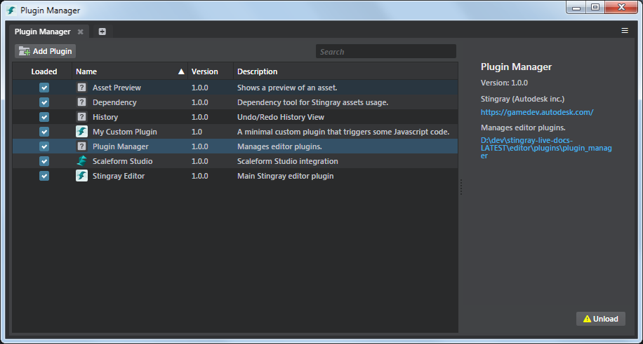

# Stingray 1.4 Release Notes

Stingray 1.4 (1.4.728.0) delivers improved connectivity with Autodesk 3D tools, adds support for more VR platforms, and provides experimental support for WebGL2, letting developers deploy projects to certain web browsers. This release of Stingray also includes numerous other updates that improve usability in several functional areas of the engine.

In addition, this Stingray release supports network licensing. Updated Autodesk licensing and installation information is included in this version of the Stingray online help.

Sections in this topic:

-	[What's New](#whats-new)

	This section lists all the major new features available with this latest version of Stingray.

-	[What's Fixed](#whats-fixed)

	Here you'll find lists of the bugs and known limitations that we fixed, sorted by workflow area.

-	[Known Limitations and Workarounds](#known-limitations)

	This section includes any new known limitations we've found since the last release of Stingray.

-	[Upgrade Requirements](#upgrade-requirements)

	If you're working on a project that you started in an earlier version of Stingray, this section lists the steps you may need to take in order to successfully upgrade to the latest version.

## What's New

* * *

## Level Sync with Maya and Maya LT

In addition to linking individual assets, you can now link and export entire scenes built in Maya or Maya LT directly to Stingray. Once Maya or Maya LT are linked to the Stingray editor, scene assets can be automatically or manually tagged, and then reproduced with the same layout in Stingray. Modifications you make to the assets in Maya or Maya LT are then updated inside Stingray. This makes it way easier to build, iterate, review and change scenes, without having to manually reproduce layouts in two tools. See ~{ Level Sync with Maya, Maya LT, or 3ds Max }~.

## WebGL2 support

The new experimental mode in Stingray offers developers a chance to try development for a new platform, WebGL2. With the experimental mode enabled, you can deploy Stingray projects to run in the nightly developer beta builds of certain web browsers. This is a great way for forward-looking developers to test their projects on a new target platform in advance of those platforms being consumer-ready.

> **Note:** This functionality requires the use of specific developer builds of certain web browsers in conjunction with an experimental mode in Stingray. The functionality is designed for early testing of projects in WebGL2.

See ~{ About Experimental Features }~ and ~{ Run your project in a browser using WebGL }~.

## VR support

Stingray 1.4 includes improved support for VR platforms, adding support for the Oculus Rift SDK v1.4 and the SteamVR SDK v1.0. See ~{ Supported platforms }~ for the updated list of VR SDK kits.

This release also includes an updated SteamVR template project, which you can download from the **Project Manager**.

## Flow scripting for Vive controllers

Developers can now make use of Flow, the node-based visual scripting system in Stingray, to create controller actions for the Vive controllers (SteamVR). This offers a much faster and simpler way to add interactivity to a Vive VR experience and makes it easier for designers to create and test their prototypes without manual coding.

## Cross-project asset sharing

You can now share assets much more easily between different Stingray projects. Right-clicking a file for export automatically includes all file dependencies into one convenient, compressed file. This makes sharing assets across projects, teams, or selling in digital asset stores easier than before. See ~{ Import and export assets as a package }~.

## Multiple databases for Gameware Navigation

In previous releases, each Stingray level could only be associated with a single Gameware Navigation database. This meant that you could only generate NavData for one size of character.

In this release, you can now create multiple NavData databases for each level when you generate your NavData in the **Navigation** panel. You can set different size parameters for each database, so that the NavData managed by each database will more accurately reflect the real movement possibilities for a character of that size. For example, you could use one database for human-sized characters, and another for giants or dinosaurs. For updated information, see ~{ Generate navigation mesh }~.

## Edit UV scale/offset values in Stingray

When exporting materials from Maya, Maya LT, or 3ds Max, Stingray now includes and exposes **UV Offset** and **UV Scale** values in the material so you can continue to edit the UV tiling in Stingray.

## Editor plug-in framework unveiled

This release introduces a new plug-in framework for the Stingray Editor. Anyone can use this framework to customize the editor's behavior and add new editing features, even without access to the Stingray source code. For details, see ~{ Customize the Stingray Editor using Plug-ins }~.

## Material interop support for 3ds Max

With the Stingray DCC Link plug-in for 3ds Max installed, you can now import and export Stingray Physically Based Shaders directly to and from a Stingray project folder. When sending a new material between Stingray and 3ds Max, its parameters, including all of its input connections and nodes, are preserved.

See ~{ Send materials to Maya, Maya LT, or 3ds Max }~ and ~{ Receive materials from Maya, Maya LT, or 3ds Max }~ for updated information.

## Expanded Android support

This release adds support for the Mali series of GPUs, providing a greater range of Android-based mobile devices as deployment targets. See ~{ Supported platforms }~ for updated information.

## Asset Browser improvements

-	Create terrain units by right-clicking in the **Asset Browser**.
-	Re-importing units, skeletons and clips now display the **FBX Import** options. Right-click an asset (or multiple assets) and select **Re-import** to re-import and apply the changes to the selected files.

## Shader Graph improvements

- The ~{ Shader Graph Editor }~ now supports multiple shader graphs open at once. Docking multiple shader graphs in the main interface lets you easily cut and paste shader nodes between different shader graphs.
- You can now search for text and nodes in your shader graph using the *Search* field in the **Shader Graph Editor**. Enter a query in the *Search* field and use the arrows to browse through the search results. Click  to narrow your search using the **Search options**.
- Nodes in the **Shader Graph Editor** now feature built-in links to the Shader reference pages of the Stingray online help, letting you locate learning material on how to use and implement shader elements.

## Flow scripting improvements

You can now access the Flow node reference documentation directly from each Flow node. You can also search through Flow graphs to find specific nodes, making it easier to navigate and build complex scene interactivity in Flow.

## Uniform scaling

The XYZ scale transform values for scene objects can now be locked, letting you easily change the scale of an object directly in the **Property Editor** but maintain the same ratio. This makes it easier to scale objects consistently to make them fit the requirements of a scene or project.

## Support for TIFF files

You can now import TIFF files to use as textures. See ~{ Supported file formats }~ for updated information.

## Cloth simulation improvements

Stingray 1.4 improves the support for NVIDIA APEX clothing added in Stingray 1.3. The new update adds collision for cloth on ragdoll characters, making cloth move more realistically and believably around characters moving through a scene.

In addition, when you import an asset with APEX cloth configured, all .apx files named to match your FBX file are now automatically imported into your Stingray project. For example, when importing an FBX file named cloth_test.fbx, files named cloth_test1.apx and cloth_test2.apx are also imported. Renaming or moving units in Stingray Editor also renames or moves the associated .apx file with the same name.

## Sort decals

You can now sort decals layered together using the new decal **Draw Order** property. The decals will be projected based on the draw order with higher valued decal displayed on the top.

## Improved rendering performance

The powerful Stingray renderer has been optimized when using Screen Space Ambient Occlusions (SSAO), resulting in better speeds overall.

## GLSL lens effect shaders

For the WebGL platform, the Stingray renderer now supports lens effect shaders suitable for wide panoramic scenes.

## New Stingray light baker settings

When you bake lightmaps with the Stingray baker, you can now adjust:

-    the overall brightness of the indirect illumination baked into the lightmaps;
-    the amount of light cast out into the scene by emissive materials;
-    the overall brightness of the diffuse light in the scene.

## Updated DCC interop plug-ins

This release includes an updated Stingray DCC Link plug-in to support Maya 2017 and Maya LT 2017, as well as the plug-in for 3ds Max 2017. For information on the plug-ins, see ~{ Interop with Maya, Maya LT, or 3ds Max }~.

## Easier Wwise engine configuration

You now have more control over the memory usage and behavior of the integrated Wwise audio engine from the *settings.ini* file in your Stingray project. See the ~{ Stingray engine settings.ini file reference }~.

## Updated PhysX plug-in

The PhysX plug-in installers for Maya 2017 and Maya LT 2017 that ship with Stingray are now updated to install the latest version of the PhysX plug-in, version 3.3.20602.11122. Click [PhysX Plugins Download]( http://www.autodesk.com/physx-plugins-download) to get the plug-ins for older versions of Maya. For related information, see ~{ Install the PhysX plug-in for your DCC tool }~.

[Return to top](#top)

## What's Fixed

### Authoring Tools and Animation:

- GAME-15081 Story: Sub-Object keys cannot be created with 'S' hotkey.
- GAME-15110 Right-click on a transformation spinner in the **Property Editor** to reset the value does not add to history and cannot be undone
- GAME-15082 Level references: Moving transforms on the xform channel in the **Property Editor** causes a crash
- GAME-15283 [AnimControllerEditor] Error when a ShortcutState is set as DefaultState for a layer
- GAME-13690 Create Project "A project with the same name already exists" notification stays for too long
- GAME-15106 UI changes in new versions of Stingray are not seen until they happen to get new instances of windows, delete their settings folder, or do Window > Reset Layout
- GAME-15048 Flow: Cursor getting stuck into hand shape when hovering buttons
- GAME-15077 Rare random crash during editor load GetUnit, 'An item with the same key has already been added'
- GAME-14944 Particle editor: Instant log errors when creating particle effect
- GAME-15213 Editor freezes when a project has a custom core directory.
- GAME-15162 Hover raycast still happens during right mouse camera rotate
- GAME-14767 Discard Changes on a material can cause a backend exception
- GAME-14773 Errors thrown when drag-and-dropping anim clips from the Asset Browser into the Anim Controller editor
- GAME-14780 File Export selected: "cannot save file outside project directory"
- GAME-14777 Copy-pasting filtered messages from Log Console gets all messages, not just those shown
- GAME-14787 Backend crashes when data compilation fails
- GAME-14808 FBX Anim Import : do not create transform curve for non-animated node
- GAME-14804 Animation Import: animation track not playing ?
- GAME-14783 Animation Import: Constant curve should not be removed too early
- GAME-14782 AnimationClip properties : order curves alphabaticaly
- GAME-14634 Import Dialog - when animation category in uncollapsed, the select skeleton listbox does not select the model value
- GAME-14576 Log Console: the filter button should indicate when any filtering is active (the way the Asset Browser filter does)
- GAME-14199 Shader Graph: 'bad number format' when entering a decimal value without a zero
- GAME-14222 LightMap ignored during a Level "Save As"
- GAME-14105 NodeInfo always have an empty Category for custom nodes
- GAME-14136 Shader Graph Editor - The "Open" button should not open a generic Open FIle window but a window that lists the materials of the project
- GAME-14125 Refresh button remains disabled after saving current graph modifications
- GAME-13315 Log Console: Toggling any of the 6 error/warning/info buttons causes the filter checkboxes to be out of sync
- GAME-13313 Renaming a level unit accepts any character without input validation and can lead to errors (ex. System.FormatException: Input string was not in a correct format)
- GAME-13860 Deleting the Standard Base node from a new material shader graph gives "Target Invocation error : Sequence contains no elements"
- GAME-13750 Asset Browser right-click context menu Create submenu is missing Terrain
- GAME-13742 Level Flow: "Paste" from the RMB context menu is always disabled
- GAME-13736 Terrain editor: Undergrow mesh reference is not updated when the unit gets renamed
- GAME-13669 Intermittent error DCCLink: System.Net.Sockets.SocketException (0x80004005): Only one usage of each socket address (protocol/network address/port) is normally permitted
- GAME-13729 Terrain: Should be able to export Height map outside of the project directory
- GAME-13769 Log Console Auto-scroll gets toggled off on startup
- GAME-13488 Animation: Selecting an animation for the very first time in the asset browser can be slow
- GAME-14684 When switching projects, the Anim Clip Editor shows clips from the previous project
- GAME-14383 FBX Import: Ignore meshes without polygons
- GAME-14434 Folder rename errors when files have no extension
- GAME-14413 APEX: Cloth assets not visible in thumbnails
- GAME-7714 Flow: missing or disappearing colon between the pin/slot/parameter name/label and its value (and their colours should be different)
- GAME-10811 Unhandled JavaScript exception in Level Flow Editor when opening level flow during compilation
- GAME-10768 Project Manager: Search filter does not get cleared properly on creating or adding a new project
- GAME-10616 Script Editor: the toolbar horizontal scrollbar disappears when the file tab scrollbar appears
- GAME-5106 Level story flow shows outputs for all unit tracks, should only be events
- GAME-11165 In the main menu bar, the File and/or Create menu sometimes end up in the wrong place
- GAME-13989 Creating a "Trigger" and "Get Trigger Properties" for same trigger is not allowed
- GAME-14589 Editor process hangs if closing from project manager
- GAME-14149 Ctrl-S shortcut does not work to save a Shader Graph
- GAME-13017 Duplicate items in the Create menu
- GAME-14880 Focus issues when opening modal dialogs
- GAME-15200 Flow: cursor gets stuck in pen/pencil shape in Level Flow editor
- GAME-13345 Cannot Create blank project if no template is present
- GAME-13070 Project Manager: when switching projects, selecting a project and double-clicking on a level does not open the level, only the project
- GAME-13821 Multiple menu items with the same shortcut do not work
- GAME-14645 When a project is already compiled, loading a level on project load doesn't open the level
- GAME-14371 Level Viewport camera shifting down every time a material is selected in the Asset Browser
- GAME-14537 Asset Browser: Locked files (i.e. p4) are not visible in Asset Browser on startup
- GAME-14480 Opening an existing project with removed `_data` folder shows no progress for compile
- GAME-14506 Asset Preview: Switching project does not re-register preview behaviors
- GAME-8591 Project Manager: adding an existing project should automatically scroll to show the just-added project
- GAME-13993 Editor opens behind other windows (in background)

### Core:

- GAME-15208 Loading customer project yields Node compile function descriptor for type `external_event` not found
- GAME-14758 Engine modules that return a local variable aren't properly refreshed/reloaded
- GAME-14160 Mouse cursor is not hidden by default when starting engine
- GAME-13976 Callstack symbols are not shown for plugins
- GAME-13255 Wwise locks up in update_async_reads(), CAkLowLevelTransferDeferred
- GAME-13178 Wwise audio streaming crash at extremely low framerates
- GAME-13933 "Run Project" from editor does not work on Galaxy S7
- GAME-13584 Opening the vehicle template level gives many warnings: Physx: PhysX: RigidBody::setRigidBodyFlag: kinematic bodies with CCD enabled are not supported! CCD will be ignored. physx\src\NpRigidBodyTemplate.h 437
- GAME-13519 [PhysX] Scale shapes local position
- GAME-14712 Apex: Crash with ragdoll + cloth
- GAME-14711 PhysX deadlock when threading not supported by browsers
- GAME-14650 Fixing memory leaks upon engine shutdown
- GAME-14406 PS4 - Voice chat threading issues
- GAME-12579 APEX Cloth material resource issue

### Entities:

- GAME-15265 Renaming an Entity in Asset Browser deletes it from project
- GAME-15386 Multi-Editing: Multi-Selecting two entities that have color property gives error
- GAME-14946 Shading environment entity cannot be duplicated
- GAME-14666 If an Entity's Inherited Asset disappears, no feedback that connections are broken

### Gameware Navigation:

- GAME-14994 NavSamples - One of the bots doesn't move in the route sample + animation broken
- GAME-15169 fix `*out_pos = *pos` when pos float[3] bug in nav_plugin_c_api
- GAME-15158 NavSamples - The nav route project has some issues with the anim controllers
- GAME-14027 Fix terrain sampling when generating NavMesh
- GAME-13921 NavPlugin: multisector generation does not stitch when terrain is used
- GAME-14721 Android live link sometimes gives "untitled / Lua: core/gwnav/lua/gwnavgen_new.lua:342: attempt to index upvalue 'GwNavGeneration' (a nil value)"
- GAME-14952 NavPlugin: Clicking Yes in "Save your changes before opening a new level" dialog triggers a Navigation Lua error

### Interop

- GAME-15457 ShaderFX: Vec2 from max exports as Vec4 and causes errors when parent material expects vec2
- GAME-15394 DCCLink: Send material to Stingray, folders not created
- GAME-15238 Set Engine Resource: instances should be detected and share the same resource name

### PhysX:

- GAME-13472 PhysX plug-in: Many variable redeclaration warnings on first using the plugin and on starting Maya with the plugin auto-loaded
- GAME-13475 PhysX plug-in: physics highlighting no longer present in Viewport 2.0
- GAME-12423 PhysX plug-in: UI - Attribute Editor label "Volocities" typo in the rigid body tab
- GAME-12375 PhysX plug-in: Changing the Output Scaling Factor unit gave Warning: physxUI.mel line 2622: Converting string "0.01m" to a float value of 0.01
- GAME-12369 PhysX plug-in > Validate PhysX Scene gives Warning: physxValidateScene.mel line 65: The -bs/-borderStyle flag is obsolete and should not be used
- GAME-15195 When using Viewport 2.0, a PhysX sample scene simulation leaves shaded objects unmoved

### Platforms and Deployer:

- GAME-14440 Specifying an invalid iOS packaging server by name results in a crash
- GAME-14771 Connections panel: an Android connection sometimes looses its Platform choice and shows a blank, undefined choice instead
- GAME-13273 Android shield tablet crash when enabling/disabling OS fullscreen
- GAME-12877 Android: Vehicle template gives warnings "android / OpenGL: Unsupported texture format: GL_COMPRESSED_RED_GREEN_RGTC2_EXT (GL format: 8dbd)"

### Rendering:

- GAME-15100 Billboards without additive blending renders incorrectly in GL shaders
- GAME-13666 textures display only the smallest mip
- GAME-12213 Decal blend orders are different in editor and in game
- GAME-11692 Stingray baker does not handle planes well
- GAME-11693 Baker handles skylight incorrectly
- GAME-14761 Engine crash on textures when loading resource package asynchronously (SR00071)
- GAME-13339 Material Variable node's Type pulldown contains a blank item and choosing it gives "nhandled exception, Error: FormatException: Input string was not in a correct format."
- GAME-14349 Editor Engine: Trying to use a deleted resource!", "Assertion failed 'idx != NOT_INITIALIZED' at 'd3d11_render_device\d3d_resource_manager.inl:6'
- GAME-14653 Terrain: When adding undergrowth and increasing density from 0, Assertion failed 'type == RenderResource::TEXTURE' at 'd3d11_render_device\d3d_resource_manager.inl:13' error

[Return to top](#top)

## Known Limitations

* * *

This section lists known limitations and workarounds for Stingray.

Unless otherwise noted in the **What's Fixed** section, please be aware that this release contains the same **Known Limitations** described in the previous versions of Stingray Release Notes.

* **GAME-15758 Flow node Get Unit Boolean always returns false**

	The output value of Get Unit Boolean is always false regardless of the actual value of the unit property.

* **GAME-15757 Flow node Spawn Unit at Position always triggers "Spawned" output event**

	When a unit is unspawned using the Spawn Unit at Position flow node it will trigger nodes connected to the "Spawned" output instead of the "Unspawned" output.

* **GAME-15756 Counter flow nodes does not begin at Start Value unless they are reset**

* **GAME-15899 Crashes in subflows**

	Creating a subflow with a delay node causes crash when running the delay node.

* **GAME-14739 Scaling UVs in the V axis can sometimes result in unexpected results.**

	Whole numbers such as 1, 2, 3 will appear correctly, numbers such as 1.23 will scale from a different origin.

*	**GAME-15456 Blank tools in earlier versions of Stingray Editor, after running Stingray 1.4.**

	**Workaround:** Select **Window > Reset Layout** to reset the editor.

*	**GAME-15085 Cannot import zip files.**

	Import packages does not import assets in a zip file.

	**Workaround:** Unzip the package and import the assets individually.

* **GAME-15458 Traffic Game from Creative Market: The taxi cab does not move forward in Stingray 1.4.**

	**Workaround:** None.

[Return to top](#top)

## Upgrade Requirements

* * *

The full installation guide for Autodesk products including Stingray is included in the Stingray online help, [here](http://www.autodesk.com/stingray-install-ENU "here").

This section explains the improvements and fixes that require specific upgrade steps for users currently using a previous version of Stingray.

### Oculus VR template update

The `Oculus` Lua API has been updated in this release in order to work with the public Oculus Rift SDK. Unfortunately, this change has also required some code changes in the Lua scripts of the VR template.

If you have previously created a project from the VR template in an earlier version of Stingray, that project will no longer work with the 1.4 Stingray release.

To get around this problem, start a new project from the VR template in this release. Then, copy all of the content **except the *scripts* folder** from your old project into the new one.

### Lua API changes

For a complete list of all new, modified, and removed elements in the Lua API in this release, see the [version history](../../lua_ref/versions.html).

If your project contains any API elements that have been modified or removed, you will need to adjust your code accordingly.

Major changes:

-	The Gameware Navigaton plug-in can now have multiple NavData databases at the same time. Most of the functions in `GwNav` objects that previously accepted a `GwNavWorld` have been updated to take either a `GwNavWorld` or a `GwNavDatabase`.

-	`Oculus` initialization and setup has changed slightly -- see the note above.

-	You can now open and manage web sockets using the new `WebSocket` API.

-	You can now access measurements from device sensors using the new `Sensor` API.

### Flow node changes

For a complete list of all new, modified, and removed Flow nodes in this release, see the [version history](../../flow_ref/versions.html).

If your project contains any of the Flow nodes that have been modified or removed, you will need to make sure that your graphs are wired correctly by deleting any old versions of the node and re-inserting the new version.

Major changes:

*	**Level > Level Story** adds a new event pin, Reverse Play, which lets you easily reverse the story playback at runtime.

[Return to top](#top)
