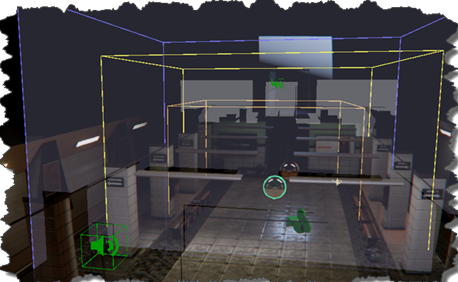
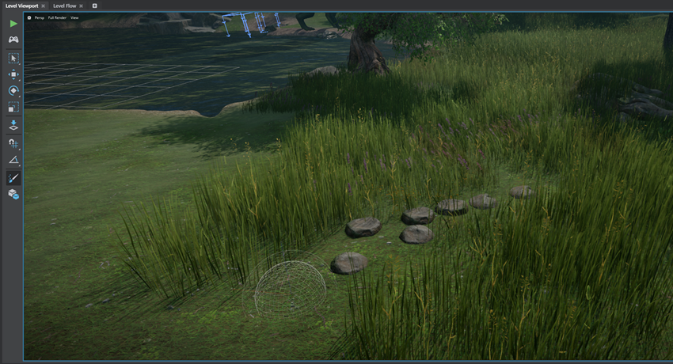
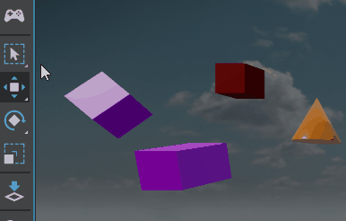

# Stingray 1.5 Release Notes

Stingray 1.5 (1.5.863.0) provides HDR eye adaptation effects, morph target workflows, and a new Scatter Tool that makes it quick and easy to populate a level environment with lightweight units. From importing projects to duplicating or selecting assets, this release also includes several usability enhancements that provide an improved experience for both new and experienced users.

In addition, Stingray 1.5 includes experimental support for GearVR, including a new mini renderer.

Sections in this topic:

-	[What's New](#whats-new)

	This section lists all the major new features available with this latest version of Stingray.

-	[What's Fixed](#whats-fixed)

	Here you'll find lists of the bugs and known limitations that we fixed, sorted by workflow area.

-	[Known Limitations and Workarounds](#known-limitations)

	This section includes any new known limitations we've found since the last release of Stingray.

-	[Upgrade Requirements](#upgrade-requirements)

	If you're working on a project that you started in an earlier version of Stingray, this section lists the steps you may need to take in order to successfully upgrade to the latest version.

## What's New

* * *

### Auto-exposure component for shading environments

For scenes with HDR information, there is now an auto exposure component for your shading environment. This component gives basic control over the auto exposure feature. You can control min and max exposure, exposure input threshold, and adaptation speed and damping. This lets you create effects of blinding light, and eye adaptation when entering darker areas. Crucially, this component lets you utilize the full HDR range of your scenes.

Accompanying the auto-exposure component, we’ve added a new rendering debug mode with a histogram and average luminance view. For more information, see ~{ Adapt scenes to different lighting environments }~.

### Blend Shape workflows

You can now use blend shapes/morph targets within Stingray. A full suite of tools let you import, preview, control and animate the blend shapes on your meshes. See ~{ Blend Shapes }~.

These tools are implemented as a plug-in that takes full advantage of the extended extensibility features of Stingray 1.5.

### Easy access to example projects

A new tab in the Project Manager makes it easy to get sample projects from Creative Market. Download example projects and game projects using the new **Online Examples** tab. See ~{ Download assets and example projects }~.

### New entity components

We've added some new components for the entity system:

-	The unit component, which associates a unit resource with the entity. Whenever the entity is spawned and unspawned, an instance of that unit is spawned and unspawned too.

-	The script component, which defines behaviors for their associated entities: actions that will be carried out when the entity is spawned and unspawned, and every frame during the main update loop. See ~{ Set up an entity's behavior using Flow or Lua }~.

-	Vector field components, which simulate effects like wind in the level. See ~{ Set up vector field (wind) effects }~.

	The vector field workflow also provides an example of how you can make the new script component work together with a data component that sets parameter values for the feature.

-	Reflection probe settings and behaviors. In previous versions of Stingray, reflection probes were units with special types of lights attached. In this version, reflection probes are represented using entities that have a specialized data component and a specific script behavior. The basic workflows are unchanged, and any existing reflection probe units in your level will be automatically migrated to use entities. See also ~{ Set up a baked reflection probe }~ and ~{ Global environment lighting }~ for more about how to use reflection probes.

	

	This change also provides an example of how to use the new component *manipulators*, which permit editing data values for components directly in the level viewport. Each reflection probe component draws its light volume and trace box in the viewport, and you can drag faces to resize the volumes interactively.

-	The auto-exposure component for the shading environment, mentioned above.

## Experimental features

### Scatter tool

The new ~{ Scatter Tool }~ plug-in lets you scatter objects in the scene. Quickly build out your level by distributing lightweight units like grass, clumps of flowers, posters, or gas cans by painting with scatter brushes. Modify spawn behavior using the **Scatter Pools Settings**, which apply the selected settings to all of the scatter data in your project at once.

Note: The **Scatter Tool** must be installed manually using the **Plugin Manager**.

### GearVR and Mini Renderer

For people trying to do VR on mobile devices (like GearVR), we’ve provided a new renderer. This is a forward renderer with a simplified material model that excludes all post effects to further improve the performance on lower spec platforms. See ~{ Mini Renderer }~.

## Other Benefits

### Updated light gizmo icons and behavior

We have updated the light gizmo icons and behaviors to be more user friendly and easy to understand. Light gizmos now look like their respective light types and also allow separate control over light gizmo size and adaptive scaling so that light icons scale with your zoom level. For updated light gizmos, see ~{ Light sources }~.

### Default loaded level and Template level

You can now set a default level in your project settings, to control which level loads automatically when you open the project. This makes it faster to get going in your daily work, and provides a more intuitive startup experience for new users.

Projects also have a template level option which lets you specify the level to use when creating new levels. For advanced users, this is a useful way to set the starting point for newer users on your project. See ~{ Create or load a level }~.

### Select Tool and selection improvements

The Stingray Toolbox now includes a Select Tool with all the intuitive selection options you expect. We’ve improved the marquee selection behavior and added standard selection hotkeys.

The Select tool lets you click objects or drag to draw a rectangular marquee to select the objects. Different modes let you specify whether to select only objects that are entirely within the marquee selection, or to also select those that partially intersect the marquee.  For more information, see ~{ Select objects in a level }~.

### Duplicate assets in the Asset Browser

You can now right-click to duplicate assets in the Asset Browser, which makes it easier to build out your level by reusing and creating new variations on existing assets.

For example, if you have an existing smoke effect particle system and you want to make another similar effect that is less dense and has a longer falloff, simply duplicate the particle system, then make changes to create the new smoke. See ~{ Asset Browser }~ for more information.

### Generate UVs option available during import

You can now enable UV-unwrapping for meshes as you import your FBX files by turning on **Generate UVs for Light Baking** in the **FBX Import** options.This eliminates the need to manually unwrap UVs for meshes using the Unit Editor. For updated information, see ~{ Unwrap UVs for light baking }~.

### Copy and paste objects in levels

You can now copy and paste level objects in the current level or to other levels to better reuse objects or recreate scenes. This lets you build out your levels more quickly and maintain a common feel throughout the levels as needed. See ~{ Copy and paste objects in a level }~

### Improved support for cloth materials

Normal maps are now supported on materials applied to cloth assets. In earlier versions of Stingray, you had to create custom materials without normal input.

### Batch import scene and texture files

Stingray now supports batch importing of asset files in your project. Copy multiple asset files to your project and select **File > Batch Import** to manually trigger importing of scenes and textures files. The batch import scans all the files in your project like scenes, images, textures, creates a .unit file for any FBX file that doesn't have one, and creates a .texture file for any missing textures. It also reimports an FBX file if it’s newer than an existing .dcc_asset file. See ~{ Batch import assets }~.

### Download resource packages from the web

If you use the resource packaging system to define bundles of assets that you stream in and out of your project at runtime, you can now have your project download those bundles at runtime when you stream them into the game. This means that you can avoid distributing the bundled data with your deployed game, but it also means that your project will likely have longer than usual delays when loading the content at runtime.

To do this, use the new `stingray.Application.resource_package_from_url()` function to create your resource package instead of `stingray.Application.resource_package()`. See also ~{ Loading and unloading packages }~.

### More editor plug-in extensions

Custom plug-ins can now include:

-	*event* extensions, which respond to named events in the editor. See ~{ Respond to an editor event }~ and ~{ Emit and handle editor events }~.
-	*migration* extensions, which can upgrade project data from one version of your plug-in to another. See ~{ Migrate an older project }~.
-	*preview* extensions, which control the way the ~{ Asset Preview }~ behaves when a given type of resource is selected in the ~{ Asset Browser }~. See ~{ Define previews for custom assets }~.
-	*service* extensions, which add new custom services that your plug-in (or other plug-ins) can access just like the standard services built in to Stingray. See ~{ Register a custom service }~.

Plus:

-	action extensions can now trigger a named event, which you can respond to elsewhere in your plug-in. See ~{ Register an action }~.
-	menu extensions can now add separators and sub-menus. See ~{ Create a new menu item }~.

[Return to top](#top)

## What's Fixed

### Animation tools

- GAME-15282 Anim Controller Editor: BlendState - When resizing Property panel, prioritize space for "Clip" column, not In/Mid/Out
- GAME-13161 Anim Controller Editor: Can't create anim clip states by dragging and dropping
- GAME-15280 Anim Controller Editor: Events on timeline can be hidden if reimported animation is shorter
- GAME-13763 Anim Controller Editor: Left panel doesn't scroll when the last item in the list is expanded, which crops items
- GAME-15710 Anim Controller Editor: No label to indicate which controller is being edited
- GAME-15619 Anim Controller Editor: UI issue in blendstate 2d
- GAME-13965 Anim Controller Editor: graph background grid doesn't redraw on resize until you release cursor
- GAME-13963 Animation Controller: timeline event labels leave white glitches at ends of timeline
- GAME-12757 Anim Clip Editor: Update Mode for "When Focused" and "Interaction Only" is broken
- GAME-15666 Skeleton editor still uses invokeMethod

### Asset Browser

- GAME-13888 Clicking on "ui" folder while project is compiling leaves spinning wait icons on the folders indefinitely
- GAME-12190 When renaming an asset, the name in the text edit field is not always automatically selected
- GAME-15872 Right-clicking a folder or background of a folder and selecting 'Show in Explorer' should open Windows Explorer inside that folder
- GAME-16125 After moving or deleting a folder, creating a new folder never puts focus in the name input field
- GAME-16296 Navigating into a folder containing terrain with missing material causes an assertion engine failure

### Asset Preview

- GAME-13537 Gear icon (settings) button does nothing when a unit is selected
- GAME-14020 Skeleton doesn't show up by default
- GAME-12441 Orange border on selecting a unit whose skeleton was deleted

### Dependency Tool

- GAME-10684 After deleting an asset with "Show broken dependencies" the "Missing" tab should be shown (ideally with the assets in question selected)
- GAME-16537 Search field is missing a Clear button

### Entities

- GAME-16461 Resource names don't display in the Property Editor
- GAME-15513 Renaming an Entity instance crashes engine
- GAME-16476 Entity with a script component that has no script specified gives "Script property is not a resource"

### Flow

- GAME-13392 Error thrown when right-clicking in the Level Flow editor while compiling data
- GAME-11965 Flow: Keyboard button picker should highlight the best match so you can just press Enter
- GAME-15746 Flow: Print to Screen node does not output anything if only the Label is specified
- GAME-15738 Flow: Search settings only come up once, then never again until a new Level Flow instance is opened
- GAME-12493 Flow: Slot names and values need to be separated by a colon and the name should possibly be in white
- GAME-8599	Flow: Escape should cancel a new connection operation
- GAME-15756 Flow: Counter nodes don't begin at Start Value unless they are reset
- GAME-15758 Flow: Get Unit Boolean node always returns false
- GAME-15757 Flow: Spawn Unit at Position node always triggers "Spawned" output event
- GAME-14854 On Animation Controller Flow Events node ignores the original event name
- GAME-12022 On creating a terrain object got error "editor_viewport.lua:251: attempt to call method 'grid' (a nil value)" and Log Console also showed an extra inner vertical scrollbar

### General

- GAME-13653 Audio Source extent shape no longer shown in the Level Viewport
- GAME-12526 Ctrl+D not working in viewport
- GAME-15405 Create > Primitives menu item does not follow the alphabetical order of the General section
- GAME-14233 Pressing Esc should cancel object creation mode without having to create one object first
- GAME-16533 Clicking on link for shading environment in status bar or History tool gives unhandled exception - TypeError: Cannot read property 'promise' of undefined
- GAME-12014 Cursor doesn't always change to the right shape during orbiting/zooming
- GAME-11188 After dragging a unit into the level, pressing F to frame it doesn't work
- GAME-16327 File > Settings > Project/Editor Settings should open a Property Editor instance if none is open
- GAME-14880 Focus issues when opening modal dialogs
- GAME-12344 Holding Esc doesn't cancel docking operation (drag and drop)
- GAME-12381 Incorrect focus during expand/collapse in tree views
- GAME-5207 Labels for particle effects, markers, triggers, and prototypes face away from the initial camera position
- GAME-12016 Level Viewport: Alt + click to orbit sometimes selects units
- GAME-13314 Level Viewport sometimes does not populate
- GAME-5353 The viewport only updates when the mouse cursor is over it: the transform gizmo becomes disconnected from the unit it controls
- GAME-14699 Low framerate when placing high poly meshes
- GAME-13703 Live link to slaved device does not update unless the camera is moved in the editor
- GAME-14678 Marquee select should not select on initial click - only on mouse up
- GAME-16636 Navigation Plugin: Fix GwNavTraversal.are_triangles_equal()
- GAME-13812 Refreshing a docking window with one tab changes the tab.id
- GAME-8540 Rename/Delete shouldn't affect files under a mapped folder
- GAME-15501 Stingray appears stuck on splash screen till project compiles
- GAME-12173 Tabs undock too easily
- GAME-15554 Test play level camera can roll just by moving mouse around (possibly by looking straight up)
- GAME-13400 Undo does not work properly for multiple objects
- GAME-13248 Undo redo spawn memory leaks in Explorer
- GAME-16614 Undoing a multiple-field-selection transformation requires several undos
- GAME-12861 Unit Editor: Changing camera to orthographic has no effect
- GAME-8664 Viewport options: Typing Near range .1 gives error "Near range needs to be smaller than Far range!"
- GAME-13157 Viewport selection and placement tool not working
- GAME-16298 When selecting multiple fields in the transform menu the text in the last field should be selected
- GAME-15534 VR: Test Level button launches viewport at 60fps instead of required 90fps
- GAME-16036 Engine: No debugging information or feedback if engine or asset-server can't run
- GAME-14896 Engine: Negative compression of bundle segments crashes during loading
- GAME-15936 Engine: Unit spawned callback for plugins does not always trigger
- GAME-15197 Foundation: Ignore resource extensions when the plugin/assets are in the project folder

### Interop

- GAME-16641Clean exponents with decimals in ShaderFX graphs during .fbx import
- GAME-15399 Exceptions not reported for DCCLink commands anymore
- GAME-16293 FBX import warnings do not include the resource causing the error
- GAME-15864 reverse_forward_axis is reset to project setting during re-import
- GAME-14099 Rationalize the PhysX units/meaning of mass within Stingray and with interop DCCs

### Launcher

- GAME-16741 Maya and Maya LT Learning and Documentation links go to 2016 pages
- GAME-15371 Not all Maya, Maya LT versions installed are recognized
- GAME-14939 Slow to populate Create Market asset pages

### Platform-specific

- GAME-15384 VR: Units parented to VR controllers lag one frame behind
- GAME-16173 Android: Connect to Device times out if the project name has parentheses
- GAME-12125 Android: Clicking a texture asset in linked viewport fails with "android / Lua: ...ave/editor/viewports/asset_preview_viewport_behavior.lua:420: attempt to index global 'GuiThumbnail' (a nil value)"
- GAME-15478 Errors when exiting a connection on iOS
- GAME-14144 Textures are slow to load on XB1
- GAME-14775 Warning when live linked: "untitled / XboxLive: No `service_config_id` in settings.ini, Xbox Live client will fail if initialized."
- GAME-14827 Wwise: Custom APUHeap setting doesn't work on XB1 anymore

### Project Manager

- GAME-16743 Can't deselect any level by clicking in the background
- GAME-16462 Drop-down section headings (Projects, Levels) do nothing
- GAME-16638 Opening an older project with no Stingray version string gives error "Cannot read property 'invokeMethod' of null"
- GAME-15101 Project search field yields no results upon relaunch
- GAME-6042	Creating a new project gives error "[Error] - Editor Engine / Refresh: Waited more than 10.000000 seconds to get directory notification about tmp_jjiuorhmaaoylzai"

### Property Editor

- GAME-15104 Tooltips for material property labels all or often show "null"
- GAME-15669 Dragging the Transformation spinner up from 0 briefly gives negative values before giving positive values again
- GAME-14303 Showing 'null' in tooltips for some fields - including all materials
- GAME-12116 Spinners for a material variable node give warnings - Received unhandled message of type "get_instantiated_shader_permutations" from editor engine
- GAME-15344 The name of level references are shown as <Unknown>

### Rendering

- GAME-15873 APEX cloth: Dragging material onto cloth in the Level Viewport gives Assertion failed `shader_exists()` at `shader.inl:3` and engine crash
- GAME-14412 APEX cloth: Jitters and blurs with motion blur when it shouldn't be moving
- GAME-12007 Missing resource in shading environment causes log spam
- GAME-13232 Modifying the Reflection Probe Light 'Box' values is not reflected in the editor
- GAME-16316 Material Editor: No prompt to save when dragging and dropping a material over an unsaved material
- GAME-13872 Changing the Size and Rotation values of a Particle Base node does not seem to have any effect
- GAME-12921 Emissive issue with the standard_base shader
- GAME-16999 Error when using streaming and compression
- GAME-11728 Global lighting of particles broken when running without shadow casting directional light
- GAME-13375 Inconsistent rendering in GL backend
- GAME-12127 Changing a light type from the default omni leaves nodes still named "omni"
- GAME-13159 Light baking: Translucent materials should be considered
- GAME-17141 Memory Leak in Stingray Baker when 'contributes' is off
- GAME-12772 Particle Preview (F5) causes material assert for graph-based materials
- GAME-7334 Reflection on transparent materials only show sky - local probes are not available in forward pass
- GAME-15378 Fix shadowcasting/receiving issues with translucent double sided materials
- GAME-12187 TAA is not disabled when overwriting the corresponding setting in settings.ini

### Scaleform Studio

- GAME-16998 Scaleform Studio ignores the playback rate when running in Stingray
- GAME-15615 Fix process_message in S2D plugin

### Script Editor

- GAME-15970 Closing the window does not prompt to save and changes are lost
- GAME-15991 Breakpoints list doesn't provide a way to jump to the breakpoint
- GAME-12348 Debugger does not get the correct engine state if opened after the engine is running
- GAME-15871 File modified/reload dialog should indicate the name of the file
- GAME-14992 Log a warning/error when someone tries to open a file from outside project directory
- GAME-13455 Opening or closing a file in one Script Editor instance does it in all other Script Editor instances
- GAME-11341 Shouldn't be able to set breakpoints in .package files
- GAME-11742 When a breakpoint is hit, the Script Editor should move to the front
- GAME-16323 Debugger View: Changing a value and hitting Tab appears to accept the change but doesn't

### Shader Graph Editor

- GAME-14134 Label of the tab should be the resource name
- GAME-14865 Need ability to open material by dragging into an open Shader Graph Editor
- GAME-14199 'bad number format' when entering a decimal value (dot) without a zero

### Terrain

- GAME-12311 History tool/Terrain: Clicking lines that precede or follow 'Create Terrain' gives error - TypeError: Cannot read property 'TerrainModel' of null at syncServices. (terrain_editor/Views/terrain-undergrowth-controller.js:231:53)
- GAME-12678 Paint Radius spinner has too many decimals
- GAME-14546 The default undergrowth density on each layer should be 0.01 instead of 0
- GAME-15286 When locked in Property Editor, the unit thumbnail doesn't update when the unit gets renamed
- GAME-9330 Adding a terrain that's missing its material file gives error "Cannot obtain a non-null value from a None option"
- GAME-10518 Terrain: Dragging terrain unit into its own Undergrowth box gives Assertion failed `mesh` at `...\terrain\decoration.cpp:307`

[Return to top](#top)

## Known Limitations

* * *

This section lists known limitations and workarounds for Stingray.

Unless otherwise noted in the **What's Fixed** section, please be aware that this release contains the same **Known Limitations** described in the previous versions of Stingray Release Notes.

- **GAME-16283 Importing Blendshapes doesn't work in combination with the Generate UV option**

	When importing a character with morph targets, a blendshape asset is created but it doesn't do anything if the **Generate UVs** option is on in the **FBX Import** options.

	**Workaround:** Turn off Generate UVs in the import options when importing a character with morph targets.

- **GAME-16847 Shining a Spotlight with scale applied can cause staircase effects passing through a density set material**

	This issue is visible if you download the Learning Museum project from the Project Manager, run the game, and visit the PBR Rendering, Density exhibit.

	**Workaround:** Don't scale spotlight, use gizmo size instead.

- **GAME-15040 Plugin Manager: Copy action does not resolve paths with spaces**

	**Workaround:** Avoid using spaces in file paths when copying.

[Return to top](#top)

## Upgrade Requirements

* * *

The full installation guide for Autodesk products including Stingray is included in the Stingray online help, [here](http://www.autodesk.com/stingray-install-ENU "here").

This section explains the improvements and fixes that require specific upgrade steps for users currently using a previous version of Stingray.

### Lua API changes

For a complete list of all new, modified, and removed elements in the Lua API in this release, see the [version history](../../lua_ref/versions.html).

If your project contains any API elements that have been modified or removed, you will need to adjust your code accordingly.

Most changes in this release have been additions of new functions and objects, so the API is mostly backward-compatible with 1.4. The only changes are in:

-	The Gameware Navigaton Lua API.

-	Minor modifications for Xbox One and PlayStation 4.

### Flow node changes

For a complete list of all new, modified, and removed Flow nodes in this release, see the [version history](../../flow_ref/versions.html).

There are no breaking changes in this release, only additions of new nodes and connections.

### Material node changes

For a complete list of all new, modified, and removed material shader nodes in this release, see the [version history](../../shader_ref/versions.html).

There are no breaking changes in this release, only additions of new nodes and connections.

### Xbox One XDK version

Stingray now requires the **March 2016 QFE 5** release of the XDK.

### PlayStation 4 SDK version

Stingray now requires **Version 3.5** of the PlayStation 4 SDK.

If you have trouble upgrading to this version from an older version of the SDK, try deleting any existing files from the `C:\ProgramData\SCE` directory before you install.

### CodeWorks for Android version

Stingray now requires NVIDIA CodeWorks for Android 1R4 in order to build from source with Android support.

### Navigaton plug-in updates

The Navigation plug-in is now available from the **Plugin Manager**. All assets in "core/gwnav" are now located in the "gwnav" folder.

When you open an existing Navigation project, click Yes when prompted to migrate. Projects that aren't migrated will generate a compilation error message: "File does not exist `core/gwnav/boot.package`".

### Rationalized physics units across Stingray

In previous versions of Stingray, there was an inconsistency between the units of mass used in the *global.physics_properties* file, and units of mass expected by the engine. The *global.physics_properties* file used relative density values (relative to the density of water, so that a material with density of 1.0 = exactly as dense as water), while the Stingray engine uses absolute density values representing ‘volumetric mass’ (in kg/m3 using SI units).

From now on, Stingray uses SI units both in the engine and the editor, including all template projects. Mass values are in kg, densities are in kg/m3, and the default density value (water) is 1000. The *global.physics_properties* file for all template projects has been updated.

**Important:** PhysX actors created with the NVidia PhysX plug-in for your DCC and exported to Stingray use grams as the base weight unit. In order to align with the units of mass expected in Stingray, these actors are now converted to kg at runtime.

If your project has a mix of physics actors, some set up using PhysX in your DCC and some set up using the **Unit Editor** in Stingray, you may need to edit the project's *global.physics_properties* file to multiply the density values by 1000.

For example, change values like:

~~~{sjson}
materials = {
 brick = {
     density = 1.922
~~~

to

~~~{sjson}
materials = {
 brick = {
     density = 1922
~~~

**Note:** Actors defined with an explicit (non-zero) mass in the **Unit Editor** (set and loaded in kg) continue to act as expected.

See also ~{ Global physics properties }~.

[Return to top](#top)
