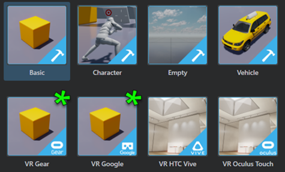
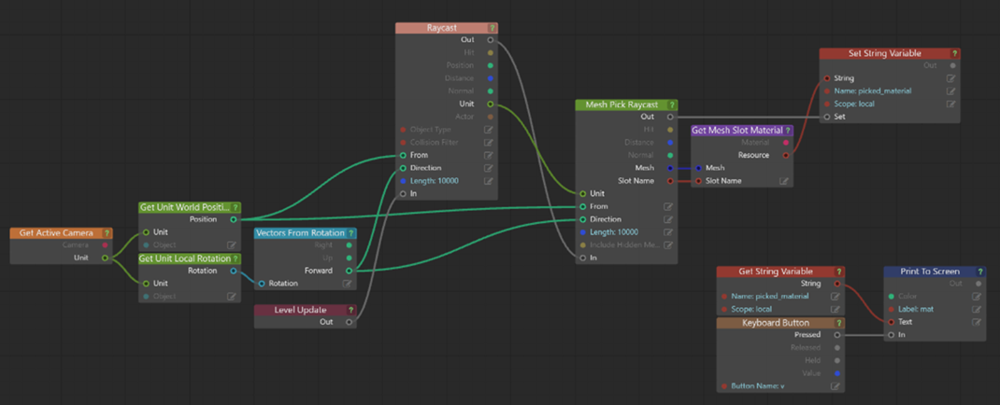
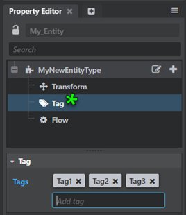

# Stingray 1.7 Release Notes

Welcome to Stingray 1.7 (1.7.1103.0).

> **Important**: We strongly recommend that you back up your existing Stingray data or work on a copy of your project when using a beta version of Stingray.

Sections in this topic:

-	[What's New](#whats-new)

	This section lists all the major new features available with this latest version of Stingray.

-	[What's Fixed](#whats-fixed)

	Here you'll find lists of the bugs and known limitations that we fixed, sorted by workflow area.

-	[Known Limitations and Workarounds](#known-limitations)

	This section includes any new known limitations we've found since the last release of Stingray.

-	[Upgrade Requirements](#upgrade-requirements)

	If you're working on a project that you started in an earlier version of Stingray, this section lists the steps you may need to take in order to successfully upgrade to the latest version.

	For example, with Stingray 1.7 we upgraded to Wwise version 2016.1.3, so you'll need to regenerate sound banks for your existing projects.

## What's New

* * *

## Browse online assets in the Asset Browser

See the new **Online Assets** folder in the ~{ Asset Browser }~. You can browse, find and import assets directly from online to your project. Right-click an online asset and select **Download Asset** to download and install the asset package to a category specific folder in the project. Updated topic include: ~{ Download assets and example projects }~.

## Improved Capture Frames Tool

The **Capture Frames** Tool is now integrated into the **Story Editor** workflow, and can also be initiated through Flow or Lua. New options in the **Capture Frames** window let you select from all available cameras, and set a specific resolution to capture. In the **Story Editor**, create a story and then click  to open the **Capture Frames** window. Modify the capture settings and click **Capture Frames** to start capturing the active Story.

>**Note:** A story can be set to be played in **Ping Pong** Mode or in **Loop**, but capture frames only works in forward or reverse, and not ping pong.

## Better texture import with automatic compression

Textures are now automatically compressed when you import them in Stingray. Depending on the texture type, Stingray assigns the texture template and compression settings for the imported textures for each platform. Texture compressions are applied by texture file suffix match or by image analysis. You can still tweak the textures as required, but you no longer need to manually compress textures on import. For details, see ~{ Import textures}~ and ~{ Create a texture template }~.

## What's new in VR: Google Daydream support, plus new VR templates

- Support for Gear VR, Google Daydream Android devices, plus Google Cardboard (iOS and Android)
- New VR project templates to support rendering on those devices
- The VR Oculus SDK has been upgraded to V1.10.1.0. See ~{ Supported platforms }~.

Stingray 1.7 introduces our GoogleVR plug-in, which adds support for Google Cardboard on iOS, as well as Google Daydream devices and controllers. Google Cardboard for Android is also supported on Daydream devices.

To support rendering your VR projects on these devices, the **Templates** tab in the **Project Manager** now includes two templates: VR Google and VR Gear.

Use these templates to start building your VR projects for Google Daydream devices and GearVR devices. See also ~{ Build a project for Gear VR }~.

## Particle Editor

In previous versions of Stingray, you created and edited particle effects using the **Asset Browser**, **Property Editor**, and **Asset Preview**. With Stingray 1.7, we're pleased to give you a standalone **Particle Editor** that streamlines the workflow for particle artists. Select **Window > Particle Editor** from the main menu, or double-click an existing particle effect in the **Asset Browser** to launch the new tool.

## Better network workflows: Run multiple local game instances

The **Connections** panel now lets you add multiple localhost PC targets, which means you can automatically start multiple targets with separate command lines on your local machine when you click **Run Project** . This makes it easier to debug and look at the console output for multiple targets using the editor engine instance dropdowns. See also ~{ Using the Connections panel }~.

## Import font files

You can now import font files to generate font resources to render text with sharp edges and preserve them when scaling. When you import font files, this generates the multi-channel signed distance field resources to display the font in your project. This feature is enabled by the *Distance Field Font Importer* plug-in, which is automatically enabled in the **Plugin Manager**. (See ~{ Add and remove plug-ins using the Plugin Manager }~.)

  > **Note:** This feature is still under active development.

To import fonts:

1. Right-click in the **Asset Browser** and select **Import Asset** from the pop-up menu.
2. Browse to select a font and click **Open**.
3. In the window that appears, enable the **Distance Field Options** check box, change any settings as required, then click **Import**.

See ~{ Import fonts }~.

## Story Editor improvements

-	Copy keyframes and paste them on the current time in the timeline or on the cursor position using either the hotkeys or by right click context menu in the **Story Editor**. You can also copy keys from multiple tracks and paste them on other tracks based on the order of track selection. Updated topics include ~{ Create simple animations with the Story Editor }~ and ~{ Story Editor hotkeys }~.
-	New reverse play icon  to play stories in reverse direction.
- A Capture Frame Tool icon  to access Capture Frame Settings; a story must be created to enable this mode. See [Improved Capture Frames Tool](#capture-frames).

## Trim animation clips

You can now edit the length of animation clips by trimming in the Anim Clip Editor or by modifying the trim values in the ~{ Animation clip properties }~. See ~{ Trim animation clips }~.

## Visual mesh raycasting

Stingray 1.7 provides new functionality that lets you lets you check for intersections with visual meshes within a specified Unit.

For complete documentation, refer to the Lua documentation (stingray.Unit.mesh_pick_raycast) and the [Flow node documentation](../../flow_ref/index.html) (**Unit > Mesh Pick Raycast**).

  > **Important:** For units containing high density meshes, the raycast does impact performance.

An example Flow graph:

## Entity updates

A new Tag component lets you associate a set of tags with an entity and quickly find all entities that have a certain tag. See also ~{ Using Entities in your Project }~.

In addition, new Flow nodes for entities let you get and set entity properties so that you can interface with entities in Flow similar to the way you've been able to use them with Lua and Story previously.

New Flow nodes include:

- **Entity > Get Component Bool Property**
- **Entity > Get Component Float Property**
- **Entity > Get Component Quaternion Property**
- **Entity > Get Component String Property**
- **Entity > Set Component Vector Property**

- **Entity > Set Component Bool Property**
- **Entity > Set Component Float Property**
- **Entity > Set Component Quaternion Property**
- **Entity > Set Component String Property**
- **Entity > Set Component Vector Property**

  > For a complete list of all new, modified, and removed Flow nodes in this release, see the [version history](../../flow_ref/versions.html).

## What's new in Interop?

### Level Sync updates

You can now update existing assets when using level sync with Maya. When **Update Existing Assets** is enabled in the **Send Level** window (**Singray > Send Selected/Send All >** ), modifications to geometry in Maya get pushed to Stingray when you send your scene. See ~{ Send assets from Maya and Maya LT with Level Sync }~.

### Import .EXR files as skydome images

Stingray now supports high definition range EXR files for image based lighting. Import (or drag and drop to Asset Browser) .EXR files to use as skydomes in your level. Updated topics include: ~{ Supported file formats }~ and ~{ Create a skydome texture }~.

## What's new in Rendering

### Light baking improvements

- The light baker is now more stable and has been optimized to run faster on most scenes and hardware. See ~{ Baking with the Stingray baker}~.
- You can now bake based on selection. After making a selection in your scene, open the **Light Baking** window (**Window > Lighting > Light Baking**) and click the new **Bake Selection** button to start a partial baking session. See ~{ Bake lightmaps }~.
- Click **Clear** in the **Light Baking** window to quickly delete and unmap all lightmaps on disk.
-	Beast is now deprecated. Use Stingray light baker instead.

## Tessellation support

Tessellation can now be activated using the standard base material node. Use the **Tesselation Factor** input on the base node to control the tesselation factor of your surface. A lower value results in a less tessellation.

## Negative scale support

Stingray shaders now support negative scale.

##Texture Manager updates

- New **Cubemap** and **HDRI/Skydome** category filters
-	New texture template for imported skydome images

[Return to top](#top)

## What's Fixed

* * *

### Animation

- GAME-19634 Anim Clip Editor: Cannot rename a trigger or beat
- GAME-19323 Anim Controller Editor: Improve error reporting for ShortcutState when target is another ShortcutState
- GAME-18733 Anim Controller Editor: Performance improvements
- GAME-15281 Anim Controller Editor: Prevent mouseover highlighting when the mouse is outside of Node view

### Asset Browser

- GAME-19647 Opening materials from Asset Browser fails in some cases
- GAME-19393 Cannot import by dragging when the list view displays with a scrollbar

### Audio/Wwise

- GAME-19082 Selecting the default Wwise project in the Asset Browser causes "unhandled exception Error"

### Content (Templates)

- GAME-20096 VR HTC Vive template: baseballs have bad normal maps
- GAME-19034 Two events triggered when pressing mouse or keyboard buttons on Steam VR template
- GAME-18744 Character template debug menu not showing

### Engine

- GAME-19635 Crash when reverse playing simple animations
- GAME-19607 Scale physics Actors when scaling a Unit with physics enabled
GAME-19438 Wwise rare crash when sounds finish playing while other sounds start
- GAME-18976 FlowData in plugin API does not match engine definition
- GAME-18855 Fixed mixup between deferred and blocking termination calls when shutting down Wwise
- GAME-18804 Mouse deltas not received when multiple windows are created
- GAME-18721 HTML5 (WebGL2): Memory corruption while playing game
- GAME-18710 Unspawn callbacks from scatter system have no unit reference
- GAME-18354 A space in the 'SR_LIB_DIR' path causes build error
- GAME-17767 Regular lua doesn't work with 32-bit windows
- GAME-17396 Optimize WebGL performance

### Entities

- GAME-19073	Reflection probe unit dependency not tracked correctly

### Flow

- GAME-19671 Nodes with unconnected or unsolvable inputs should reset output to a default value
- Compare Objects node should not do memcmp on unit references

### General

- GAME-20074 (All node editors) Pressing Esc while moving nodes should cancel the move
- GAME-13654 (All node editors) Double-clicking shouldn't trigger if the mouse is moved between clicks
- GAME-19328 Dragging a capture_settings asset into the viewport causes an error
- GAME-19160/GAME-19063 OK and Cancel buttons overlap input fields in some dialog boxes
- GAME-19125 Hotkeys for tool switching (W, E, R) don't work when dragging an object
- GAME-18222 Units created with Scatter Tool not visible in new level
- GAME-16496 Project Manager: Switching to large icon view doesn't make icons larger
- GAME-7740 Panning in the viewport by middle-dragging shouldn't activate the transformation manipulator of a selected unit
- GAME-20269 Deployer: Package Project button disabled when no targets are selected in Connections panel
- GAME-14091 Color picker: Color history section doesn't allow storing custom colors and behavior is erratic
- GAME-14087 Color picker: Clicking the left-most tab the first time (Ring, RGB) doesn't work
- GAME-13518 Color picker: RGB sliders are hard to drag
- GAME-10014 Cursor appears when changing the camera navigation speed using the mouse wheel
- GAME-19902	Navigation Lab - Run samples fails
- GAME-20026 Level Editor: Can't cancel marquee selection by pressing Esc (to preserve the existing selection)
- GAME-18890 Level Editor: Snap to Grid is dysfunctional

### Interop

- GAME-19789 Importing .fbx into a core folder imports to wrong location
- GAME-19346 Warning: "Performance: Skin influence count was raised..." does not indicate which meshes/materials have influence count problems
- GAME-18828 File > Batch Import incorrectly includes .s2d images
- GAME-18558 Vcache Optimizer warning log does not user inform user which content is causing the issue
- GAME-16385 DCC link Maya plugin is not enabled after installation

### Particles

- GAME-18725 Can no longer create/edit particle variables when editing particles
- GAME-15094 Particle graphs can end up not going from 0-1 over lifetime, specify multiple values at the same point in lifetime, and/or be misordered
- GAME-14700 Property editor: caption for a Particle property graph node appears on wrong graph
- GAME-14689 Particle: Undo of removal of billboard component is not reflected in the Asset Preview
- GAME-14109 Particle color gradient not showing in the effect (particles render as white)
- GAME-13754 For a new particle effect the property editor should show the system expanded, not collapsed
- GAME-13753 Particle effect default settings should be more user-friendly (not just show a static square)

### Plug-ins

- GAME-19331 Stingray Editor plugin can't be updated using the Plugin Manager
- GAME-16471 Plugin information in the Plugin Manager doesn't refresh after being updated

### Project Manager

- GAME-20150 Errors when adding/opening projects with read-only project files
- GAME-19574 Pressing Esc doesn't close the Project Manager window when it's launched from the File menu or Alt-F7
- GAME-18462 Can't rename downloaded projects
- GAME-15240 Need an error when a directory is missing the root directory
- GAME-11203 Project paths are reset when removing non-existent projects

### Rendering

- GAME-19743 Negatively scaled objects look inverted on webGL
- GAME-19013 TAA overblurry in VR
- GAME-18992 Box lights not working in VR
GAME-18973 VR: Crash when unloading a resource that has been linked to tracker
- GAME-18972 SSR reprojection ghosting under camera roll
- GAME-18971 Popping reflection probes on transparent surfaces
- GAME-18967 Threshold too low on Oculus Touch Triggers
- GAME-18915 Light flickers around edges of spotlight on Oculus
- GAME-18840 GL: depth of field effect causes over lighting
- GAME-18815 iOS: instance merger render command crash
- GAME-18787 Android: Run Project of character-template project works on a Nexus 9 but fails on an Nvidia Shield
- GAME-18763 Four viewports not rendering as expected
- GAME-18586 SSAO jittering and flickering
- GAME-18581 SSAO artifacts on cylindrical objects
- GAME-18468 Crash in condition_language.cpp
- GAME-18417 Lighting > AO shading mode is broken or deprecated
- GAME-18410 Unit loses its light bake when reloaded
- GAME-17978 Baking shader permutation should be kept when assigning materials using set material flow node
- GAME-17751 Lightmap mesh settings "Receives" is broken
- GAME-17663 Selection outlines doesn't work on PS4
- GAME-16387 Stingray baker: objects may receive old lightmaps when canceling a bake
- GAME-16313 No viable way to delete lightmaps
- GAME-13751 Crash in renderer, due to sleep mode
- GAME-12651 Shadow flickering
- GAME-11318 Shadowmap bug with high FOV and short far range
- GAME-10641 Drag and Drop Materials clear lightbakes on objects
- GAME-19535 Unit Editor crashes when opening the color picker
- GAME-16295	Connections to light maps are lost with Ctrl+F6 'restart engine'

### Scaleform Studio

- GAME-19041 Problems with display and selection when dropdown menus are stacked close together
- GAME-16456 For projects on WebGL, switching in and out of fullscreen mode breaks the UI
- GAME-18891 Warning/error when importing a Scaleform project

### Scatter Tool

GAME-20392 After deleting a scatter brush trying to create a new one with the same name in the same folder does not work
GAME-18224 Deleting scatter on a unit (non-terrain) deletes all scatter
GAME-16594 Scatter doesn't follow the deformation of a terrain if the deformation occurs after painting the scatter

### Script Editor

- GAME-19141 Evaluate in Engine doesn't print to Log Console

### Viewport

- GAME-19845 Viewport seems to stall when navigating with WASD keys

[Return to top](#top)

## Known Limitations

* * *

This section lists known limitations and workarounds for Stingray.

Unless otherwise noted in the **What's Fixed** section, please be aware that this release contains the same **Known Limitations** described in the previous versions of Stingray Release Notes.

> **Important**: We recommend you back up your existing Stingray data or work on a copy of your project when using a beta version of Stingray.

- **GAME-19871 Too easy to remove lightmaps, this needs a popup with a warning**

	The new **Clear** button in the **Light Baking** window deletes all lightmaps on disk and unmaps them.

	**Workaround:** Unfortunately there's no workaround for this right now, so we wanted to warn you in advance. By the time we release 1.7, we'll have a pop-up to make sure you actually want to do this.

- **GAME-19936 Project compile appears to hang during UV unwrapping**

	When opening a project that contains complex meshes, the project compilation process appears to hang during UV unwrapping.

	**Workaround:** Prepare complex meshes prior to exporting by manually unwrapping UVs in your DCC tool.

- **GAME-20894 Holding Ctrl + V creates too many objects in Explorer panel**

	**Workaround:** Press Ctrl + V quickly to paste a single instance of the copied object. 
	
- **GAME-19975 Stingray hangs and prevents any other window from coming to the forefront**

	We don't have consistent repro steps for this one, so if you see it let us know. It seems to happen for some people when Alt + tabbing between windows.

	**Workaround:** Close Stingray using Windows Task Manager. If Task Manager will not come to the forefront, you may need to right-click it in the taskbar to close it, and then restart the Task Manager.

[Return to top](#top)

## Upgrade Requirements

* * *

The full installation guide for Autodesk products including Stingray is included in the Stingray online help, [here](http://www.autodesk.com/stingray-install-ENU "here").

This section explains the improvements and fixes that require specific upgrade steps for users currently using a previous version of Stingray.

### Wwise version update

Stingray 1.7 is upgraded to use Wwise version 2016.1.3. If you have an existing project built in previous versions of Stingray, you'll need to manually regenerate sound banks in Stingray 1.7 after migrating your project. (If you notice several Wwise-related errors during compilation when you load an existing project in Stingray 1.7, this is why.)

For new projects created with Stingray 1.7 templates, no extra action is required for the Wwise update.

**To regenerate sound banks:**

1. Load your existing project in Stingray and click Yes to migrate it for Stingray 1.7.

> **Note**: We recommended that you always back up existing projects before migrating. During migration Stingray does create a .backup file containing the original contents of each migrated file, which you can delete after successfully migrating your project.

2. Select **Window > Wwise Audio** to open the authoring tool.

3. In Wwise, press F7 to switch to the Soundbank layout, then click **Regenerate sound banks**.

(See also ~{ Generate sound banks }~.)

### Lua API changes

For a complete list of all new, modified, and removed elements in the Lua API in this release, see the [version history](../../lua_ref/versions.html).

If your project contains any API elements that have been modified or removed, you will need to adjust your code accordingly.

A summary of the most important changes:

-	All functions related to managing engine plug-ins have been brought together under a new `stingray.PluginManager` namespace. The old `stingray.Application.all_plugin_names()` and `stingray.Application.set_plugin_hot_reload_directory()` functions have been removed, and several more new functions added. See the `stingray.PluginManager` namespace for details.

-	Use the new `Http.post()` function to send POST messages over HTTP.

-	If you use custom script Flow nodes intended for use by entities, you can now use `Application.flow_callback_context_entity()` in your custom Flow node's callback function in order to get the entity evaluating that node.

-	If you use Gameware Navigation in your projects, check the [version history](../../lua_ref/versions.html) for details on several changes, including exposing NavMesh generation to Lua.

-	`Application.quit()` now accepts an optional exit value, which the application will return to the operating system when it shuts down.

### Flow node changes

This version includes new nodes for controlling frame capture, triggering Level Flow events, getting more properties from lights and units, exchanging meshes and materials as external input and output variables, and more.

-	The **Unit > Mesh Pick Raycast** conducts a raycast collision test against the meshes owned by a specific unit, and returns information that includes the material that was hit by the ray. Knowing which material is hit by a ray may be useful if you need to play different sounds (like footsteps or bullet impacts) or different particle effects depending on the material. **NOTE** however that this raycast does consume more CPU resources than a regular raycast, particularly for meshes with many triangles.

-	Only one node has been modified: **Application > Quit** now accepts an optional exit value, which the application will return to the operating system when it shuts down.

For a complete list of all new, modified, and removed Flow nodes in this release, see the [version history](../../flow_ref/versions.html).

### Shader node changes

-	The **Output > Standard Base** node now accepts inputs to control tessellation and world space displacement, and a new option that enables and disables hardware tessellation.

-	In addition, you can use a new **Sampling > Domain Sample Texture** node in order to read input data from a texture when that data is needed in the *domain* stage of the shader -- for example, when providing values for the new tessellation factor and displacement inputs.

For a complete list of all new, modified, and removed shader nodes in this release, see the [version history](../../shader_ref/versions.html).

### Visual Studio 2015

Stingray now requires Visual Studio 2015 for rebuilding all components from source code. See [Software requirements](http://help.autodesk.com/view/Stingray/ENU/?guid=__source_access_getting_started_software_requirements_html) for updated information.

[Return to top](#top)
