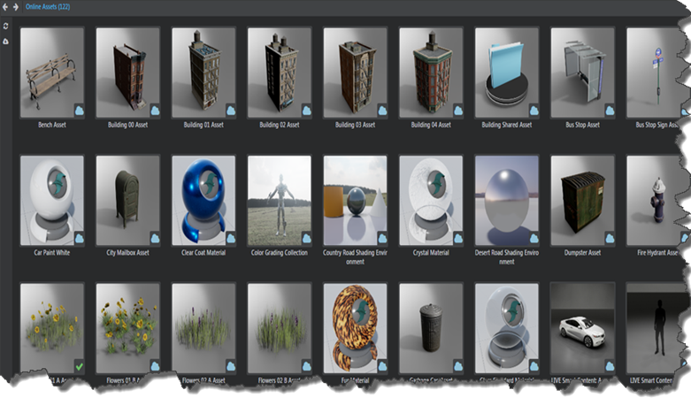
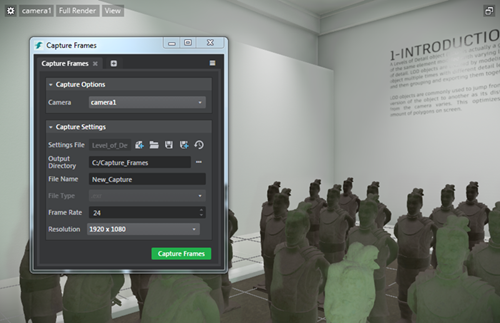
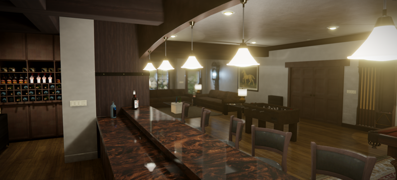

# Stingray 1.7 Release Notes

Welcome to Stingray 1.7 (1.7.1177.0).

Sections in this topic:

-	[What's New](#whats-new)

	This section lists all the major new features available with this latest version of Stingray.

-	[What's Fixed](#whats-fixed)

	Here you'll find lists of the bugs and known limitations that we fixed, sorted by workflow area.

-	[Known Limitations and Workarounds](#known-limitations)

	This section includes any new known limitations we've found since the last release of Stingray.

-	[Upgrade Requirements](#upgrade-requirements)

	If you're working on a project that you started in an earlier version of Stingray, this section lists the steps you may need to take in order to successfully upgrade to the latest version.

	For example, with Stingray 1.7 we upgraded to Wwise version 2016.1.3, so you'll need to regenerate sound banks for your existing projects.

## What's New

* * *

## What's new in VR

### Google Daydream support, plus new VR templates

- Support for Gear VR, Google Daydream Android devices, plus Google Cardboard (iOS and Android)
- New VR project templates to support rendering on those devices
- The VR Oculus SDK has been upgraded to V1.10.1.0. See ~{ Supported platforms }~.

Stingray 1.7 introduces our GoogleVR plug-in, which adds support for Google Cardboard on iOS, as well as Google Daydream devices and controllers. Google Cardboard for Android is also supported on Daydream devices.

To support rendering your VR projects on these devices, the **Templates** tab in the **Project Manager** now includes two templates: VR Google and VR Gear.

Use these templates to start building your VR projects for Google Daydream devices and GearVR devices. See also ~{ Build a project for Gear VR }~.

## Browse online assets in the Asset Browser

See the new **Online Assets** folder in the ~{ Asset Browser }~. You can browse, find and import assets directly from online to your project. Right-click an online asset and select **Download Asset** to download and install the asset package to a category specific folder in the project. Updated topic include: ~{ Download assets and example projects }~.

## Improved Capture Frames Tool

The **Capture Frames** Tool is now a standalone tool connected to the **Story Editor**. Simply create a story and click  to adjust your **Capture Settings**. New settings include support for different cameras and resolutions, and options to save and reuse your settings. Capturing can also be initiated through new Capture Flow Nodes. For details, see ~{ Capture Frames Tool }~.

## Better texture import with automatic compression

Textures are now automatically compressed when you import them in Stingray. Depending on the texture type, Stingray assigns the texture template and compression settings for the imported textures for each platform. Texture compressions are applied by texture file suffix match or by image analysis. You can still tweak the textures as required, but you no longer need to manually compress textures on import. For details, see ~{ Import textures}~ and ~{ Create a texture template }~.

## Particle Editor

In previous versions of Stingray, you created and edited particle effects using the **Asset Browser**, **Property Editor**, and **Asset Preview**. With Stingray 1.7, we're pleased to give you a standalone **Particle Editor** that streamlines the workflow for particle artists. Select **Window > Particle Editor** from the main menu, or double-click an existing particle effect in the **Asset Browser** to launch the new tool. For more information, see ~{ Create and edit particle effects }~.

## Better network workflows: Run multiple local game instances

The **Connections** panel now lets you add multiple localhost PC targets, which means you can automatically start multiple targets with separate command lines on your local machine when you click **Run Project** . This makes it easier to debug and look at the console output for multiple targets using the editor engine instance dropdowns. See also ~{ Using the Connections panel }~.

## Edit this page in Github!

At the bottom of most pages in the Stingray Help, you'll now see a green button that invites you to visit the topic source file in GitHub, make any changes you want, and submit a PR to us. With your help we want to make the Stingray Help better and better. If you're feeling inspired, check out ~{ Get Involved! }~ for more ways to contribute to the Stingray community.

## Import font files

You can now import font files to generate font resources to render text with sharp edges and preserve them when scaling. When you import font files, this generates the multi-channel signed distance field resources to display the font in your project. This feature is enabled by the *Distance Field Font Importer* plug-in, which is automatically enabled in the **Plugin Manager**. (See ~{ Add and remove plug-ins using the Plugin Manager }~.)

See ~{ Import fonts }~.

## Story Editor improvements

-	Copy keyframes and paste them on the current time in the timeline or on the cursor position using either the hotkeys or by right click context menu in the **Story Editor**. You can also copy keys from multiple tracks and paste them on other tracks based on the order of track selection. Updated topics include ~{ Create simple animations with the Story Editor }~ and ~{ Story Editor hotkeys }~.
-	New reverse play icon  to play stories in reverse direction.
-	Stories now stop playing at the end of the playback range in *None* playback mode. See ~{ Story Editor }~.
- A Capture Frame Tool icon  to access Capture Frame Settings; a story must be created to enable this mode. See [Improved Capture Frames Tool](#capture-frames).

## Trim animation clips

You can now edit the length of animation clips by trimming in the Anim Clip Editor or by modifying the trim values in the ~{ Animation clip properties }~. See ~{ Trim animation clips }~.

## Visual mesh raycasting

Stingray 1.7 provides new functionality that lets you check for intersections with visual meshes within a specified Unit. You can use this mesh pick raycast to get visual mesh information from a surface, such as which material within a mesh gets hit. (If you don't actually need that level of information, use the standard phyiscs raycast instead.)

For complete documentation, refer to the Lua documentation `stingray.Unit.mesh_pick_raycast()` and the [Flow node documentation](../../flow_ref/index.html) (**Unit > Mesh Pick Raycast**).

  > **Important:** For units containing high density meshes, the raycast does impact performance.

An example Flow graph:

## Entity updates

The Tag component is now exposed in the Stingray Editor, which lets you associate a set of tags with an entity and quickly find all entities that have a certain tag. See also:

- ~{ Using Entities in your Project }~
- ~{ About built-in components }~
- ~{ Assign components to an entity }~

In addition, new Flow nodes for entities let you get and set entity properties so that you can interface with entities in Flow similar to the way you've been able to use them with Lua and Story previously.

New Flow nodes include:

- **Entity > Get Component Bool Property**
- **Entity > Get Component Float Property**
- **Entity > Get Component Quaternion Property**
- **Entity > Get Component String Property**
- **Entity > Set Component Vector Property**

- **Entity > Set Component Bool Property**
- **Entity > Set Component Float Property**
- **Entity > Set Component Quaternion Property**
- **Entity > Set Component String Property**
- **Entity > Set Component Vector Property**

  > For a complete list of all new, modified, and removed Flow nodes in this release, see the [version history](../../flow_ref/versions.html).

## More granular asset overrides

If your project contains a folder whose name matches another folder already mounted by the engine or by another plug-in, such as the `core` folder, the project now merges the contents of your project's folder on top of the existing folder. This makes it easier to override selected core resources, such as Appkit script files, without having to copy the entire core folder into your project.

## Updated version of Wwise Audio

Stingray 1.7 integrates Wwise version 2016.1.3, which includes various new features and bug fixes.

If you have an existing project built in previous versions of Stingray, the sound banks are automatically regenerated when you load/migrate the project into Stingray 1.7. Depending on how much audio your project has, please note that the regeneration process can take a long time.

**Important:** In order for Stingray to migrate existing sound banks correctly, make sure the wwise project is available and writable. If you experience any issues with the automatic migration, you can also manually regenerate the sound banks. (See ~{Generate sound banks}~.)

## What's new in the SDK?

-	Plug-ins can now provide template projects, which are listed on the **Templates** tab of the ~{ Project Manager }~, just like the template projects that ship with Stingray. See [the help for the templates extension](http://help.autodesk.com/view/Stingray/ENU/?guid=__sdk_help_extend_editor_plugin_extensions_templates_html).

-	We've made some fixes and improvements in the hot-reloading system for engine plug-ins. If you had trouble getting hot reloading to work in the past, try [the new instructions](http://help.autodesk.com/view/Stingray/ENU/?guid=__sdk_help_reload_html).

## What's new in Interop?

### Level Sync updates

You can now update existing assets when using level sync with Maya. When **Update Existing Assets** is enabled in the **Send Level** window (**Singray > Send Selected/Send All >** ), modifications to geometry in Maya get pushed to Stingray when you send your scene. See ~{ Send assets from Maya and Maya LT with Level Sync }~.

### Import .EXR files as skydome images

Stingray now supports high definition range EXR files for image based lighting. Import (or drag and drop to Asset Browser) .EXR files to use as skydomes in your level. Updated topics include: ~{ Supported file formats }~ and ~{ Create a skydome texture }~.

### Updated PhysX plug-in

The PhysX plug-in installers for Maya 2017 and Maya LT 2017 that ship with Stingray are now updated to install the latest version of the PhysX plug-in, version 3.3.21117.04582. For related information, see ~{ Install the PhysX plug-in for your DCC tool }~.

## What's new in Rendering

### Light baking improvements

- The light baker is now more stable and has been optimized to run faster on most scenes and hardware. See ~{ Baking with the Stingray baker }~.
- You can now bake based on selection. After making a selection in your scene, open the **Light Baking** window (**Window > Lighting > Light Baking**) and click the new **Bake Selection** button to start a partial baking session. See ~{ Bake lightmaps }~.
- Click **Clear** in the **Light Baking** window to quickly delete and unmap all lightmaps on disk.
- You can now start a standalone baking session using a command-line prompt. For details, see ~{ Trigger lightmap baking from the command line }~.
-	Beast is now deprecated.

### Tessellation support

Tessellation can now be activated using the standard base material node. Use the **Tesselation Factor** input on the base node to control the tesselation factor of your surface. A lower value results in a less tessellation. See ~{ Create a tessellation material }~.

### Negative scale support

Stingray shaders now support negative scale. See ~{ Assign a material to an object }~.

### Texture Manager updates

- New **Cubemap** and **HDRI/Skydome** category filters
-	New texture template for imported skydome images

[Return to top](#top)

## What's Fixed

* * *

### Animation

- GAME-20869 Anim Controller Editor: Selecting an event in the typeahead creates events twice
- GAME-20839 Anim Controller Editor: Create states at the drag and drop location when dragging clips from Asset Browser
- GAME-20071 Anim Controller Editor: State node help buttons do nothing
- GAME-19323 Anim Controller Editor: Improve error reporting for ShortcutState when target is another ShortcutState
- GAME-19164 Anim Controller Editor: The "from" part of GroupTransition mappings cannot be expanded
- GAME-18733 Anim Controller Editor: Performance improvements
- GAME-15281 Anim Controller Editor: Prevent mouseover highlighting when the mouse is outside of Node view
- GAME-13654 Anim Controller Editor: Double-click should not be triggered when moving the mouse between clicks
- GAME-19634 Anim Clip Editor: Cannot rename a trigger or beat
- GAME-18807 Ensure state name unicity when moving states into Group States
- GAME-17912 Opening one of the anim controllers from the character template returns an error
- GAME-17456 Add new type of node in the NodeEditor for TransitionSwitchState

### Asset Browser

- GAME-20484 Re-import unit context menu item does not appear during multi-select
- GAME-19393 Cannot import by dragging when the list view displays with a scrollbar
- GAME-18865 Rename error after deletion, "Failed to move [Safe] Rename ... Success False. An item with the same key has already been added."
- GAME-1771 Dragging and dropping a folder onto itself broken
- GAME-19647 Opening materials from Asset Browser fails in some cases

### Audio/Wwise

- GAME-20391 New Wwise project gets created inside game project directory
- GAME-20080 Streaming sounds do not work on Android, iOS, PS4 and XB1
- GAME-18960 Event name field on placed audio emitter does not display a browser
- GAME-19082 Selecting the default Wwise project in the Asset Browser causes "unhandled exception Error"
- GAME-19224 1.6 projects migrated from 1.5 won't associate with the Wwise project
- GAME-20076 Real-time profiling and remote sync do not work on Android, PS4 and XB1
	> **Note:** There is still a Known Limitation with remote sync to Android devices. (See below.)

### Content (Templates)

- GAME-20096 VR HTC Vive template: baseballs have bad normal maps
- GAME-19034 Two events triggered when pressing mouse or keyboard buttons on Steam VR template
- GAME-18547 Empty template project gives error "WwiseResourceManager::bank_data. Cannot get resource for bank content/audio/Init" when run without * = [ * ]
- GAME-18437 VR Oculus template: Can't press Esc to close 'Run project' window
- GAME-18428 Creative Market: Browsing through assets gets broken after viewing an asset
- GAME-18047 Deploying Basic template to Android device takes excessive time
- GAME-20498 Teleporter raycast in VR Vive and VR Oculus templates behaves badly when there is no collision

### Documentation and Learning

- GAME-18876 Lua API context-sensitive help is broken in Script Editor
- GAME-19724 Adoc documentation for blendshape plugin lua api missing
- GAME-20842 Unit.set_mesh_visibility doc is incorrect
- GAME-14642 .mouse_cursor resource type is not described
- GAME-18867 Hands-on Training Misison: Dragging the drum unit asset to the viewport causes error

### Engine

- GAME-20739 Missing profiling information in game_update
- GAME-20702 Story: Stories must have a length
- GAME-20397 Level Viewport stops working when opening certain levels
- GAME-19635 Crash when reverse playing simple animations
- GAME-19607 Scale physics Actors when scaling a Unit with physics enabled
- GAME-19438 Wwise rare crash when sounds finish playing while other sounds start
- GAME-18976 FlowData in plugin API does not match engine definition
- GAME-18855 Mix up between deferred and blocking termination calls when shutting down Wwise
- GAME-18804 Mouse deltas not received when multiple windows are created
- GAME-18721 HTML5 (WebGL2): Memory corruption while playing game
- GAME-18642 HTML5 (WebGL2): Fullscreen is broken
- GAME-18710 Unspawn callbacks from scatter system have no unit reference
- GAME-18354 A space in the 'SR_LIB_DIR' path causes build error
- GAME-17767 Regular Lua doesn't work with 32-bit Windows
- GAME-17396 Optimize WebGL performance
- GAME-14748 Wwise bank load thread lock on PS4
- GAME-18799 .entity resource compile is not deterministic
- GAME-20900 Reduce amount of prints generated from missing resources

### Entities

- GAME-19073 Reflection probe unit dependency not tracked correctly
- GAME-18783 Cancelling the entity component rename dialog produces an error

### Flow

- GAME-20993 Get Mesh Slot Material migration not working
- GAME-20669 Script Flow nodes "id" type is sent as string (should be sent as IdString64)
- GAME-20653 Script Editor: "Save As" saves a script flow node file as a Lua file causing a compilation error
- GAME-20211 Subroutine external input pins aren't read on Level Update
- GAME-19671 Nodes with unconnected or unsolvable inputs should reset output to a default value
- GAME-18400 Compare Objects node should not do memcmp on unit references
- GAME-15714 Switching back to the Level Viewport from the Level Flow tab momentarily shows horizontal stretching artifacts
- GAME-13994 Not allowed to spawn more than one unit at a Marker

### General

- GAME-20269 Deployer: Package Project button disabled when no targets are selected in Connections panel
- GAME-18158 Invalid "Project is already running" error after crash
- GAME-18132 Slow navigating to lightmaps folder (200+ items)
- GAME-17348 Editor recompiles every resource package in the entire project when editing levels
- GAME-14091 Color picker: the color history section doesn't allow storing custom colors and behaviour is erratic
- GAME-14087 Color picker: clicking on the left-most tab the first time (Ring, RGB) doesn't work
- GAME-13518 Color picker: Can only drag RGB sliders while the pointer is directly over them
- GAME-19535 Unit Editor crashes when opening the Color picker
- GAME-10014 Mouse cursor becomes visible when changing the camera navigation speed using the mouse wheel
- GAME-20074 (All node editors) Pressing Esc while moving nodes should cancel the move
- GAME-16510 Terrain Editor: Creation window can take up to 15 seconds when opening for the first time
- GAME-18729 Dialog boxes can appear under other windows when you have multiple monitors with different scaling
- GAME-18087 Context menus are cut off at the bottom of the screen
- GAME-19536 Mouse input for navigation modes is handled in discreet steps
- GAME-19328 Dragging a capture_settings asset into the viewport causes an error
- GAME-19063 Rename Group dialog box: Confirmation buttons overlap input field
- GAME-19125 Hotkeys for tool switching (W, E, R) don't work when dragging an object
- GAME-18901 Modal dialogues can open with bad resolution on a non-HDPI screen
- GAME-16055 Asset preview: Light displayed along with unit
- GAME-18232 Level Viewport: Right-clicking and selecting 'Connect to device/Add device' does nothing
- GAME-16486 Create panel is not cleared properly when a plugin is unloaded
- GAME-20914 Make sure Explorer panel can handle a lot of scene objects
- GAME-20026 Level Editor: Can't cancel marquee selection by pressing Esc (to preserve the existing selection)
- GAME-18890 Level Editor: Snap to Grid is dysfunctional
- GAME-18872 Node names beginning with "[" cause errors in unit_utils.lua
- GAME-19397 Log console disappears when undocking
- GAME-19902 Navigation Lab: Run samples fails

### Import, Export, and Interop

- GAME-20768 Re-importing updated units doesn't work properly
- GAME-19789 Importing FBX file into a core folder imports to wrong location
- GAME-18256 FBX Import dialog shows selected file path and name all in lowercase even when there are uppercase letters
- GAME-19468 Data compiler warning doesn't explain on which platform a format isn't supported
- GAME-19312 Live Link send selection can send an empty file between Max and Stingray
- GAME-18823 Maya DirectX materials no longer import with textures to Stingray
- GAME-16267 Stingray can overwrite project source data when using embedded textures
- GAME-20520 Exporting units to zip does not include blend shapes
- GAME-20495 FBX Import: When no target skeleton is selected, disable import

### Particles

- GAME-18674 Changing Particle size is not reflected until you re-open the level
- GAME-16361 Particle system: Ray component crash
- GAME-15094 Particle graphs can end up not going from 0-1 over lifetime, specify multiple values at the same point in lifetime, and/or be misordered
- GAME-15031 Impossible to delete points on Particle Life Time curve
- GAME-14730 Saving a particle effect after adding mesh visualizer returns error "Target Invocation error : Mesh not set"
- GAME-14700 Caption for a Particle property graph node appears on wrong graph in Property Editor
- GAME-14689 Undo removal of billboard component is not reflected in the Asset Preview
- GAME-14109 Particle color gradient not showing in the effect (particles render as white)
- GAME-13754 For a new particle effect the Property Editor should show the system expanded, not collapsed
- GAME-13753 Particle effect default settings should be more user-friendly (not just show a static square)
- GAME-12717 Particle effect plays briefly and goes out before playing continuously as expected

### Plug-ins

- GAME-19331 Stingray Editor plugin can't be updated using the Plugin Manager
- GAME-16471 Plugin information in the Plugin Manager doesn't refresh after being updated

### Project Manager

- GAME-16496 Switching to large icon view doesn't make icons larger
- GAME-20150 Errors when adding/opening projects with read-only project files
- GAME-19574 Pressing Esc doesn't close the Project Manager window when it's launched from the File menu or Alt-F7
- GAME-18462 Online Projects: Downloaded projects can't be renamed in Project Manager
- GAME-16595 No error message is displayed when online projects fail to download
- GAME-15240 Need error if directory is missing the root directory
- GAME-11203 Project paths are reset when removing non-existent projects
- GAME-18870 Opening the Project Manager during a data compilation leaves it blank

### Rendering

- GAME-19160 Shader graph: Confirmation buttons overlap input field in dialog box
- GAME-20807 Billboard particle distortion renders as white square on GL
- GAME-20597 Integrate patch with set_post_transform API fix
- GAME-20261 Oculus Touch controllers - 'get pose' follows behind tracker node links
- GAME-20228 Selection outline for transparent objects doesn't show outer edges
- GAME-19743 Negatively scaled objects look inverted on WebGL
- GAME-19605 Material live editing breaks for non standard permutations
- GAME-19579 UI issues after testing level in full screen
- GAME-19498 Diffuse Boost creates strange color blocks
- GAME-19326 Selection outlines don't follow alpha masked materials
- GAME-19069 Buffered Lightmap not being flushed appropriately
- GAME-19013 VR: TAA gives exaggerated blur
- GAME-18992 VR: Box lights are dysfunctional
- GAME-18973 VR: Crash when unloading a resource that has been linked to tracker
- GAME-18842 VR: Skydome ghosts a little bit due to bad motion vectors
- GAME-18972 SSR reprojection ghosting under camera roll
- GAME-18971 Popping reflection probes on transparent surfaces
- GAME-18967 Threshold too low on Oculus Touch triggers
- GAME-18915 Light flickers around edges of spotlight on Oculus
- GAME-18840 GL: depth of field effect causes over lighting
- GAME-18815 (iOS) 'instance merger render' command crash
- GAME-18801 .shading_environment compile is not deterministic
- GAME-18798 .material compile is not deterministic
- GAME-18787 (Android) Run Project with Character template works on Nexus 9 but fails on Nvidia Shield
- GAME-18763 Four viewports not rendering as expected
- GAME-18586 SSAO jittering and flickering
- GAME-18581 SSAO artifacts on cylindrical objects
- GAME-18541 No direct shadow baking from items that don't have a lightmap UV set
- GAME-18468 Engine crash in condition_language.cpp
- GAME-18417 AO shading mode is broken or deprecated
- GAME-18410 Unit loses its light bake when reloaded
- GAME-18289 Light Baking session can result in a faulty state
- GAME-17978 Baking shader permutations should be kept when assigning materials using the 'set material' flow node
- GAME-17751 Lightmap mesh settings: "Receives" is broken
- GAME-17663 (PS4) Selection outlines don't work
- GAME-16387 Stingray baker: objects may receive old lightmaps when canceling a bake
- GAME-16313 No viable way to delete lightmaps
- GAME-15921 Flipbook menu location adjustment
- GAME-15876 Shader Graph Editor should only show errors when attempting to save
- GAME-15201 Lightmaps get disconnected with a 'restart engine'
- GAME-14530 Two new shader nodes are missing docs
- GAME-14505 WebGL warning "there is no texture bound to the unit [n]"
- GAME-14156 Pasting arbitrary text into the Shader Graph editor gives error
- GAME-14124 Shader Graph Editor nodes label UV/XY, XYZ outputs as RG, RGB
- GAME-13751 Crash in renderer due to sleep mode
- GAME-13497 SSAO broken when turned off
- GAME-12233 Renderer crash after unloading resource bundle/package
- GAME-11834 Flipbook row/column names are swapped
- GAME-11446 Bake settings are saved per project, not per level
- GAME-10683 Saving a material after deleting its shader graph gives an access violation
- GAME-19723 When a material is saved the selection of the current node in the Property Editor is lost
- GAME-10641 Dragging and dropping materials removes lightbakes on objects
- GAME-18497 Light Properties: Setting Baking to Direct & Indirect shows unfriendly 'unhandled exception' error
- GAME-16295 Connections to light maps are lost when you press Ctrl+F6 to restart engine

### Scaleform Studio

- GAME-18891 Warning/error when importing a Scaleform project
- GAME-19041 Problems with display and selection when drop-down menus are stacked close together
- GAME-16456 For projects on WebGL, switching in and out of fullscreen mode breaks the UI

### Scatter Tool

- GAME-20575 Scatter Pool Settings can be renamed from the Property Editor
- GAME-20461 On creating a new Scatter pool in the level, the ScatterPoolSettings should be automatically selected
- GAME-20392 After deleting a scatter brush, trying to create a new one with the same name in the same folder does not work
- GAME-19818 Scattered units do not behave properly on units with non-equilateral scale
- GAME-18224 Deleting scatter on a unit (non-terrain) deletes all scatter
- GAME-16594 The scatter doesn't follow the deformation of a terrain if the deformation occurs after painting the scatter
- GAME-18222 Units created with Scatter Tool are not visible when a new level is created

### Script Editor

- GAME-18822 Unhandled exception error if you press Ctrl+Space to autocomplete
- GAME-18073 Missing Alt-text for buttons in search & replace window
- GAME-11343 Clicking [ALL] in the Script Editor Find window closes it if there are no matches
- GAME-19141 Evaluate in Engine doesn't print to Log Console
- GAME-18026 Stepping in sometimes doesn't switch tab
- GAME-18020 Script debugger: Margin is not highlighted after pressing Continue and hitting breakpoint
- GAME-18023 Script debugger: Switching tabs when stepping into functions is slow

### Story Tool

- GAME-20097 'F' shortcut should Frame All when no keys are selected
- GAME-19030 Animation keys are set on all properties even though only specific ones are selected
- GAME-15075 Viewport doesn't maintain 60fps during camera rotation or story playback

### Viewport

- GAME-19845 Viewport seems to stall when navigating with WASD keys
- GAME-7740 Panning in the viewport by middle-dragging shouldn't activate the transformation manipulator of a selected unit

[Return to top](#top)

## Known Limitations

* * *

This section lists known limitations and workarounds for Stingray.

Unless otherwise noted in the **What's Fixed** section, please be aware that this release contains the same **Known Limitations** described in the previous versions of Stingray Release Notes.

- **GAME-19936 Project compile appears to hang during UV unwrapping**

	When opening a project that contains complex meshes, the project compilation process appears to hang during UV unwrapping.

	**Workaround:** Prepare complex meshes prior to exporting by manually unwrapping UVs in your DCC tool.

- **GAME-20689 Remote sync from Wwise editor can't connect to Stingray on Android**

	When you try to connect to an instance of the Stingray engine running on an Android device using the **Remote** sync feature in the Wwise Editor, the connection to the device fails. In some cases, the engine on the device crashes. There is currently no workaround for this issue.

- **GAME-20834 Level Sync from 3ds Max (using 'Level Send All') stalls at the end of the import process**

	The first time you send assets between 3ds Max and Stingray using **Stingray > Level Send All** (in 3ds Max), the import operation stalls if **Update textures** is on.  

	**Workaround:** Turn off **Update textures** the first time you send assets with **Level Send All**. On subsequent level sync operations, you can then use **Level Send Selected** or **Level Send All** with **Update textures** on as required.

[Return to top](#top)

## Upgrade Requirements

* * *

The full installation guide for Autodesk products including Stingray is included in the Stingray online help, [here](http://www.autodesk.com/stingray-install-ENU "here").

This section explains the improvements and fixes that require specific upgrade steps for users currently using a previous version of Stingray.

### Auto-loading removed from templates

In previous releases, the *boot.package* file in the template projects used a `* = [*]` wildcard pattern to match all types of resources in the project. This made sure that all content you put in a project (and all content in the core resources) would always be compiled, bundled, and loaded into the project at runtime, no matter where in the project that content was located. The downside was that as a project grew, it sometimes led to crashes when the engine tried to load more resources than it could fit in the available memory -- especially on mobile platforms.

We've now modified the *boot.package* in the template projects to disable this all-inclusive wildcard.

-	This change affects any new projects you create from a template in 1.7.

-	If you create a project from one of the newer templates and you see errors about missing resources when you run your project, the cause is likely due to your resource not being included in the *boot.package* file.

-	This change *doesn't* affect any projects that you've already created in previous versions of Stingray. They'll still work the same way they do now.

-	Each template project is set up to load all of the default resources it needs.

-	When you add new content of your own, check that your content will be picked up by the resource specifications in the *boot.package*. The template boot packages load all levels that are saved under *content/levels*, so as long as you save your own levels there, those levels and all the resources they depend on will be bundled correctly. However, be careful about any content that you spawn dynamically in Lua.

-	You can go back to the old auto-loading method by removing the two slashes `//` at the start of the line `//* = [*]` at the top of the *boot.package* file in any template project.

For more background information, see ~{ Loading and unloading content at runtime }~ and ~{ Defining resource packages }~.

### Lua API changes

For a complete list of all new, modified, and removed elements in the Lua API in this release, see the [version history](../../lua_ref/versions.html).

If your project contains any API elements that have been modified or removed, you will need to adjust your code accordingly.

A summary of the most important changes:

-	All functions related to managing engine plug-ins have been brought together under a new `stingray.PluginManager` namespace. The old `stingray.Application.all_plugin_names()` and `stingray.Application.set_plugin_hot_reload_directory()` functions have been removed, and several more new functions added. See the `stingray.PluginManager` namespace for details.

-	Use the new `Http.post()` function to send POST messages over HTTP.

-	If you use custom script Flow nodes intended for use by entities, you can now use `Application.flow_callback_context_entity()` in your custom Flow node's callback function in order to get the entity evaluating that node.

-	If you use Gameware Navigation in your projects, check the [version history](../../lua_ref/versions.html) for details on several changes, including exposing NavMesh generation to Lua.

-	`Application.quit()` now accepts an optional exit value, which the application will return to the operating system when it shuts down.

-	The setting names accepted by `Unit.set_animation_bone_mode()` and returned by `Unit.animation_bone_mode()` have been renamed to begin with `delta_`, like the ones accepted and returned by `Unit.set_animation_root_mode()` and `Unit.animation_root_mode()`.

### Flow node changes

This version includes new nodes for controlling frame capture, triggering Level Flow events, getting more properties from lights and units, exchanging meshes and materials as external input and output variables, and more.

-	The **Unit > Mesh Pick Raycast** conducts a raycast collision test against the meshes owned by a specific unit, and returns information that includes the material that was hit by the ray. Knowing which material is hit by a ray may be useful if you need to play different sounds (like footsteps or bullet impacts) or different particle effects depending on the material. **NOTE** however that this raycast does consume more CPU resources than a regular raycast, particularly for meshes with many triangles.

-	Only one node has been modified: **Application > Quit** now accepts an optional exit value, which the application will return to the operating system when it shuts down.

For a complete list of all new, modified, and removed Flow nodes in this release, see the [version history](../../flow_ref/versions.html).

### Shader node changes

-	The **Output > Standard Base** node now accepts inputs to control tessellation and world space displacement, and a new option that enables and disables hardware tessellation.

-	In addition, you can use a new **Sampling > Domain Sample Texture** node in order to read input data from a texture when that data is needed in the *domain* stage of the shader -- for example, when providing values for the new tessellation factor and displacement inputs.

- Values entered for **Sprite Columns** and **Sprite Rows** in the **Utility > Flipbook** node are now output correctly on the sprite sheet.

For a complete list of all new, modified, and removed shader nodes in this release, see the [version history](../../shaders_ref/versions.html).

### Visual Studio 2015

Stingray now requires Visual Studio 2015 for rebuilding all components from source code. See [Software requirements](http://help.autodesk.com/view/Stingray/ENU/?guid=__source_access_getting_started_software_requirements_html) for updated information.

[Return to top](#top)
