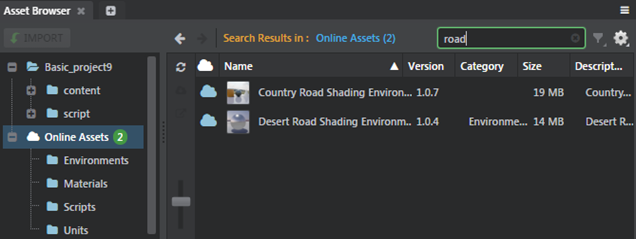
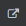
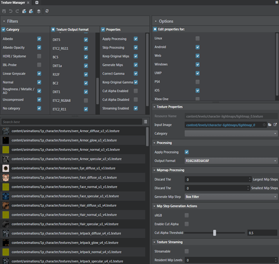
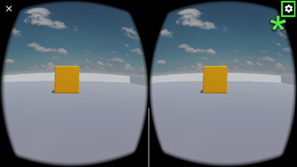

# Stingray 1.8 Release Notes

Welcome to the Stingray 1.8 (1.8.1267.0) release.

Stingray 1.8 includes a new non-interactive mode for the light baker, built-in support for splash screens in the appkit, and experimental support for the Hololens platform. Now that both WebAssembly and WebGL 2.0 are released, the workflow to run your project in a web browser has officially graduated out of experimental mode, and the process to deploy is smoother than ever.

In addition, you'll find some nice usability improvements in the Capture Frames tool, the Particle Editor, and the Asset Browser. An updated GoogleVR template lets you create hybrid apps that can run with or without VR. Plug-in developers will want to check out the new public stingray-plugin repo on GitHub, which has everything you need to get started, including a great new tutorial.

For details on these and more new features, refer to the [What's New](#whats-new) section below.

Sections in this topic:

-	[What's New](#whats-new)

	This section lists all the major new features available with this latest version of Stingray.

-	[What's Fixed](#whats-fixed)

	Here you'll find lists of the bugs and known limitations that we fixed, sorted by workflow area.

-	[Known Limitations and Workarounds](#known-limitations)

	This section includes any new known limitations we've found since the last release of Stingray.

-	[Upgrade Requirements](#upgrade-requirements)

	If you're working on a project that you started in an earlier version of Stingray, this section lists the steps you may need to take in order to successfully upgrade to the latest version.

## What's New

* * *

## Run projects in a web browser

For early adopters of WebGL 2.0 or WebAssembly tech in Stingray, or those who have been waiting to try it out, we're happy to announce that the workflow for deploying your project to run in a web browser has graduated out of 'experimental' status.  Highlights of this new and improved workflow:

- Since both WebAssembly and WebGL 2.0 are now released, it's no longer necessary to modify any web browser configuration or flags to run Stingray in a web browser. If you modified your browser configuration to run Stingray in a web browser, we suggest you revert these changes.

- We now use a local Node.js HTTP server to run projects for the web rather than using a file URL served up to the browser, which eliminates a bunch of tricky extra configuration steps that you had to do in previous versions of Stingray. We also use virtual mapping to reduce the URL to a much simpler value (like localhost:3000) that stays the same across projects.

- We've started making use of the web browser’s indexedDB local storage so that you don’t have to re-download content every time you refresh the page. (You might notice you need to clear that cache from time to time if you’re making frequent updates to the project.)

- To support all of this, Stingray now requires a web browser that also supports WebAssembly, like Chrome version 57 or Firefox version 52.

Check out ~{ Get started for the Web }~ for updated information.

## Particle Editor updates

-	You can copy and paste particle effect systems and controllers. Select a system or controller, and either right-click to select Copy (and Paste) or use the Ctrl + C, Ctrl + V hotkeys to copy and paste the systems.

-	Drag and drop the systems around to reorder the effects in a particle.

-	A default particle material gets created when you create a new particle effect.

See ~{ Create and edit particle effects }~.

## Asset Browser improvements

Searching for online assets indicates the number of results next to the **Online Assets** in the tree view of the **Asset Browser**. You can clear the *Search* results by clicking the Clear icon in the Search field.

You can also locate an online asset installed in your project using a new option **Locate in Project** from the **Online Assets** view. Select an installed asset (indicated with a green checkmark) and either click the  icon or right-click and select **Locate in Project**. See ~{ Asset Browser }~.

## Capture Frames Tool updates

You can now define the capture range in your story using the Capture Frames Tool. Instead of recapturing your entire story after making a fix, specify the capture range in frames or seconds, and then quickly recapture.

- ~{ Capture Frames Tool }~
- ~{ Capture frames to disk }~

## Texture Manager

Check out the revamped **Texture Manager** with improved texture loading and filtering.

-	~{ Create a texture template }~
-	~{ Create a texture category }~

## Light baker improvements

A new non-interactive light baking mode has been added to the Stingray baker to better control memory consumption. Instead of baking everything in the scene and showing the progress, this new mode bakes one object in the scene completely and then outputs the lightmap, saving memory in the process. Disable **Interactive** baking in the **Light Baking** window to turn on this mode. Non-interactive baking is also the default baking mode when you launch a baking session from the command line. See ~{ Trigger lightmap baking from the command line }~.

## Interop: Updated DCC link plug-in for 3ds Max 2018

This release of Stingray ships with an updated Stingray DCC Link plug-in to support 3ds Max 2018 and 3ds Max 2017. See ~{ Interop with Maya, Maya LT, or 3ds Max }~.

## Appkit loading screens

We've had many requests from customers who want to know how to start off their project with a simple splash screen while the bulk of their content loads in the background. So we've added support for loading screens to the Appkit!

When you start a new project based on one of the Stingray templates that uses the Appkit, you'll notice that each time you run the project you now start with a "Powered by Autodesk Stingray" loading screen. You can customize this splash screen to show your own logos, or whatever works for your project.

See ~{ Work with the Appkit loading screen }~ for more information.

## Appkit project script

You can now configure the name of the Lua script that the Appkit loads at startup. In your *settings.ini* file, find or create a `script_data` object, and add a `project_script` setting. For example:

~~~{sjson}
script_data = {
	project_script = "scripts/lua/my_project/boot_script"
}
~~~

## What's New in VR?

### Accessible Google VR settings

When using a Google Cardboard or Google Daydream head-mounted display, touch the gear icon in the top right hand corner to quickly adjust your phone's VR settings.  New lua functions have also been added.

>**Note:** Currently, only Android devices are supported.

### Toggle VR mode

New functionality has been exposed from the GoogleVR API in the **GoogleVR** template.  You can now enter or exit VR mode at runtime using Lua. This supports hybrid applications that can run with or without VR.  Simply invoke the project’s Lua function, Project.shutdown(), to switch from VR stereo display to non-VR display, and then invoke Project.on_init_complete() to return to VR mode.

### VR SLI support

VR SLI improves performance for VR applications, and uses multiple GPUs to accelerate stereo rendering. To take advantage of this enhanced performance, manually add two new settings, `disable_implicit_sli` and `nv_vr_sli_enabled`,  to the settings.ini file when working in the VR templates. For more information, see ~{ Stingray engine settings.ini file reference }~.

## Stingray resource files

You can use the **Script Editor** to open and edit Stingray resource files like

-	 Render Configuration (.render_config)
-	 Shader Node (.shader_node)
-	Shader (.shader)
-	Shading Environment Mapping (.shading_environment_mapping)
-	Entity Component (.component)
-	Stingray Create Panel Object (.object_creator_item)
-	Physics Properties (.physics_properties )
-	Network Config (.network_config)
-	Surface Properties (.surface_properties) and
-	Stingray Type Description(.type) files.

## Experimental feature: HoloLens

Initial support for the HoloLens platform has been added. For more information, see ~{ Get started on HoloLens }~.

## What's New for developers?

### Quick-start plug-in repository

If you haven't seen it yet, check out the new public [stingray-plugin](https://github.com/AutodeskGames/stingray-plugin) repo on GitHub! It contains everything you need to quickly get started making a new plug-in that extends Stingray -- including Visual Studio projects and build tools for extending the engine and editor using C/C++.

While you're there, a must-read is [this detailed tutorial](https://github.com/AutodeskGames/stingray-plugin/wiki/How-to-create-a-cool-plugin) that walks you through all the steps involved in using the plugin repository as a basis for creating and packaging a full-featured plug-in that hooks into the engine and editor.

### *.stingray_plugin* files

We've decided to standardize on *stingray_plugin* as the preferred extension for our plug-in descriptor file format. Don't worry if you've already written or installed any *.plugin* files, we'll still recognize *.plugin* for backward-compatibility. But for future development, we now recommend using *.stingray_plugin* instead.

### `runtime_libraries` extension

If you write a Stingray plug-in that extends the runtime engine with a *.dll* file, you don't have to copy your *.dll* into your engine's *plugins* folder anymore!

Use the new `runtime_libraries` extension to set up the path to the *.dll* file inside your *.stingray_project* file. While your plug-in is loaded in the editor, any engine instances that you spawn from the editor (using Test Level or Run Project) will automatically load your library.

See [this example config](https://github.com/AutodeskGames/stingray-plugin/blob/master/plugin/example.stingray_plugin) in the new base plugin repository, or read about it [in the SDK Help](http://help.autodesk.com/view/Stingray/ENU/?contextId=SDK_ENGINE_PLUGIN).

### Supply Lua code on the command line

The engine executable now accepts a `--lua <code snippet>` command-line parameter. If you include this parameter, the engine automatically runs the code snippet that you specify on the command line within its Lua environment. It runs your code after it calls the `init()` function from the project's Lua boot script, but before it calls `update()` for the first time.

This can be useful when you launch multiple instances of the engine from the **Connections** panel, in order to make each one behave in a different way.

## What else is new?

- Motion Blur is now disabled in the default shading environment. (See ~{ Shading environment properties }~.) You can turn Motion Blur on if you want to create a slightly blurred effect when the camera is moving.

- You can now press F1 to open the Stingray Help while using the Editor.

- The `SaveSystem` in Lua and the `SaveSystemCApi` in C can now save and load `IdString32` and `IdString64` objects. In Lua, you can also save and load `IdString32Box` and `IdString64Box` objects.

[Return to top](#top)

## What's Fixed

## Previous known limitations:

These were late-breaking issues that affected Stingray 1.7 as known limitations. They really bugged us and we're extra happy to tell you we fixed them in Stingray 1.8.

- GAME-21615: First frames rendered by Capture Frames tool are not part of the animation in the story
- GAME-20834: Level Sync from 3ds Max (using 'Level Send All') stalls at the end of the import process

## Animation

- GAME-21593 Animation: Cannot save several additive animations
- GAME-21180 Skeleton Editor: Skinned mesh is displayed when the skeleton is edited even though mesh display is disabled
- GAME-20967 Remove "Loop" and "Cancel" icon when drawing a transition from a TransitionSwitch State
- GAME-20763 Blend shape animation from Maya is dissimilar inside Stingray
- GAME-20762 Send to Stingray: Creating an animation controller on a unit with shape will crash the engine
- GAME-19391 Property Editor: Blend shape sliders are very slow to update
- GAME-22081 Unit Flow automatically generated by Anim Controller Editor contains the same node twice
- GAME-22120 Anim Controller: Any new shortcut state must be given a name
- GAME-19163 AnimController: Show the target state full path in the Shortcut State Properties
- GAME-16645 Anim Controller: Path/name title gets clipped
- GAME-13877 Anim Controller: When deleting a transition from the tree-view context menu, the new selection is random
- GAME-17299 Animation auto-play doesn't work as expected when Stingray is run for the first time
- GAME-17212 Reverting changes to blend shapes does not reset the sliders in Property Editor
- GAME-16393 Crash when adding animation group with existing name in Unit Editor
- GAME-10543 Set a preview Level when creating a new Anim Controller
- GAME-21988 Property Editor for a skeleton has a Save button but no Discard changes button or right-click menu item
- GAME-21198 Documentation update for set_animation_bone_mode

## Asset Browser

- GAME-20989 Pressing Esc confirms Asset Browser rename instead of cancelling it
- GAME-20747 Levels deleted from Asset Browser still show in the right panel
- GAME-20541 Cannot import asset if source file is in the destination folder
- GAME-20048 Links in History panel don't bring focus on the specific asset
- GAME-18242 Log Console: Clicking on a link returns a warning if the Asset Browser is not opened
- GAME-19477 No folder is selected in the Asset Browser when deleting currently selected folder
- GAME-17811 No visual feedback when the asset is hovered over the various folders

## General

- GAME-22058 FBX files containing " in node names will assert in Lua
- GAME-22178 Unhandled exception when prompted to save an untitled script file
- GAME-21770 Script Editor: Missing message when attempting to save a script file outside the project folder
- GAME-19158 ADP dialog gets behind the Editor at launch
- GAME-20631 Capture Frames should prompt to save before closing
- GAME-20469 Story Editor: 'a' to Frame All provides a right margin but is missing the corresponding left margin (so keys may not be properly seen)
- GAME-16434 Story Editor: Error when changing from playing Story to "\<none\>"
- GAME-21323 Property Editor: Capture Frames settings can get out of sync with Story Editor
- GAME-21044 Property Editor: Stingray crash with many units selected (20,000)
- GAME-22060 Asset Preview: Unhandled exception when collapsing the Viewport options with wrong input
- GAME-21214 Dragging tabs to other windows doesn't show tab anchor right away
- GAME-20765 Path browser/selector dialogs no longer start at the path currently specified in the associated text field
- GAME-19554 The level viewport disappears when switching focus to and from the main window
- GAME-19409 Minimized floating window goes away
- GAME-16426 Game window is sometimes created with the title bar outside the monitor borders
- GAME-21402 Interop: Support negative scaled meshes during FBX import with combine meshes
- GAME-21616 Trying to use stingray.World.create_video_player() gives "The video player is not supported"
- GAME-19840 2D/3D Text: Crashing engine when toggling "shadow caster"
- GAME-19428 3D Text Label: Opacity doesn't seem to be having any effect
- GAME-20374 Scatter Brush: Shift-drag on translation manipulator (to duplicate) gives "Number of scene elements does not match number of level objectsParameter name: scene_elements" errors
- GAME-21777 Navigation Plugin: Upgrade to version 2.17.1 and fix obstacles in Flow/Lua
- GAME-22376 Attempting to create terrain outside project folder returns error message only in Log Console
- GAME-21526 Terrain brush shortcuts are broken
- GAME-13198 Terrain: 'mask resolution' doesn't respect resolution settings and is tiled incorrectly
- GAME-20174 Editor hotkeys are not functional inside the Script Editor
- GAME-21151 HumanIK Example project: Pressing 'x' for XRay mode shows green/white rigs that seem to be in the wrong space/orientation

## Audio/Wwise

- GAME-21039 Package that is unloading bank that failed to load causes the loaded banks list to become corrupt
- GAME-20852 Projects created in 1.4 and 1.5 were missing extensions causing loading issues
- GAME-19829 Adding a Wwise project to a game without sounds doesn't add required settings to settings.ini
- GAME-18123 Wwise audio failed on Generate after the default folder is deleted
- GAME-14959 Option "Update Wwise Project Settings" provides no feedback when selected

## Content (Templates)

- GAME-22096 Online Assets: Compiling error when importing exported online assets
- GAME-21834 'valve with grip' example won't function on Oculus
- GAME-21107 Android: Run Project of GearVR on localhost (Windows) gives an access violation
- GAME-20043 SimpleProject.on_level_shutdown_post_flow() does not get called on exiting from Test Level or Run Project

## Deployer/Connections

- GAME-21099 GearVR deployment should not deploy if the required Oculus signature is not specified
- GAME-20476 Show the commands used to launch slaved devices in the log
- GAME-18910 Deployment works in Development and Release, but fails in Debug because the engine run-time is not found

## Engine Core

- GAME-22025 Stingray fails to load a level if the level file is not located in content/levels folder when using Stingray template
- GAME-21494 Window disappeared after calling Application.apply_user_settings() from Lua
- GAME-21349 register_world(debug_world) is called *before* setup_game
- GAME-21195 Command given to an engine instance via the main window (vs External Console) affects more than the engine specified
- GAME-21079 Flow: Stack overflow with an infinite While Loop node
- GAME-21117 Shader cache is not saved on Android
- GAME-21264 Lag and tearing on Pixel phone when using GoogleVR rendering
- GAME-21073 Google VR template on Android only works on Daydream handsets (ex. Google Pixel)
- GAME-14725 Android: Stingray crash on device on doing a Window > Lighting > Bake Reflection Probes while live linked
- GAME-15235 Deploying for Android produces zipalign.exe not found error
- GAME-20270 Changing "version" when deploying Android doesn't work
- GAME-18663 Android: Connection does not show Copy All Game Data to Device option when Android flavor GearVR is selected
- GAME-19782 UWP: Deployed appx won't run on HoloLens
- GAME-16450 WebGL does not support 32bit browsers
- GAME-21045 Android: Running with copied game data fails - Assertion failed `_size == 0 && _allocations == 0` at memory/trace_allocator.cpp:111
- GAME-20985 Lua: stingray.World.create_video_player() crashes engine with "Not implemented" gui\video_player.cpp:15
- GAME-20977 PhysX actors are colliding with floor and ChamfBox (static physics actors) but go through one another
- GAME-20970 Update packet for game object can arrive before create packet
- GAME-20896 Error in documentation for Replay.set_frame()
- GAME-20706 .flow compile is not deterministic
- GAME-20245 Crash when using various number of 'bits' for vector3 network type
- GAME-20224 Opening and closing a second window stops mouse events on original window
- GAME-19810 Silent crash when destroying gui

## Entities

- GAME-21179 Entity compile will fail after moving an entity with a Unit component to a different folder
- GAME-22140 Create: Dialog to create an empty entity doesn't have a default name
- GAME-20627 Clicking the shader environment entity gives an invalid operation exception
- GAME-20647 The shading environment entity can be selected in the viewport
- GAME-21762 Level Entities: Attempting to save outside the project folder gives misleading error

## Flow

- GAME-20216 Deleting a Flow node while trying to drag a connector creates orphaned connector and crashes Unit Editor
- GAME-21481 Link Unit node's "Child Node" and "Parent Node" slots no longer allow picking from a list
- GAME-21215 Level Flow Editor error when opening a new project "Editor / Level Flow Editor: TypeError: Cannot read property 'SetSelection' of null"
- GAME-21194 Flow Editor does not support position with lowercase {x, y}
- GAME-20932 Cursor shape when over a node output port often remains the move or the pointing hand shape
- GAME-20929 Cursor shape should change to a pen when over input/output pins and when drawing connections
- GAME-19107 The Flow group box gets stuck to the mouse pointer when attempting to rename a Flow group
- GAME-10032 Numeric input fields accept non-numeric character input

## Level Editor

- GAME-22302 Removing material resource does not clear all material slots on Units
- GAME-21864 Selected viewport changes when splitting into 4 views
- GAME-21345 Running refresh of content (F5) freezes editor for a long time when having large levels loaded
- GAME-21022 Working with layers in large scenes is really slow
- GAME-21021 Validating gizmo visibility in the level editor becomes very expensive in larger levels with many objects
- GAME-20991 Clicking the Create buttons to change category switches the current tool in the level viewport
- GAME-20805 The viewport won't show broken dependencies until the engine is restarted
- GAME-19416 Explorer selection doesn't clear when nothing is selected
- GAME-18162 Pressing Esc to cancel Create action doesn't untoggle icon
- GAME-16587 Story cut and paste is broken and results in exception when duplicating a lot of objects
- GAME-9828 After selecting a unit with the Explorer/Layers view, global hotkey E for Rotate does not work unless clicking elsewhere first
- GAME-9822 Rotate and Scale operations made through the transformation manipulators show up as Move operations in the History

## Log Console

- GAME-20649 Error messages can get progressively indented, making the Log Console wider
- GAME-17975 Stall for several minutes when logging many messages in a short period of time
- GAME-16530 Auto-scroll does not take place on making the panel narrower by docking or resizing
- GAME-15253 Messages in the editor status bar cannot be copied to the clipboard

## Particles

-  GAME-22177 Viewport options in Particle Editor and Asset Preview are not saved when the project is closed
-  GAME-22164 Particle Editor: Crash when saving a particle after having discarded the changes
-  GAME-22043 Particle Editor: Controller graphs disappear when collapsing the properties
-  GAME-21682 Particle Editor: Variables show ID number instead of variable name in the history
-  GAME-21658 Particle Editor: Undo resets the camera view in the particle viewport
-  GAME-21583 Particle Editor: Viewport settings are not saved when closing the window
-  GAME-21333 Particle Editor: removing a Billboard Visualizer while particles are playing back freezes the engine
-  GAME-21248 Particle Editor: Mesh Visualizer won't work with foam_projectile
-  GAME-13310 Particle Editor: Mesh Visualizer component is looking for the wrong, non-existent material
-  GAME-21434 Level Viewport doesn't resize at launch after having had a Particle Editor docked next to it
-  GAME-21076 Unit Editor: Particle Effect flow node no longer lists available particle effect assets
-  GAME-20949 When removing a billboard material from a particle effect cloud a material should not get created next to the particle effect
-  GAME-20840 Editor crashes if a non-particle material is chosen for a Billboard Visualizer
-  GAME-20820 The particle is not flagged as having unmodified changes when closing the Particle Editor
-  GAME-19754 Dependency window doesn't show materials used in particle effects
-  GAME-16406 Particle system components cannot be removed via the Delete key
-  GAME-16167 Android: Selecting particle effect in Asset Browser while connected temporarily shows empty level on device and gives warnings "Application: Can't monkey patch `material`, monkey patching is currently not supported on this platform"
-  GAME-14701 Particle property page for Size component should rename second graph and grey it out when not enabled
-  GAME-13760 On creating a new Particle Effect, its material is not seen in the Asset Browser

## Plugins

- GAME-22056 Plugin Dependencies are not activated when installed
- GAME-21922 Online Plugins list not updated for installed dependencies
- GAME-20751 Refresh button for online plugins does not work
- GAME-20764 Trying to load an engine plugin dll via the Plugin Manager gives error and modifies Settings to cause errors and blank Log Consoles in all future sessions

## Project Manager

- GAME-20890 Online Projects: Progress indicator is no longer present
- GAME-20347 Removing project does not clear level list in project browser
- GAME-20041 Creating a new project from character template indicates unsaved changes
- GAME-19777 search filters are no longer remembered (stored but ignored)
- GAME-19772 View Size pulldown no longer shows a checkmark on the current icon size
- GAME-18864 Home/End keys in the search filter box should affect the cursor position, not the panel scroll position
- GAME-16260 Project Manager doesn't automatically scroll down if the current project is at the bottom of a long list

## Rendering

- GAME-22342 Opaque alpha objects has incorrect shadows
- GAME-22243 Jitter on Sky in VR projects
- GAME-22213 Command `graph show fps` does not work anymore
- GAME-21695 Crash when baking reflection probes using the mini-renderer
- GAME-21623 Light baking command line crash when the default setting for light baking are used by the level
- GAME-21605 Shadowcasting on tessellated surfaces behaves as if they are not tessellated
- GAME-21582 Setting a material's Shadow Casting property to Opaque gives errors
- GAME-21574 Vive and the Oculus display the size of particles incorrectly when tracking spaces are scaled
- GAME-19108 Fix tracking space scale to not affect the camera world matrix
- GAME-21492 Terrain crashes on Oculus VR
- GAME-21379 Crash when selecting objects in the LEI scene
- GAME-20686 Vive controllers are lagging in vive template
- GAME-20538 Unsafe thread access to `_swap_chain_render_targets` in render_device.cpp
- GAME-2478 Materials fail to refresh on units in Level Viewport
- GAME-20474 Baked lighting doesn't work on PS4
- GAME-19961 Light gizmo hides move tool arrows
- GAME-19955 Discarding largest mip steps crashes the Editor Engine
- GAME-19810 Silent crash when destroying world gui
- GAME-19751 VR Gear Template has out of date oculus_vr.lua script
- GAME-19413 GL Shader binary dump code is broken
- GAME-19404 Android: Yellow artifacts on nVidia shield

[Return to top](#top)

## Known Limitations

* * *

This section lists known limitations and workarounds for Stingray.

Unless otherwise noted in the **What's Fixed** section, please be aware that this release contains the same **Known Limitations** described in the previous versions of Stingray Release Notes.

- **GAME-19426 iOS cardboard VR view only renders on part of the screen on iPhone 7 Plus**

	We changed the rendering backend in Stingray 1.8 to Metal instead of OpenGL on iOS. We use the googlevr SDK to implement iOS Cardboard support and this means it has been temporarily disabled, because this SDK does not include support for Metal out of the box. For details, see [this known issues link](https://developers.google.com/vr/ios/release-notes).

-	**GAME-22249 All templates missing Scaleform UIs when running on iOS**

	**Workaround:** None.

- **GAME-20689 Remote sync from Wwise editor can't connect to Stingray on Android**

	When you try to connect to an instance of the Stingray engine running on an Android device using the **Remote** sync feature in the Wwise Editor, the connection to the device fails. In some cases, the engine on the device crashes. There is currently no workaround for this issue.

-	**GAME-22069 Baked reflection probes don't function properly when using the mini-renderer**

	Reflection probe cubemaps are not generated properly when using the mini-renderer, and the reflections look faded in VR template projects.

	**Workaround:** Modify your project's *settings.ini* file to use the default renderer, and generate the cubemaps. Close the project, switch back to mini_renderer in *settings.ini* and then re-open the project.

-	**GAME-22597 Newly spawned shading environment entity does not work**

	No changes take place when you destroy a shading environment entity and respawn a new entity. After you spawn a new shading environment entity, switching between background levels in the Particle Editor viewport or switching shading environments in the game will not work properly.

	**Workaround:** None.

[Return to top](#top)

## Upgrade Requirements

* * *

The full installation guide for Autodesk products including Stingray is included in the Stingray online help, [here](http://www.autodesk.com/stingray-install-ENU "here").

This section explains the improvements and fixes that require specific upgrade steps for users currently using a previous version of Stingray.

### Wwise updates

The Wwise exporter tool has been updated to finish generating sound banks before compilation by the Stingray editor. The sound banks are automatically regenerated when you load/migrate projects into Stingray 1.8, provided your Wwise project is writable. If you encounter any errors, reload the project or update the Wwise settings file (**File > Settings > Update Wwise Project Settings**).

### Lua API changes

For a complete list of all new, modified, and removed elements in the Lua API in this release, see the [version history](../../lua_ref/versions.html).

If your project contains any API elements that have been modified or removed, you will need to adjust your code accordingly.

-	The setting names accepted by `Unit.set_animation_bone_mode()` and returned by `Unit.animation_bone_mode()` have been renamed to remove the `delta_` prefix. This better describes the effect of each setting.

-	Use `Oculus.set_tracking_space()`and `SteamVR.set_tracking_space()` to track space scaling without scaling the world in VR. This fixes issues with the scaled effects like fog, shadows affecting the world space.The functions `Oculus.set_tracking_space_pose()` and `SteamVR.set_tracking_space_pose()` are now deprecated. Note that when you scale the tracking space, you need to manually resize the controllers using `Unit.set_local_scale()`.

### Flow node changes

For a complete list of all new, modified, and removed Flow nodes in this release, see the [version history](../../flow_ref/versions.html).

### C plug-in API changes

-	The `FlowNodeApi` functions now require numeric ID values to identify Flow node and event names, instead of `const char*`. You can generate these IDs from strings using the `IdString32()` class in the `stingray_plugin_foundation`. For more, see [About resource names and IDs](http://help.autodesk.com/view/Stingray/ENU/?contextId=resource_ids) in the SDK Help.

-	The editor's `ConfigDataApi` has changed to better align with the `DynamicConfigValue` class in the `stingray_plugin_foundation`. If you have written any editor plug-ins that use this API to exchange data between the editor and the plug-in, you will have to refactor your code to match the new API.

[Return to top](#top)
