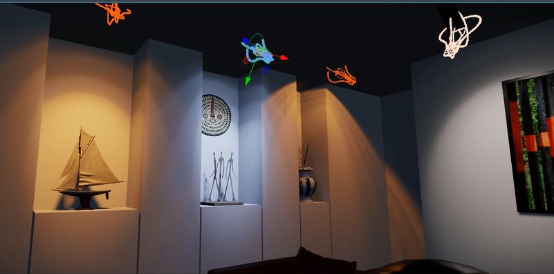
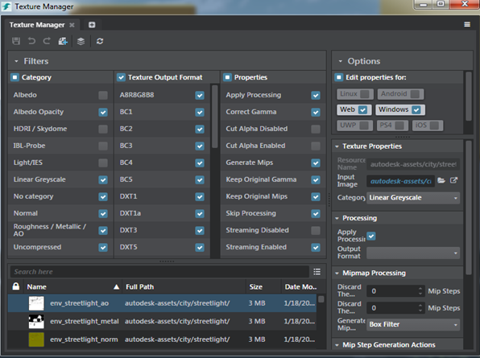
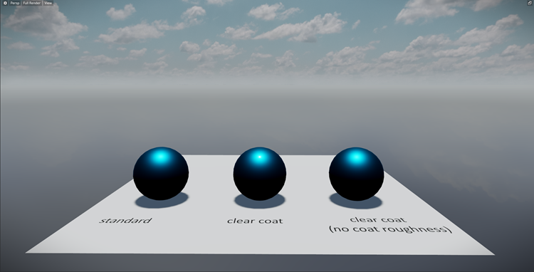

# Stingray 1.9 Release Notes

Welcome to the Stingray 1.9 (1.9.1358.0) Beta release.

> **Important**: We strongly recommend that you back up your existing Stingray data or work on a copy of your project when using a beta version of Stingray.

Sections in this topic:

-	[What's New](#whats-new)

	This section lists all the major new features available with this latest version of Stingray.

-	[What's Fixed](#whats-fixed)

	Here you'll find lists of the bugs and known limitations that we fixed, sorted by workflow area.

-	[Known Limitations and Workarounds](#known-limitations)

	This section includes any new known limitations we've found since the last release of Stingray.

-	[Upgrade Requirements](#upgrade-requirements)

	If you're working on a project that you started in an earlier version of Stingray, this section lists the steps you may need to take in order to successfully upgrade to the latest version.

## What's New

* * *

## Physically-based lights

The new **Physical Light** entity lets you use data from real-world lights to create a realistic distribution of light in your scene. You can add a **Physical Light** from the **Create** panel, and adjust its **Brightness** and **Temperature** using new sliders in the **Property Editor**.  To emulate the distribution of a real-world light source, import an IES Light Profile and assign it to your light. Physical lights are fully compatible with the light baker, so your lights appear when you bake your scene. See ~{ Physically Based Lighting }~ and ~{ Create a physical light }~.

## Capture Frame Tool updates

The Capture Frames tool has now been updated to be a frame capturing interface plugin tool with a separate encoder plug-in using the OpenEXR format (.exr). You can extend the encoder plug-in with other encoder formats to capture frames in different file formats.

## Favorites in Asset Browser

You can add frequently used assets or folders as favorites  to the **Favorites** directory in the **Asset Browser**. Check the favorite icon  or right-click in the **Asset Browser** and select **Add to Favorites** to mark an asset or folder as favorite. You can also drag and drop assets and folders to the **Favorites** directory. For more information, see ~{ Asset Browser }~.

## Texture Manager improvements

Continuing the improvements from the previous release, the **Texture Manager** tool is looking better than ever. The platform list looks crisp and compact, and headers added to the texture view list lets you view textures in an organized manner. You can organize your textures in the Texture Manager by sorting them by size, date modified or name. The Texture Manager also now preserves the state of UI layout you adjust like filters enabled or resized filter views.

-	~{ Create a texture template }~
-	~{ Create a texture category }~

## Debug projects in Visual Studio Code

You told us that you wanted to debug your projects in a dedicated, full-featured development and debugging environment, and we listened! As of now, you can use our [Stingray extension for Visual Studio Code](https://marketplace.visualstudio.com/items?itemName=jschmidt42.stingray-debug) to set and trigger breakpoints in Lua code, step through your code, trace variable values, send commands and Lua to the engine, read console messages, and more!

We're so happy about this new workflow, and so confident that you'll love it too, that we've removed the old integrated **Script Debugger** from the Stingray editor.

## FBX Version 2018.1.1

This release of Stingray picks up the latest version of FBX (2018.1.1), which provides various improvements and bug fixes.

## Updated DCC interop plug-ins

This release also includes an updated Stingray DCC Link plug-in to support Maya 2018 and Maya LT 2018. For information on the plug-ins, see ~{ Interop with Maya, Maya LT, or 3ds Max }~.

## Clear coat improvements

Clear coat is now more energy conserving, which reduces bloom when using a clear coat material.

## Experimental feature: HoloLens updates

- A new experimental HoloLens project is now available for *source code customers* in the **Online Projects** tab in the **Project Manager**. See ~{ Get started on HoloLens }~.
- A new option (`mesh_both_sides`) has been added to the `Raycast` Lua function that lets you cast a ray against both sides of triangles. This parameter is needed for raycasting against a spatial mapping mesh on HoloLens.

## What else is new?

-	You can now exclude physics actors from navmesh generation by adding their shape templates in the **Excluded Physics Actor Shape Template** field in the ~{ Navigation options }~.
-	We have removed the **History** tool from the Stingray Editor. You can view the list of actions executed and undo/redo actions in the Particle Editor or the Texture Manager.
- The viewport option  to toggle playing of audio sources in the level is now renamed to **Play Audio Sources**.

## What's new for developers?

### Typescript and the JavaScript API reference

We're starting to move the editor's front-end JavaScript code to [TypeScript](https://www.typescriptlang.org/)! This won't change your life much as a plug-in developer, since the changes for now are mostly about how we manage our own source code in our repo. You can keep doing your editor plug-ins in plain JavaScript the way you have been.

But we wanted to mention that as a result of this change, we're also taking out our old JavaScript API reference docs for now. We don't think this is a terrible loss -- since they never fully covered the whole public API, you often had to go look for functions directly in the editor's source files anyway.

Our hope is that before long we'll be able to leverage the built-in type info in the new TypeScript code to generate a much more complete and more useful reference than we had before.

### Native zip support for editor plug-ins

The `stingray.fs` JavaScript API now offers built-in support for working with *.zip* files:

`stingray.fs.zip(folderPath:string, zipFilePath: string): boolean`

Creates a new zip file from the contents of *folderPath*, and names the new zip file *zipFilePath*. The return value indicates whether the new file was written.

`stingray.fs.zipinfo(zipFilePath: string): array.<{path:string, size:number}>`

Reads a zip file named *zipFilePath*, and returns an array of all objects contained in the zip. Each object in the array has a `path` member that identifies its filename within the zip, and a `size` member that contains its size when uncompressed.

`stingray.fs.unzip(zipFilePath:string, destinationPath: string): boolean`

Reads a zip file named *zipFilePath*, and extracts its contents to the folder named *destinationPath*. The return value indicates whether the extraction was completed successfully.

### Run Lua from JavaScript and get its result in a Promise

The JavaScript `engine-service` offers a new function, `evaluateScript()`. This function runs a Lua script in the engine's Lua environment, and returns a `Promise` that you can use to access the result of that Lua script. This makes it much easier for your plug-in's JavaScript code to get and use the results of Lua snippets, using the same asynchronous mechanism you use to call other JavaScript services provided by the editor.

For example:

~~~{js}
let snippet = "6 * 8";
engineService.evaluateScript(script).then(
	function (result) { console.log("The result is: " + result); }
);
~~~

[Return to top](#top)

## What's Fixed

## Previous known limitations:

- GAME-19426 iOS cardboard VR view only renders on part of the screen on iPhone 7 Plus
-	GAME-22597 Newly spawned shading environment entity does not work

## Asset Browser

- GAME-22659 Importing a texture when the texture already exists does nothing
- GAME-22495 Drag & drop from Windows Explorer into the Asset Browser from within the same project folder is not supported
- GAME-21855 Clearing Search input in the Asset Browser results in Error
- GAME-21853 Search Result in the Asset Browser does not update on "Search in" Option
- GAME-21017 Online Assets: Assets sometimes fail to download but give no error
- GAME-12642 Asset Browser: Create Animation Controller should leave the resulting new controller selected
- GAME-12478 Goto resource when resource is from core folder navigates incorrectly in the Asset Browser

## General

- GAME-18689 Failure to create a Scatter Brush if it has the same name as previously deleted brush
- GAME-23193 Window > Animation > Anim Clip and Skeleton menu items should be renamed to Clip Editor and Skeleton Editor (to match window titles)
- GAME-22126 Prevent animation compiler from replacing the root node
- GAME-21743 Color Picker palette file extension contains a redundant parenthesis
- GAME-22183 Save Selected saves unselected files
- GAME-22894 Script Editor: A new script file is created when docking a script file that was just created
- GAME-22958 Capture Frames window is sometimes created with the title bar outside the monitor borders
- GAME-21614 Story output fails to fire if an Event track node is placed on or near the last frame
- GAME-23092 Undo/Redo on data-service can lead to object being unexpectedly mutated
- GAME-23343 Searching in the Log Console is really slow
- GAME-22872 Nodes on Color graph aren't easily visible when working with greys
- GAME-21963 No 'Save Changes' prompt when switching levels through the Project Manager
- GAME-20446 Asset Preview shows 'Persp' and 'FullRender' menus that do nothing
- GAME-19951 Asset Preview can end up in the wrong position
- GAME-13947 Asset Preview errors when clicking a .platform.material in the Asset Browser
- GAME-23007 Entity Editor: Sub-menus in the component explorer does not display correctly
- GAME-22985 Navigation: "Filter out by Unit subname" is mislabeled as "Filter out by script data"
- GAME-22359 Navigation: Be able to exclude physics shape templates when generating navmesh
- GAME-22957 Cannot use appkit class.lua without the full appkit
- GAME-22202 VR Oculus and Vive: Oculus/SteamVR.set_tracking_space_pose(Matrix4x4) is deprecated. Use Oculus/SteamVR.set_tracking_space(Vector3, Quaternion, Vector3) instead
- GAME-22813 Explorer: The rename option shouldn't be available in the context menu for multiselection
- GAME-22291 Explorer and Asset Preview windows sometimes do not populate
- GAME-21551 Explorer: F2 doesn't work to rename layers
- GAME-22853 Pressing Spacebar when a checkbox has focus causes exception checkbox.js:45:24 unhandled exceptionTypeError: model is not a function
- GAME-22641 Clicking on a transformation field while holding Shift returns unhandled exception
- GAME-21974 Viewport options window can get into a state where it will not display
- GAME-21569 Cancelling the Save File dialog causes problems in the Save all dialog
- GAME-21824 Wrong frame rate when playing IVF videos
- GAME-18422 Arial DF font artifacts fixed by increasing character resolution while maintaining texture size

## Audio/Wwise

- GAME-23109 Audio: Wwise exporter temp files are locked before exporter can write to them
- GAME-21909 UI text: Viewport "Audio Render Enabled" changed to "Play audio sources"
- GAME-20014 Wwise editor doesn't close or update when switching projects in Stingray
- GAME-19834 After adding Wwise sounds to a project that had none, a restart is needed for sounds to play

## Deployer/Connections

- GAME-22411 No slaving option if the first localhost entry is changed to another device
- GAME-22052 Deployer: iOS Deployer panel is not grayed out when iOS binaries are not present
- GAME-21804 Android: Terminating the Stingray app on the slaved device incorrectly shows error message "Failed to run project"
- GAME-21764 Each time Run Project is done, another entry appears in the command target pulldown
- GAME-9934 Changing project while slaving doesn't disconnect the remote engines properly

## Engine Core

- GAME-23093 Camera controls are invisible and functional with GoogleVR
- GAME-23080 Console server lua commands fail to output traceback to console.exe and editor log.
- GAME-22911 Visual Studio debug visualization of plugin types is not working
- GAME-22576 Escape from basic-template Test Level with a dynamically-spawned ChamfBox gives error "Unloading a locked resource content/models/props/ChamfBox"
- GAME-22457 Debug shaders are compiled on Android release builds
- GAME-22173 Invalid format of saved game files causes crashes
- GAME-22076 Certain projects crash on Android 6.0 or greater due to missing permissions
- GAME-21809 Missing Light source level material results in warning at runtime
- GAME-21802 Android: Slaved viewport is stretched after dismissing lock screen on Pixel XL
- GAME-19424 iOS cardboard renders black if there is a dynamic light

## Flow

- GAME-22828 Flow and Particle Editor: Cannot open editor if file is saved in a mapped folder
- GAME-21290 Search box cyan highlight frame does not seem to be tall enough (only seen on sides)
- GAME-20934 Nodes should automatically update for changed External Input/Output pins instead of giving an error
- GAME-18119 Search bar should only count each field once
- GAME-18111 There is no shortcut for going to next/previous search result
- GAME-18106 Re-setting a Flow Subroutine to the same Flow resource clears all connections
- GAME-18099 Undoing removal of object referenced in a Flow node does not restore it in the Flow node
- GAME-18092 Tab quick-search menu doesn't have tooltips
- GAME-17349 Error message for a missing required input does not get shown in the status bar
- GAME-12762 Right-clicking the background should clear the Tab search results
- GAME-12726 "Effect Resource" node "Resource" input should be renamed "Effect"
- GAME-8883 Tab search and right-click context menu can both be on the screen at the same time
- GAME-8094 When a larger node is under a smaller one, it always gets and stays highlighted as if selected
- GAME-16558 Double-clicking in the Level Flow Editor while compiling data produces an error
- GAME-15099 Searching nodes inside collapsed groups focus empty space
- GAME-16369 Error thrown for a Flow node without a unit
- GAME-18780 Subroutine nodes do not automatically refresh when saved
- GAME-5269 Undoing a drag-and-drop into a group leaves the node in the group and requires two Ctrl-Z undos
- GAME-14996 Weird Level Story Flow node context menu labels

## Interop

- GAME-23183 StingrayLinkSendTo with -selected sends the whole scene
- GAME-23181 Connection to Stingray doesn't update properly in 3ds Max when Stingray connection changes
- GAME-23122 Crash importing instanced geometry
- GAME-22666 Maya level sync Set Engine Resource ignores values in dialog
- GAME-22649 Maya > Send to Stingray no longer works in developer builds
- GAME-21933 No feedback to user when editor external applications path is not set
- GAME-21838 Asset Browser: Should allow import of IVF video files
- GAME-21669 Skeleton creation fails if an FBX is re-imported into same folder, even if the folder is empty
- GAME-21364 Crash after import if the physics actor's nodes are removed from FBX

## Level Editor

- GAME-22378 Gizmo for point lights is hard to select from certain angles
- GAME-22491 Stalls in the tree view update while navigating large scenes
- GAME-22334 Selection ("hot") area for some object gizmo components is smaller than the visual representation
- GAME-22333 Focus does not change when dragging a unit into the level viewport
- GAME-21977 Light gizmos not displaying upon importing an FBX file with light
- GAME-22876 Exception thrown "New poses does not match number of level objects"
- GAME-18048 Open Level will open a level even when nothing is selected

## Particles

- GAME-23552 Particle Editor: Points added to the graph when the user does not click in the graph area
- GAME-23202 Particle Systems are not renamed properly after being re-ordered
- GAME-23185 Particle Editor: Moving particles through the editor breaks the Material resource reference
- GAME-22856 Full Render button in the Particle Editor preview area does nothing
- GAME-22852 Framerate on preview gets progressively worse when more viewport tabs are added
- GAME-22847 Particle Editor: Tilt and Spin in the editor is broken
- GAME-22804 Particle Editor: Shading environment is always set to default
- GAME-22461 Particle Editor: Effect using Tangent and Binormal crashes
- GAME-22371 Clicking on an asset opens a new window instead of bringing forward its editor
- GAME-21668 Particle Editor: Root options are shown when selecting the variable node without variables
- GAME-21568 Particle Editor: Undo an Add operation resets selection in the tree view
- GAME-20466 Asset Preview of a particle effect does not respect the Asset Preview background setting

## Rendering

- GAME-23274 Setting lights to "indirect" will bake 'direct light'
- GAME-23129 Texture streaming crashes
- GAME-23052 mini_renderer doesn't work on iOS Metal
- GAME-22978 Shader Graph: Channel specification dialog needs input validation (invalid input causes inability to open shader graph)
- GAME-22844 D3D11 doesn't allocate global constant buffer for all shaders
- GAME-22802 Performance issues with onboard GPUs on Windows
- GAME-22751 Crash using terrain on Steam VR
- GAME-22655 Perfhud reporting incorrect information
- GAME-22523 VRSLI: Poor rendering quality and screenspace artifacts on Vive and Oculus
- GAME-22077 Deadlock occurs when `RenderInterface::_message_ring_buffer` is full on render thread
- GAME-21918 Lightmapper Error: 'Compiler: Corrupt file: Unexpected end of data'
- GAME-20749 Sharing code between HLSL/HLSL fails to include some blocks
- GAME-16543 Lighmapping disables shape morph on baked units
- GAME-14377 Clear coat - excessive bloom (double specular)

## Texture Manager

- GAME-22732 Only one texture is deleted/duplicated at a time when selecting multiple textures
- GAME-22389 When a texture category is deleted, related textures should have their category properties set to "No category."
- GAME-22358 Importing FBX with textures does not update the Texture Manager list
- GAME-22195 Long file paths makes it difficult to read the texture name
- GAME-22159 Typo in the option 'Generate Mip Step'
- GAME-22068 Platforms checkbox list should be in a grid format
- GAME-22067 Filter checklists should have right-justified checkboxes
- GAME-21970 Cut Alpha Threshold slider can have negative values
- GAME-21962 Input image should accept image file instead of textures
- GAME-21961 Pressing Escape in the search/filter field should clear the field
- GAME-21928 Textures thumbnails don't update when changing projects
- GAME-21920 History panel does not use a resizer and is difficult to see
- GAME-21889 Texture Manager selects all platforms by default
- GAME-21828 Ctrl-Z and Ctrl-Y do not Undo/Redo
- GAME-21803 Texture Manager doesn't update when deleting or duplicating textures until the window is reloaded
- GAME-21788 Create Template and Create Category are using the same icon

## Tools Foundation

- GAME-22923 Load dll dependencies when loading editor native extensions
- GAME-22596 Custom allocator for editor ConfigValue API is not used in free()
- GAME-22396 Threading error in Data Compiler - results MUST be posted on the dispatcher
- GAME-22210 Editor viewports are offset when using multiple monitors with mixed 4k and 1080p scaling
- GAME-22199 Saving dialog for unsaved textures, scripts, particles shows after switching projects
- GAME-13991 Multi-monitor setup with different scaling behaves badly
- GAME-13782 Context menu showing at the wrong location if dual monitors have different DPI scaling
- GAME-13781 Mouse interaction and transition between high-DPI and low-DPI monitors

[Return to top](#top)

## Known Limitations

* * *

This section lists known limitations and workarounds for Stingray.

Unless otherwise noted in the **What's Fixed** section, please be aware that this release contains the same **Known Limitations** described in the previous versions of Stingray Release Notes.

> **Note**: We recommended you back up your existing Stingray data or work on a copy of your project when using a beta version of Stingray.

- **GAME-22567 Main window, Project Manager, Getting Started, About Box and possibly other dialogs often come up smaller than they should be (and sometimes offset with blank areas)**

-	**GAME-23257 Directed Learning: Hands-on Training Mission option is not functional anymore**

-	**GAME-23441 Renaming an entity resource that is instanced in a level with changes causes an error**

- **GAME-23579 Android: Connection to device takes much longer (2x-3x) now than before**

-	**GAME-23563 Android: Scaleform buttons flicker/transparency glitches**

-	**GAME-23556 Android: Run Project no longer works reliably and often gets stuck indefinitely at "Installing Android Application"**

	**Workaround:** Retry after exiting and restarting Stingray.

[Return to top](#top)

## Upgrade Requirements

* * *

The full installation guide for Autodesk products including Stingray is included in the Stingray online help, [here](http://www.autodesk.com/stingray-install-ENU "here").

This section explains the improvements and fixes that require specific upgrade steps for users currently using a previous version of Stingray.

### Shader compiler updates

The D3D10 compatibility flag, *D3D10_SHADER_ENABLE_BACKWARDS_COMPATIBILITY*, has been removed from the D3D11 shader compiler. This change affects users with custom shaders. Without the compatibility flag, you can no longer modify shader constants, as they are now considered static.  To modify values, you now need to create local variables.

### Clear coat changes

Updates have been made to improve clear coat. As a result, the behavior of the `Output` node has changed. If your project contains a clear coat material, you may need to adjust your content.

### Lua API changes

For a complete list of all new, modified, and removed elements in the Lua API in this release, see the [version history](../../lua_ref/versions.html).

If your project contains any API elements that have been modified or removed, you will need to adjust your code accordingly.

### Flow node changes

For a complete list of all new, modified, and removed Flow nodes in this release, see the [version history](../../flow_ref/versions.html).

[Return to top](#top)

### Xbox One XDK version

Stingray now requires the **October 2016 QFE 2** release of the XDK.

### PlayStation 4 SDK version

Stingray now requires **Version 4.0** of the PlayStation 4 SDK.

If you have trouble upgrading to this version from an older version of the SDK, try deleting any existing files from the `C:\ProgramData\SCE directory` before you install.
