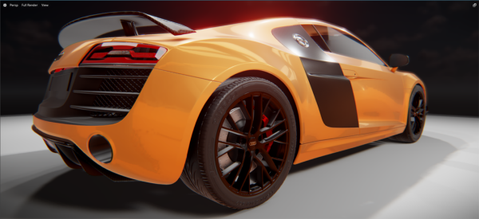
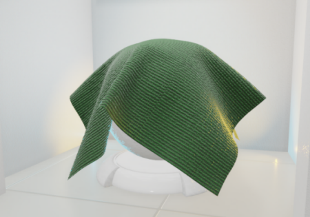
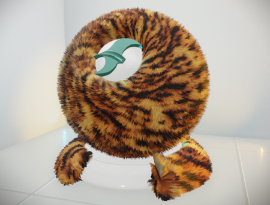
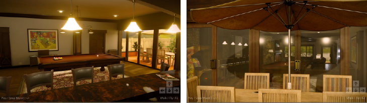
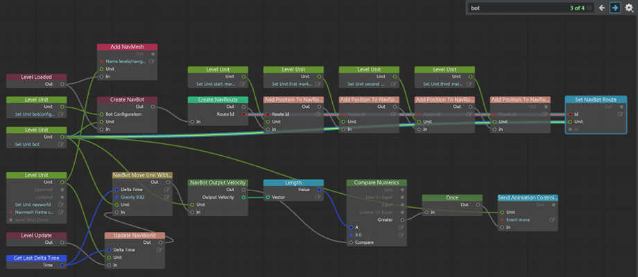

# Stingray 1.3 Release Notes

Sections in this topic:

-	[What's New](#whats-new)

	This section lists all the major new features available with this latest version of Stingray.

-	[What's Fixed](#whats-fixed)

	Here you'll find lists of the bugs and known limitations that we fixed, sorted by workflow area.

-	[Known Limitations and Workarounds](#known-limitations)

	This section includes any new known limitations we've found since the last release of Stingray.

-	[Upgrade Requirements](#upgrade-requirements)

	If you're working on a project that you started in an earlier version of Stingray, this section lists the steps you may need to take in order to successfully upgrade to the latest version.

-	[Source updates](#source-updates)

	If you have access to the Stingray source code, see this section for information about what's new for this release in the master branch.

## What's New

* * *

## Smoother migration for existing projects

When you open an existing project, or a project without a version number specified (in the project settings.ini file), you'll be automatically prompted to migrate the project to work with Stingray 1.3.

Note that after you create or open a project in Stingray 1.3, those projects no longer work with earlier versions of Stingray. See ~{ Open an existing project }~.

## New in Rendering

### Texture streaming

The engine can now stream textures from disk automatically when they are needed for rendering, instead of keeping them in memory persistently. This can help you increase the number of different textures you use in your game without increasing your memory requirements or your initial load times. For details, see ~{ Texture streaming }~.

### Clear coat

The new clear coat shader lets you simulate a translucent layer of film on a surface. For example, you can use clear coat to create colored films on metal, like car paint. See ~{ Create a clear coat material }~.

### Cloth shading

You can now use the new **Cloth Falloff** property to mimic a cloth-like appearance. See ~{ Simulate cloth }~.

### Fur

Stingray now includes a new standard fur material that lets you add short fur to assets like bears, cats, and dogs. See ~{ Create Fur }~.

### Graph-based particle materials

The Particles system now uses the standard shader graph, making the workflow consistent with how you edit shaders in Stingray.

In the default particle system, the **Material:Billboard** component is replaced by the **Billboard Visualizer** component, which lets you specify a single material, and edit the shader graph to modify it. A new material called particle_default is assigned to the Billboard Visualizer component by default. See ~{ Particle system properties }~ for updated information.

Several nodes have been added to support the new physically based materials used for particles. Refer to the [Stingray Shader Node Reference](../../shaders_ref/index.html) for details on the new nodes, including:

- **Output > Particle Base**
- **Particles > Billboard Position**
- **Particles > Billboard Rotation**
- **Particles > Billboard Size**

### Improved Shadow Casting

Improved shadow casting on back of translucent objects. For proper light scattering on translucent materials (based on **Density** input), set the **Material Type** option to *Translucent* in the **Standard Base** node.

## New game kits and examples

Check out Creative Market for all the latest examples and game kits shipping with this version of Stingray, including:

### Stingray Learning Museum

[Download this project](http://www.autodesk.com/stingray-creativemarket-examples) and walk through the museum to explore the interactive details, with live examples at each station. You can then experiment with the examples right in the Stingray Editor, for more hands-on learning about the PBR materials, lighting, and rendering systems.

<iframe width="640" height="360" src="http://player.ooyala.com/iframe.html?pbid=6055f5a2061d4016b11ebf1fa8a7751e&amp;platform=html-fallback&amp;ec=pzdmN1MzE6MpSHGb-8eiPpTtiHeugCH9" frameborder="0" allowfullscreen></iframe>

### Gears

This complete game kit showcases highly polished VFX, dynamic lighting, and sound. Get it at [www.autodesk.com/stingray-creativemarket-gamekits](http://www.autodesk.com/stingray-creativemarket-gamekits).

<iframe width="640" height="360" src="http://player.ooyala.com/iframe.html?pbid=6055f5a2061d4016b11ebf1fa8a7751e&amp;platform=html-fallback&amp;ec=hhNXZ0MzE6uZJw4YWNyZURKfSw0DzwpK" frameborder="0" allowfullscreen></iframe>

### Pool Room

The Pool room example to shows off the physically-based rendering capabilities of Stingray. Get it at [www.autodesk.com/stingray-creativemarket-examples](http://www.autodesk.com/stingray-creativemarket-examples).

>  Look for the <a href="http://www.autodesk.com/stingray-creativemarket" target="blank">Creative Market</a> icon throughout the Stingray Help, where you'll find links to download projects, examples, and game kits designed to help you learn Stingray.

## Updated DCC interop plug-ins

Updated the Stingray DCC Link plug-in to support Maya 2016 Extension 2, Maya LT 2016 Extension 3, and 3ds Max 2017. For information on installing the plug-ins, see ~{ Setup the DCC plug-in }~.

## New FBX Import options

### Import Materials
You can now group materials together on import. Ensure **Create Materials Folder** is on in the **FBX Import options** to group any materials associated with the imported objects in a new Materials folder. See ~{ Import a model with textures and materials }~.

### Mikktspace tangent support
New mikktspace support consistently generates tangent spaces for an imported mesh. The new **Tangent** option in the **FBX Import options** lets you **Import** vertex tangents or **Calculate** tangents using mikktspace tangent generation. If you import a model that contains vertex tangents, Stingray imports them from the file. Missing tangents are generated using mikktspace.

## Animation clip updates
Curves for animated properties are now imported with animation clips. The name of each imported curve is displayed in a read-only list in the animation clip properties, and new options in the ~{ Animation Clip Properties }~ let you select the type of curves (**Transform Curves** or **Property Curves**) that are evaluated during playback.

## Extended custom Flow node variable types

You can now create custom Flow nodes with input and output connections that handle the following additional types of data: `material`, `id`, `light`, and `mesh`.

## Search in Flow graphs

You can now search for nodes in your flow graph using the *Search* in the **Level Flow** Editor. Enter a text in the *Search* and use the arrows to browse through the search results. Narrow down your search using the  Search options.

## New in Core

* Increased the limit for maximum units reached in a scene to around 4 million.

## Asset Browser improvements

The following new ~{ Asset Browser }~ shortcuts let you browse assets in your game project more efficiently:

* Right-click anywhere in the **File View** and select **Show in Explorer** to open the current directory in Windows Explorer.

* Press Backspace to return to the previously opened folder.

## Enable Apex Cloth

You can now view cloth simulation in the viewport. You must make changes directly in your project's settings.ini file before you can enable Apex cloth in the editor. See ~{ Enable Apex Cloth }~.

## Updated PhysX plug-in

The PhysX plug-in installers for Maya, Maya LT, and 3ds Max that ship with Stingray are now updated to install the latest version of the PhysX plug-in, version 3.3.20222.00162a. This plug-in includes several improvements and bug fixes by Nvidia. For related information, see ~{ Install the PhysX plug-in for your DCC }~.

## Launch data compilation in the Connections Panel

New data compile options let you use the **Connections Panel** to launch a data compilation for a specific target. Right-click a target in the **Connections Panel** and select **Compile Data** or **Compile and Bundle Data**. See ~{ Using the Connections Panel }~.

## Support for PlayGo on PS4

Stingray now supports PlayGo calls from gameplay Lua code to the engine. On PS4 consoles, PlayGo lets the player start the game once an initial 5GB of game data is downloaded and installed. For more information, refer to your [PS4 developer documentation](https://ps4.scedev.net/resources/documents/SDK/3.000/PlayGo-Overview/0001.html).

## Wwise plug-in updates

*	You can now use Wwise on Xbox One with Visual Studio 2015.

[Return to top](#top)

## What's Fixed

- GAME-14328 Games Launcher: Unable to launch Maya LT Extension 3

### Authoring Tools and Animation:

- GAME-14305 Successfully compiled assets do not trigger a refresh when non-fatal errors are present
- GAME-13102 Learning button does not always respond on Steam version
- GAME-14547 FBX import on specific file when lights are not imported with mesh: Assertion failed `_size > 0` at `collection\vector.h:100`
- GAME-14441 Ghost Town: limitless warning "Unit Deprecated call, use material slot name instead"
- GAME-14321 FBX Import: Cannot import mesh with skeleton
- GAME-14305 Content problems with one asset stops another one from being seen
- GAME-14238 Asset Browser: incorrect number of items shown for empty folders
- GAME-14237 Asset Browser: TypeError: Cannot read property 'isDirectory' of undefined at `_triggerAsset (asset-browser-controller.js:905:25)``
- GAME-13766 Asset Browser doesn't highlight folder in tree view when navigating happens in the contents view
- GAME-13186 Asset Browser: Resizer error
- GAME-12965 Find Selected Asset in Asset Browser on a particle does not select and scroll the asset into view
- GAME-12531 Asset Browser: Tree does not update to show or hide core folder on changing "Show All Files" until a restart
- GAME-12426 Asset Browser: Thumbnails not generated in any folder visited during compilation
- GAME-14228 Crash when changing selection of particle effects
- GAME-14178 Scaleform events without data do not get triggered
- GAME-14148 Particles: Infinite Life Time forced on each time editor loaded
- GAME-14028 Editor does not work if engine takes more than 2 seconds to start up
- GAME-14016 Editor is always performing Unit.visual_mesh_raycast()
- GAME-13988 Story Editor: Adding material tracks doesn't work with level material overrides
- GAME-13770 Story Editor: 'next key' buttons move timeline randomly
- GAME-13926 Cursor gets stuck with 'up down' arrow in tabs field when using spinner
- GAME-13904 Trying to display context menu in Flow too early on startup gives an error
- GAME-13883 DCC Link: If Maya is set to meters, camera connection fails to properly adjust its position
- GAME-13859 Core folder particle default material which should be read-only can be modified and saved
- GAME-13792 Billboards align only on 2 axes
- GAME-13771 Shift-click in the Explorer tree to add an item to a selection started in the Level Viewport does not always work properly
- GAME-13764 Some hot keys of object visibility don't work
- GAME-13711 Terrain: Spinner box in the Property Editor should reject invalid values
- GAME-13685 Terrain: The height map resolution spinner should prevent from entering invalid value
- GAME-13225 Terrain/Property Editor: Undergrowth density stays grayed out and increment is wrong (0.1 vs 0.01)
- GAME-13224 Terrain/Property Editor: Undergrowth section is missing its borders/title/check box, other sections missing borders
- GAME-13702 Terrain/Property Editor: Unhandled exception when changing properties
- GAME-13692 Material thumbnails don't update correctly at certain times
- GAME-13690 Create Project "A project with the same name already exists" notification stays for too long
- GAME-13686 Manual refresh (F5) of particle effects necessary
- GAME-13676 "Delete Assets" dialog glitch when pressing delete on selected asset
- GAME-13646 Audio source event name can't be set in Property Editor
- GAME-13619 Undocking and docking the Asset Preview crashes engine
- GAME-13556 Animation data compilation ignores bone custom compression settings
- GAME-13503 Android: Duplicating a level unit while connected to a device gives "android / Lua: core/editor_slave/stingray_editor/unit.lua:222: attempt to call field 'guid' (a nil value)"
- GAME-12174 Android: Save Level or New Project while connected to a device gives error: android / Lua: core/editor_slave/editor/editor.lua:450: attempt to call field 'needs_saving' (a nil value)
- GAME-13487 Widget (move, rotate, scale) shown on wrong object
- GAME-13427 FBX import results in unit and material that are not found or loaded, and thumbnails that are not generated. Content specific
- GAME-13242 Inconsistent paths in `Delete Asset Dialog`
- GAME-13241 Wwise Package-based bank auto loading is broken
- GAME-13135 Adding an Audio Source to the level gives "Editor / Property Editor: Error: No component registered for display type Element", property-editor-utils.js:96:19
- GAME-12908 Property Editor unhandled exception, TypeError: Cannot read property 'invokeMethod' of undefined at Object.ColorGradientController.mouseup (/color-gradient.js:131:44)
- GAME-12532 Typing in text fields (like new folder, new material) has no effect until explicitly clicking in text field to give focus
- GAME-12170 Flow: Animation Clip Flow Nodes do not have consistent controls
- GAME-11972 Flow: Tab search results stay on screen when focus is lost (through Alt-Tab or clicking outside the Level Flow editor)
- GAME-11962 Flow: the cursor shape sometimes gets stuck (left-right arrow shape)
- GAME-10525 Flow: Put Get Unit Animation Controller Root Motion in the base Animation sub menu
- GAME-5815 Flow: Defining custom node property as "instance_id" uses wrong colour
- GAME-11817 Angular Error: [ngRepeat:dupes] when using the Dependency viewer
- GAME-11815 Editor Settings: External Applications labels should not have "Path" capitalized
- GAME-11776 Editor engines not cleaned up when opening new project
- GAME-11666 Level Editor: Sub-object toolbar icon wrong size
- GAME-11648 Export Selected to FBX works even if nothing is selected
- GAME-11550 Project Manager has no taskbar icon
- GAME-11445 Annoying fade when opening a shader graph
- GAME-11444 Alt-tabbing loses input focus
- GAME-11439 Replay button can become hidden in particle editor
- GAME-11358 Dragged folders cannot be dropped on the tree view
- GAME-11356 Find in Asset Browser fails unless search field is empty
- GAME-11253 Layer Freeze is not Working as Intended
- GAME-11067 Anim Controller: Incorrect Hover Cursor showing when side panel is overtop a graph item
- GAME-10750 Animation Type-Ahead Box doesn't grab the closest match and gets too long
- GAME-10363 Import: Skeleton selection gets cleared when other settings are modified
- GAME-3119 Level Viewport: Custom grid size allows negative values
- GAME-13900 FBX Import: Incorrect LOD values on import
- GAME-13767 FBX Import incorrectly merges meshes by material type even though the top level option is disabled
- GAME-11153 3ds Max Interop: Gamma should always be turned off with Send to Max
- GAME-14031 Creating a project deletes ALL files and folders under the path specified as the data directory
- GAME-13966 Ctrl-Z undo of a spinner operation does not work if the text field still has focus
- GAME-13953 When having multiple undocked panels on different monitors, in some cases the focus jumps from one undocked panel/group to another endlessly
- GAME-13557 Moving a texture leaves behind its image file
- GAME-13485 Undo doesn't work when using the spinner component
- GAME-13426 Renaming a file or folder and gives errors "Internal file could not be updated: .sync_token", "Target Invocation error : Value cannot be null."
- GAME-12909 Not all thumbnails are properly generated, some are black or show only the checkerboard background
- GAME-12412 Cannot move an empty folder
- GAME-9460 If my selection in a tree view is collapsed, pressing F may not scroll to the selected item

### Rendering:

- GAME-14270 Lightmapper: crash when using pause on a bake then deleting a unit then resume
- GAME-14558 Android: spotlight illumination cut off by hard shadow on device in live link
- GAME-13968 Missing parent material can crash the data compiler
- GAME-13062 Shader Database accesses disk during every compile
- GAME-10994 Apex cloth rendering error: only supports material sets
- GAME-14558 Android: Spotlight illumination cut off by hard shadow on device in live link
- GAME-14263 Test Level: Occasional crashes with renderer during level shut-down 'Assertion failed'
- GAME-14220 Crash in material compiler when compiling child materials
- GAME-14215 Lights that are disabled are contributing to the lightmap
- GAME-13967 Yellow patterns rendering on Tegra X1
- GAME-13839 Terrain: Re-importing an undergrowth unit with different settings and orbiting the viewport gives an access violation (terrain\decoration.cpp(1348): stingray::terrain::RenderDecoration::kick_analysis_job)
- GAME-13684 Occasional crashes in renderer when working in the editor
- GAME-13336 Optimize and fix transparency issues
- GAME-13335 Fix material id brdfs in forward pass
- GAME-13331 RenderResourceContext::reset crash
- GAME-13259 Objects are randomly ignored by baker
- GAME-13151 Particle: Mesh Visualizer changing the unit gave Assertion failed `e->mo` at `particle_world.cpp:523`
- GAME-13144 Extremely long stalls when destroying world
- GAME-13123 VR: Clustered shading flickers in VR but not in editor
- GAME-13009 Objects should cast shadows on the back of translucent objects
- GAME-11687 Beast: Precision problems in Stingray baker

### Core:

- GAME-14440 Specifying an invalid iOS packaging server by name results in a crash
- GAME-14519 iOS Package Server doesn't contain log data for connections
- GAME-14306 Engine crash / Asset actor "is not rigid_dynamic" / Assertion failed `actor_connector.internal_actor().isRigidDynamic()` at `physx\physics_world_internal.cpp:1497`
- GAME-14304 Copying content into project folder gives "Data / : Cannot list entries in", "Assertion failed `h != INVALID_HANDLE_VALUE` at `io\file_system.cpp:504`"
- GAME-14241 Shading Environment sends logging messages as though it was the data compiler
- GAME-14223 Building without Scaleform plug-in crash flow events
- GAME-14221 Material Compiler crashes when using inherited materials
- GAME-14182 Sometimes crash in stingray::delete_flow_events_referring_to on shutdown
- GAME-13974 [PhysX] APEX Clothing GPU dlls missing for vc14
- GAME-13613 HumanIK plug-in fails to build in Xcode 7.3
- GAME-13271 Sporadic crash exactly after done compiling data
- GAME-13258 Stingray reports high memory use and can run out of memory
- GAME-13220 Editor Engine: Cannot obtain value from Error<T> with error state: `File does not exist `exploded_database.db` with root `basic_project_SSS_data\win32``
- GAME-13026 Low address page allocator should not be used on 32-bit
- GAME-12988 Setting fixed framerate causes engine crash
- GAME-12955 Scattered units don't appear far from origin
- GAME-12811 Throttle wait ignores internal components update duration
- GAME-12579 APEX Cloth material resource issue
- GAME-12432 Web server parsing errors when web socket header is overlapping across two packets
- GAME-10934 ResourceManager log messages do not give enough information to fix problems
- GAME-10444 Warnings printed about being unable to refresh some asset types
- GAME-8632 Unit reverts to default material after Unit Editor changes

### Gameware Navigation:

- GAME-13778 NavPlugin upgrade to SDK 2016.1.9 (Xcode 7.3 compile fix)
- GAME-13776 Navigation panel labels and tooltips are confusing. Use same text in tooltip and doc.
- GAME-13724 With a French locale, the Navigation Generate button triggers a Lua error
- GAME-13718 Lua symbol GwNavGeneration is nil when running the win32 version of editor-stingray-engine
- GAME-13516 Exiting test level with 2 Nav Worlds gives "core/gwnav/lua/runtime/navflowcallbacks.lua:26: attempt to index local 'world' (a nil value)"
- GAME-13306 Navigation: Bot Configuration gizmo appears in game play
- GAME-10583 Fix crowd dispersion
- GAME-8861 NavPlugin - expose low_memory_mode in c_api, lua_api and the ui

### Templates/Content:

- GAME-14441 Ghost Town :Warning "Unit Deprecated call, use material slot name instead" when running the level
- GAME-14426 VR: HTC Vive controller mesh is out of date
- GAME-14040 Flow Space Shooter played on 1.2/1.2.5 displays warnings when shooting

### Scaleform Studio:

- GAME-12728 Deleting an Actor asserts in Debug
- GAME-12024 Grid: Increase grid input field cell size from 2 to 4 digits
- GAME-11745 Assert occurs when user presses left bumper key in Xbox One
- GAME-11209 ActionReplay doesn't replay SelectTimelineFrames correctly
- GAME-10972 SVGs render errors, missing clipping masks, and gradients don't smoothly blur zoomed in
- GAME-10830 Multi-selection doesn't deselect in Asset Browser when you single select one of the items that is multi-selected
- GAME-10451 Transform pivot property breaks after setting skew
- GAME-10144 Undo requires extra step after adding Actor to stage
- GAME-9923 Scaleform Studio should cache PluginDescriptions
- GAME-9414 SpriteComponent does not play correctly
- GAME-14370 Character Template project throws errors when packaging for Windows

[Return to top](#top)

## Known Limitations

* * *

This section lists known limitations and workarounds for Stingray.

Unless otherwise noted in the **What's Fixed** section, please be aware that this release contains the same **Known Limitations** described in the previous versions of Stingray Release Notes.

*	**GAME-14029: Missing menus or blank tools including Level Viewport in Stingray Editor v1.2, after running v1.3**

	**Workaround:** Select **Window > Reset Layout** to restore all tools and editors.

*	**GAME-14516 Crash when closing the editor after opening a 1.3 project using Stingray 1.2.5**

	**Workaround:** Do not use earlier versions of Stingray to open projects created with Stingray 1.3.

*	**GAME-14786 Cannot reimport assets in the Asset Browser**

	Right-clicking an asset and selecting Re-import does not reimport updated assets to your project.

	**Workaround:** If you need to reimport assets that you've changed outside of Stingray, the best workaround is to delete the original assets from your project, then import the updated versions.

*	**GAME-13232 Modified Box Min and Box Max values in 'Reflection Probe Settings' are not reflected in the editor**

	**Workaround:** Edit another property for the reflection probe first, for example, temporarily turn on **Cast Shadows**. You can then change the **Box Min** or **Box Max** value (under the **Reflection Probe Settings** heading in the **Property Editor**), and your changes are properly reflected in the editor.

*	**GAME-14737 Dialogs open behind the Stingray editor main window when an undocked Story Editor window is in Live mode**

	**Workaround:** Dock or close the **Story Editor** window.

[Return to top](#top)

## Upgrade Requirements

* * *

The full installation guide for Autodesk products including Stingray is included in the Stingray online help, [here](http://www.autodesk.com/stingray-install-ENU "here").

This section explains the improvements and fixes that require specific upgrade steps for users currently using a previous version of Stingray.

### Xbox One XDK version

Stingray now requires the **November 2015** release of the XDK.

### PlayStation 4 SDK version

Stingray now requires **Version 3.0** of the PlayStation 4 SDK.

If you have trouble upgrading to this version from an older version of the SDK, try deleting any existing files from the `C:\ProgramData\SCE` directory before you install.

### Lua API changes

For a complete list of all new, modified, and removed elements in the Lua API in this release, see the [version history](../../lua_ref/versions.html).

If your project contains any API elements that have been modified or removed, you will need to adjust your code accordingly.

Major changes:

*	`stingray.Quaternion.from_matrix()` has been renamed to `stingray.Quaternion.from_matrix4x4()`.
*	You can use the new `stingray.Http` API to send HTTP GET requests directly from your gameplay code.
*	The `stingray.Joint` object includes new functions to set limits, motion, change joint position, and more.
*	New functions in `stingray.Renderer` to control texture streaming.
*	New objects and functions to integrate with console features, such as streaming installs, downloadable content and social status.
*	A note about documentation: many items that were previously documented as Objects are now documented as Namespaces. This change more accurately reflects the way those APIs are used.

### Flow node changes

For a complete list of all new, modified, and removed Flow nodes in this release, see the [version history](../../flow_ref/versions.html).

If your project contains any of the Flow nodes that have been modified or removed, you will need to make sure that your graphs are wired correctly by deleting any old versions of the node and re-inserting the new version.

Major changes:

*	**Animation > Animation Clip Play from Current**, **Animation > Animation Clip Reset and Play** have been replaced by **Animation > Play Animation Clip**.
*	Moved **Animation > Unit > Get Unit Animation Controller Root Motion** to **Animation > Get Unit Animation Controller Root Motion**.
*	**Math > Rotation > Addition** has been replaced by **Math > Rotation > Multiplication**.

### Shader node changes

For a complete list of all new, modified, and removed shader nodes in this release, see the [version history](../../shader_ref/versions.html).

Major changes:

*	**Decal > Decal UV** and **Terrain > Terrain UV** have been deprecated. You can now use the standard **Texcoord** nodes in order to get UVs in graphs that use the decal and terrain output nodes. The old nodes are still present for backward compatibility, but if you have created your own custom shader graphs for decals or materials, it is recommended that you update your material graphs.
*	Several nodes have been added to support the new physically based materials used for particles.
*	New options and inputs have been added to the **Output > Standard Base** node to support rendering fur and clear coats.

[Return to top](#top)

## Source Updates

* * *

### Building the engine with Visual Studio 2015

You can now use Visual Studio 2015 to build the Stingray engine for all target platforms that you build on Windows. The default build environment is still Visual Studio 2012, so you will need to specify to the `make` script that you want to use 2015 instead:

~~~{nohighlight}
> ruby make.rb --devenv msvc14 --engine
~~~

Note that you still need to use Visual Studio 2012 to build the Stingray Editor.

[Return to top](#top)
