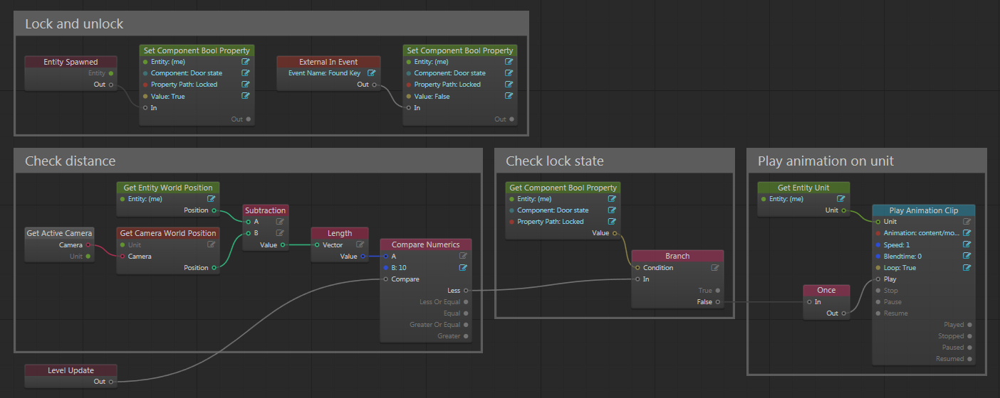

# Set up an entity's behavior using Flow or Lua

Often, you'll want all entities of a given type to behave the same way when you run your project -- that is, to respond with the same actions when certain events and conditions occur. For example, when a player-controlled unit comes close enough you might want doors to open up, lights to turn on, or enemies to become hostile.

This is made easier by using *script* components and *Flow* components, which associate your entities with Lua modules and Flow graphs in your project. Those Lua modules and Flow graphs can take care of responding to the events that happen over the lifetime of the entity, and carrying out the appropriate response for the entity to take.

These components are useful because they help you keep your entity's behavior relatively self-contained. This makes your game easier to manage, and makes it easier to re-use your behaviors. For example, instead of having to include a Lua routine in your game's main update loop that checks the state of each door in the level, you can encapsulate all the dynamic runtime behavior for your doors inside a script component that gets invoked automatically. This keeps your main gameplay scripts and Flow graphs less cluttered with logic to handle for specific types of game objects, and allows you to more easily share behaviors between different entities (and across multiple projects).

## Set up a behavior in Flow

Flow is a great choice for setting up an entity's behavior because it's a visual language that some people find easier to get started with, and faster for setting up prototypes.

### Step 1. Create the Flow graph

You'll need to create your entity's Flow graph in the External Flow Editor.

1.	Launch the editor by choosing **Window > External Flow Editor** from the main menu.

2.	Once you have the Flow editor open, start a new graph by choosing **File > New**.

3.	Set up your new graph with the behavior you want for your entity.

	The external Flow editor works exactly the same way as the Unit Flow editor, with the same controls for adding and removing nodes. In your graphs, you can use the same set of nodes that are available in Level Flow and Unit Flow. In addition, there are a few nodes that you'll find particularly useful for dealing with your entities. See the example below.

4.	Save the graph by choosing **File > Save**. This will create a new *.flow_editor* resource in your project.

Here's an example of a Flow graph for an entity that represents a door. This door uses a custom data component to keep track of whether or not it is locked. At each frame, if the door is unlocked and the camera is close enough, the door will automatically open by playing an animation on the unit owned by the entity.

This graph demonstrates a few useful things:

-	how to use **Event > Entity Spawned** to trigger some logic in respons to the entity that owns this graph being spawned.

-	how to use the **Set Component Property** and **Get Component Property** nodes to set and get data in a data component: in this case, a boolean value that indicates whether or not the door is open.

-	how to use the **Entity > Get Entity World Position** node to retrieve the position of the entity from its transform component (if any).

-	how to refer to the entity instance that owns this graph by using the special **My Entity** or **(me)** value in any node's entity variable.

-	how to use the **Entity > Get Entity Unit** node to get the unit instance that has been assigned to the entity's unit component (if any).

-	how the entity's Flow can trigger some logic in response to getting an **Event > External In Event**. You could trigger this event from a Level Flow graph, or by calling the `stingray.FlowComponent.trigger_flow_event()` Lua function. For more information on how to access and use that `FlowComponent` manager in your project's Lua code, see also ~{ Interact with entities during gameplay }~.

### Step 2. Set up the Flow component

To set up the Flow component for an entity in the editor:

1.	Select your entity in the ~{ Asset Browser }~ or the ~{ Explorer panel }~.

2.	In the ~{ Property Editor }~, add a new **Flow** component to the entity.

3.	Set the **Flow** property of the new Flow component to point to the resource where you saved your Flow graph.

## Set up a behavior in Lua

Lua is a great choice for setting up an entity's behavior because you have access to more API functions than are exposed in Flow.

### Step 1. Write a behavior module in Lua

Most of the work involved in setting up a script behavior is to create your Lua module.

#### Get started

The best way to get started writing a behavior module for your own entities is to begin with the template that you'll find under *core/components/templates/script_component.template*. It gives you a good, mostly functional base to build your own behaviors on, and takes care of some of the trickier things for you.

1.	Copy this file to your project, and rename it with a *.lua* extension.

2.	Edit the template, and rename `MyBehavior` to a unique name that describes the entity you want to control.

3.	Finish implementing the functions in the template, or change them to suit your needs.

#### Requirements and base interface

-	The only absolute requirement is that your module must return an object that contains a field called `component`. In turn, this `component` field must refer to an object that contains a `name` field.

-	The `component` object may also contain certain specific functions that the script component looks for at different times in the lifespan of the entity. (These are the functions that have been partially implemented in the template script.) If you define any of these functions in your module, the script component will automatically invoke them at the indicated times.

	For example, if you create a `spawned()` function for your component, that function will get called automatically each time an entity is spawned with has a script component that is associated with this module. This gives you a chance to do any initialization needed for your entity. Similarly, if you create an `update()` function, that function will be systematically invoked each frame as long as a living entity is associated with this module.

	For a full list of all the functions that you can set up in your script component module, as well as what parameters get passed to each, see the *core/components/templates/script_component.template* file.

The trickiest thing to keep in mind while writing this script is that your module has to handle *all* entities that it is associated with, across all game worlds. You don't have a separate copy of the component object you define in this script for each entity; there is only *one* instance of this Lua object in the game. The script module itself is only run once, the first time one of its associated entities is spawned. After that, each time one of the functions in this module needs to be invoked (say the `update()` function), it is only invoked *one* time. You have to be aware when implementing these functions that your component has to handle the event for all entity instances associated with that component.

For example, if you look at the template file, you'll see that the pre-written function definitions for `spawned()` and `unspawned()` cache some state information in the `world_data` field about all entities that are currently using the component. It uses this cache in the `update()` function to loop through all of the entities that need updating.

Note that you don't have to `require` your script anywhere. The script component will automatically take care of loading it in to the Lua environment in the game.

#### More examples

You can also see some other working examples under *core/entities/vector_fields*. These script components set up wind effects that can blow particles around in the level. For more background on vector fields and how these script components are used, see also ~{ Set up vector field (wind) effects }~.

### Step 2. Set up the script component

To set up the script component for an entity in the editor:

1.	Select your entity in the ~{ Asset Browser }~ or the ~{ Explorer panel }~.

2.	In the ~{ Property Editor }~, add a new **Script** component to the entity.

3.	Set the **Script** property of the new script component to point to your Lua module.

### Optional. Interact with the script behavior from Lua

In your project's Lua code, you don't have direct access to the component object that you define in your module. However, you can interact with the component through the `stingray.ScriptComponent` manager API, which you retrieve by calling `stingray.EntityManager.script_component()`.

For example, you can use `ScriptComponent.broadcast()` to have the script component manager automatically invoke a given function in all script components that define that function.

The `stingray.ScriptComponent` manager is responsible for managing all script components in the world. So, if you're looking to interact only with the entities that are associated with a particular behavior, you will probably want to filter its list by calling `ScriptComponent.instances_with_script()`.

Once you have a filtered list of script component instances, you can have the manager invoke a given function only on that list of behaviors by calling `ScriptComponent.dispatch()`.

---
Features:
-   Lua
-   Flow

---
