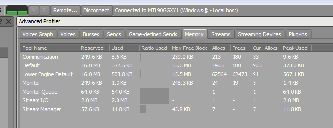
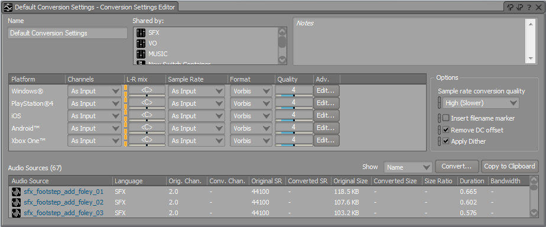

# Optimize audio memory usage

The following sections describe some strategies that you can use to keep the runtime memory requirements for your game's audio as low as possible. Which techniques you choose can depend on many factors including the kind of game you are making, how many sounds there are in your game, what platforms you are targeting, etc.

See also the topics [in the Wwise help](https://www.audiokinetic.com/library/2015.1_5418/?source=Help&id=managing_memory_in_wwise) about managing memory within the Wwise engine.

See also ~{ Optimize memory usage }~ for tips on monitoring memory consumption in your game, and ideas about reducing runtime memory usage in other areas.

## Monitor audio usage with the Wwise profiler

The Wwise editor contains a built-in profiling and monitoring system that you can use to track and follow the way your game loads and uses audio clips at a more granular level than the shared memory monitoring tools offered by the Stingray engine.

To get started profiling:

1.	From the Stingray Editor, run your Stingray project on your local PC or on another connected platform.

2.	In Wwise, choose **Layouts > Profiler** from the main menu.

3.	In the toolbar, click **Remote...**. Select the host running your game, if it is listed, and click **Connect**. If your game's host not, try clicking **Refresh** or click **Connect to IP...** and specify the IP address.

Select the **Memory** tab to get an overview of the memory used by the Wwise engine:

Note that Wwise profiling is only available for Debug and Development builds of your game, not in the final Release version.

See also the Wwise documentation about [profiling](https://www.audiokinetic.com/library/2015.1.4_5497/?source=Help&id=profiling) and [memory statistics](https://www.audiokinetic.com/library/2015.1.4_5497/?source=Help&id=memory).

## Use multiple sound banks

If you have set up a system for loading and unloading resource packages in your game, you can reduce memory usage by creating multiple different sound banks (or sets of audio clips) in Wwise, and listing those different sound banks in different Stingray resource packages. This ensures that you only load into memory the sets of sounds that you will actually need in the game at a given time.

For example, if you set up your game to use a different resource package for each level, you could also create a sound bank for each level that contains only the sounds needed for that level. You would then add each level's bank to that level's resource package.

Or, if your game uses a large number of sounds, you can create more granular banks and resource packages. For example, if your game has a dozen different models of weapons, each with their own distinct set of sound effects, you might create a separate sound bank and a separate resource package for each weapon's audio clips. Then, in your gameplay code, you could stream in a new resource package (along with its corresponding sound bank) each time the player picks up a new weapon.

Keep in mind that if you localize your game, you will likely want to keep voice-over and dialogue tracks for a given character or level in separate banks and packages from the other sound effects used by that character or level.

For details on using Stingray resource packages, ~{ Loading and unloading content at runtime }~.

## Compress and downsample clips

When you generate sound banks in Wwise, each audio clip in the project undergoes a format conversion for each target platform. You can change the conversion settings used for each clip on each platform.

Wwise saves your conversion settings in presets, which you can edit in the **Conversion Settings Editor** window. By default, when you create a new Stingray project, its corresponding Wwise project is created with the following default settings for all clips:

Ways to save memory during this conversion include reducing the number of channels (i.e. going from a stereo track to mono), lowering the sampling rate, and changing the format and quality of compression applied. All of these will affect the sound quality of the resulting clip, so be careful not to change these settings too aggressively.

**To set the default preset used for all clips in the project:**

-	Choose **Project > Project Settings...** from the main menu. In the **Project Settings** window, go to the **Source Settings** tab, and click **...** in the **Default Conversion Settings** area.

**To manage conversion settings for a particular clip or container:**

-	Select it in the Wwise **Project Explorer**. In the **Property Editor** panel, on the **Source Settings** tab, find the **Conversion Settings** area. Check the **Override parent** box. Once you have overridden the parent setting for the selected clip or container, you can assign a different preset, create a new preset, or modify the selected preset.

For detailed information, see the Wwise documentation on [authoring across platforms](https://www.audiokinetic.com/library/2015.1.4_5497/?source=Help&id=authoring_across_platforms).

## Stream audio clips

The Wwise engine can play clips by reading the data straight from disk instead of loading the whole clip into memory. This saves the memory that would have been used to load the file, but adds some amount of latency while the data is fetched from disk.

This approach is particularly useful for long audio clips, where the memory saved is significant. Due to the possibility for latency, it is typically not as good for sounds with sharp attacks that need to be triggered in sync with game events, like gunshots.

In addition, note that the latency time is usually larger when the game is reading from a slow data source like a DVD. You can offset the latency by "pre-loading" part of the sound file, but doing so reduces the amount of memory saved, and can cause the sound to drop out if the disk latency is longer than the preload buffer.

To enable streaming for a clip, select it in the WWise **Project Explorer**. In the **Property Editor**, on the **General Settings** tab, check the **Stream** box.

See also the [Wwise documentation](https://www.audiokinetic.com/library/2015.1.4_5497/?source=Help&id=streaming_media).

## Optimize Wwise engine settings

The Wwise engine reserves several pools of memory that it uses over the course of the game. By default, Stingray initializes Wwise with fairly large values for these engine pools, which are suitable for games with quite complex audio needs. If your game has more moderate needs, you can tune the size of these pools.

These settings are exposed in your Stingray game's *settings.ini* file.

See the ~{ Stingray engine settings.ini file reference }~ for a list of the Wwise engine settings exposed there, and also see these [tips to reduce memory usage](https://www.audiokinetic.com/library/2015.1.4_5497/?source=SDK&id=goingfurther__optimizingmempools__reducing__memory.html) in the Wwise documentation.

## Sound design techniques

The way you design your game's use of sounds can also have a large impact on the amount of memory that the game needs in order to realize that design.

One useful piece of advice is to build up long sounds by combining short clips together dynamically in the game at runtime, rather than by pre-recording long audio clips and loading them into memory. To do this, you can take advantage of the options Wwise offers for choosing sounds dynamically from random, sequence, blend and switch containers that you create in the Actor/Mixer hierarchy.

For example, if you need an ambient city sound, you could record a single clip several minutes in length, and loop it. However, you can achieve a similar effect by recording several shorter clips, setting them to play in random sequence, and cross-fading between them. This creates a seamless, never-ending ambient sound that is constantly changing.

Similarly, you can use these containers to assemble different kinds of weapon sounds from a library of small samples. For example, you could make different kinds of machine gun bursts by combining small clips of single-shots with different delays between them, sharing recoil or reloading sounds between different weapons, etc.
