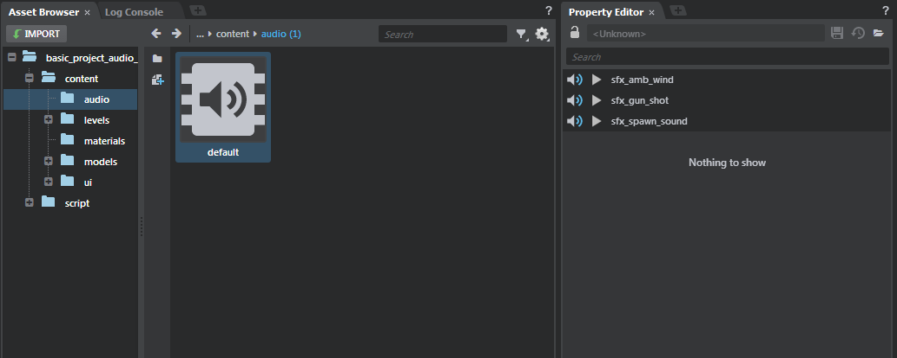

# Listening to sound events

After you generate sound banks in Wwise, you can preview events in the Stingray **Property Editor**.

Click each sound bank to reveal the events tied to that sound bank. You must have the
~{ Asset Preview }~ window open in order for playback to occur.

Click the play button on the event to play that event and/or begin any other functionality that has been set by that event. A Stop icon appears when the event is playing and changes back
into a Play icon when the event is finished.

> **Note:** If you have an RTPC or State or any other kind of functionality tied to an event, previewing this event also calls that functionality.
